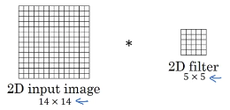
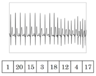
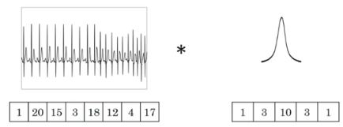
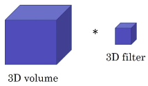

# 1D and 3D Generalizations

## Convolution 2D

Output size:

| First layer |    |
|-------------|----|
| Convolution 2D | $(14 \times 14)*(5 \times 3)=10\times{10}$ |

----

Another example:

| First layer |    |
|-------------|----|
| Convolution 2D with 16 filters | $(14 \times 14 \times 3)*(5 \times 5 \times 3)=10 \times 10 \times 16$ |

| Second layer |    |
|--------------|----|
| Convolution | $(10 \times 10 \times 16)*(5 \times 5 \times 16)= 6 \times 6 \times 32$ |

## Convolutions 1D

Example with electrocardiography signal (heartbeat signal).

If you want to use Electrocardiography signals to make medical diagnoses then you would have 1D data. Electrocardiography signals are a time series.

So rather than a 2D 14x14 shape input, maybe **you just have a 1D 14 dimension input**.

So rather than the 5x5 filter, **you just have a 5 
dimension filter**.

So here, you will convolve your 14 dimension Input with a 5 dimension filter.

What a 1D filter allows you to do:

- Is take your 5 dimensional filter 
- and similarly **apply that in lots of different positions throughout this 1D signal**. 

Output size:

| First layer |    |
|-------------|----|
| Convolution 1D | $14*5=10$ |
| Convolution 1D with 16 filters | $14*5=10 \times 16$ |

| Second layer |    |
|--------------|----|
| Convolution with 32 filters | $(10 \times 16)*(5 \times 16) =6 \times 32$ |

So all of these ideas apply also to 1D data, where you can have the same feature detector (filter) apply to a variety of positions along these time series. 

For example, to detect the different heartbeats in an EKG signal.

For 1D data applications, you actually use a **recurrent neural network** (specially designed for sequece data), but some people can also try using ConvNets in these problems.

## Convolutions 3D data

Computerized tomography (CT) scan combines a series of X-ray images.

Here you can look at different slices of the human torso to see how they look and so this data is fundamentally three dimensional:

 etc...

3D data: So your data has some Width, Heigth and Depth:

What the filters do is really detect features across your 3D data.

| Output |
|--------|
| $(10 \times 10 \times 10 \times n_C)*(5 \times 5 \times 5 \times n_C)=6 \times 6 \times 6 \times numberOfFilters$ |

Scans, medical scans as one example of 3D volumes.

But another example of data, you could treat as a 3D volume would be movie data, where the different slices could be different slices in time through a movie. And you could use this to detect motion or people taking actions in movies. 