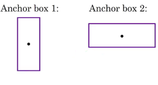
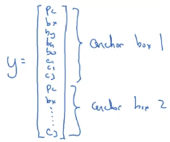
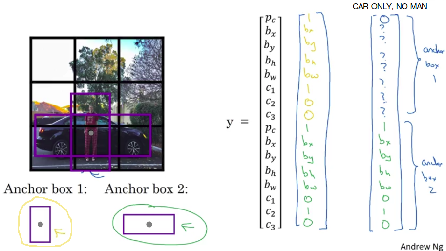

# Anchor Boxes

## Overlapping objects

Notice that the midpoint of the pedestrian and the midpoint of the car are in almost the same place and both of them fall into the same grid cell.

For that grid cell, if Y outputs this vector:

$$y = \begin{bmatrix}
p_{c} \\
b_{x} \\
b_{y} \\
b_{h} \\
b_{w} \\
c_{1} \\
c_{2} \\
c_{3} \\
\end{bmatrix}$$  

where you are detecting three causes (pedestrians, cars and motorcycles), it won't be able to output two detections. 

## Use anchors boxes of different shapes

Pre-define multiple different shapes called anchor boxes.

**In general, you might use more anchor boxes, maybe 5 or even more.**

For the purpose of illustration we will use 2 anchor boxes:

Now you will be able to associate two predictions with the two anchor boxes:

## Anchor box algorithm

| | Explaination | Output shape of y |
|-|--------------|-------------------|
| Previously | Each object in training image is assigned to grid cell that contains that object's midpoint. | 3x3x8 |
| With anchor boxes | Each object in training image is assigned to grid cell that contains that object's midpoint AND anchor box for the grid cell with highest IoU. | 3x3x16 |

What if you have 2 objects associated with the same grid cell  but both of them have the same anchor box shape? 

Again, that's another case that this algorithm doesn't handle well. 

If you influence some default way of tiebreaking if that happens, hopefully this won't happen with your data set, it won't happen much at all. And so, it shouldn't affect performance as much. 

## Anchor boxes allows your learning algorithm to specialize

Maybe even better motivation or even better results that anchor boxes allows your learning algorithm to specialize better. 

In particular, if your data set has some:

- tall, skinny objects like pedestrians
- some white objects like cars

then this allows your learning algorithm to specialize so that some of the outputs can specialize in detecting:
- white, fat objects like cars
- and some of the output units can specialize in detecting tall, skinny objects like pedestrians.

## How do you choose the anchor boxes?

So finally, how do you choose the anchor boxes? And people used to just choose them by hand or choose maybe five or 10 anchor box shapes that spans a variety of shapes that seems to cover the types of objects you seem to detect.

As a much more advanced version, just in the advance common for those of who have other knowledge in machine learning, and even better way to do this in one of the later YOLO research papers, is to use a K-means algorithm, to group together two types of objects shapes you tend to get.

And then to use that to select a set of anchor boxes that this most stereotypically representative of the maybe multiple, of the maybe dozens of object causes you're trying to detect. But that's a more advanced way to automatically choose the anchor boxes.

And if you just choose by hand a variety of shapes that reasonably expands the set of object shapes, you expect to detect some tall, skinny ones, some fat, white ones. That should work with these as well. 
