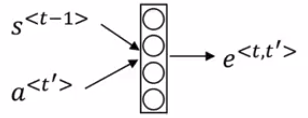
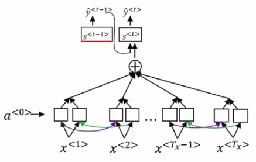
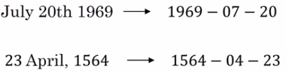
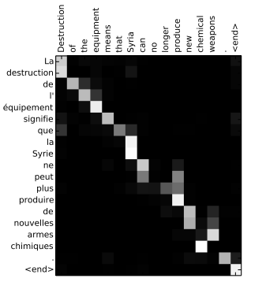

# Attention model

The Attention Model papers:

- [Neural Machine Translation by Jointly Learning to Align and Translate by Dzmitry Bahdanau, Kyunghyun Cho, Yoshua Bengio](https://arxiv.org/abs/1409.0473v7)
- [Show, Attend and Tell: Neural Image Caption Generation with Visual Attention by Kelvin Xu, Jimmy Ba, Ryan Kiros, Kyunghyun Cho, Aaron Courville, Ruslan Salakhutdinov, Richard Zemel, Yoshua Bengio](https://arxiv.org/abs/1502.03044)

- a: denote the activation
- S: to denote the hidden state in the upper part of the RNN

## Encoder part

Let's assume you have an input sentence and you use a bidirectional RNN, or bidirectional GRU, or bidirectional LSTM to compute features on every word.

- **In practice, GRUs and LSTMs are often used for this, with maybe LSTMs be more common.**

And so for the forward occurrence, you have a forward occurrence first time step.

- $\overrightarrow{a}^{<0>}$ = vector of all zeros
- $\overleftarrow{a}^{<6>}$ = vector of all zeros

| Notation                                                           | Definition                                                                                          |
| ------------------------------------------------------------------ | --------------------------------------------------------------------------------------------------- |
| $t'$                                                               | is an index into the words input (French sentence)                                                  |
| $a^{<t'>} = (\overrightarrow{a}^{<t'>}, \overleftarrow{a}^{<t'>})$ | $a^{<t'>}$ is a concatenated vector of the forward and backward occurence in the bidirectional RNN. |

## Decoder part

| Notation          | Definition                                                                              |
| ----------------- | --------------------------------------------------------------------------------------- |
| S                 | Denote the hidden state in the upper part of the RNN                                    |
| $\alpha^{<t,t'>}$ | Attention parameters: The amount of attention that's $y^{<t>}$ should pay to $a^{<t'>}$ |
| C                 | Input context                                                                           |
|                   | $C^{<t>}=\displaystyle \sum_{t'} \alpha^{<t,t'>}$                                       |

### Computing alpha

| Formula to compute $\alpha^{<t,t'>}$ |
|--------------------------------------|
| $\alpha^{<t,t'>}=\frac{\exp(e^{<t,t'>})}{\sum_{t'=1}^{T_x} \exp(e^{<t,t'>})}$ |
| It computes the terms $e^{<t,t'>}$ and then use essentially a softmax to make sure that these weights sum to one if you sum over $t'$. |

Note: $e^{x}$ is replaced by $\exp{(x)}$ to avoid double superscript.

| Reminder softmax function |
|---------------------------|
| ${\displaystyle \sigma (\mathbf {z} )_{i}={\frac {e^{z_{i}}}{\sum _{j=1}^{K}e^{z_{j}}}}}$ for i = 1, …, K and $\displaystyle \mathbf {z} =(z_{1},\ldots ,z_{K})\in \mathbb {R} ^{K}$ |
| In words: We apply the standard exponential function to each element $z_{i}$ of the input vector $\mathbf {z}$ and normalize these values by dividing by the sum of all these exponentials. This normalization ensures that the sum of the components of the output vector $\sigma (\mathbf {z})$ is 1. |

So the sum of all $\alpha^{<t,t'>}$ over t' = 1

**How do we calculate the factors e?**

One way to do so is to use a small neural network as follows:

| $e^{<t,t'>}$ |                                                  |
| ------------ | ------------------------------------------------ |
| $S^{<t-1>}$  | Neural network state from the previous time step (see below) |
| $a^{<t'>}$   | The features from time step $t'$ is the other input |

If you're trying to generate $y^{<t>}$ then $S^{<t-1>}$ was the hidden state from the previous step that just fell into st and that's one input to very small neural network.

And the intuition is: If you want to decide how much attention to pay to the activation of t':

- that seems like it should depend the most on what is your own hidden state activation from the previous time step.
- It seems pretty natural that $\alpha^{<t,t'>}$ and $e^{<t,t'>}$ should depend on these two quantities: $S^{<t-1>}$ and $a^{<t'>}$

But we don't know what the function is.

So one thing you could do is just train a very small neural network to learn whatever this function should be. And trust back propagation and gradient decent to learn the right function.

And it turns out that if you implemented this whole model and train it with gradient descent, the whole thing actually works.

This little neural network does a pretty decent job telling you how much attention $y^{<t>}$ should pay to $a^{<t'>}$

Without going too much into detail this idea has been applied to other problems as well (like image captioning).

In an image captioning problem the task is to look at the picture and write a caption for that picture:
- So in this paper:  [Show, Attend and Tell: Neural Image Caption Generation with Visual Attention by Kelvin Xu, Jimmy Ba, Ryan Kiros, Kyunghyun Cho, Aaron Courville, Ruslan Salakhutdinov, Richard Zemel, Yoshua Bengio](https://arxiv.org/abs/1502.03044) they also showed that you could have a very similar architecture.

Look at the picture and pay attention only to parts of the picture at a time while you're writing a caption for a picture.

## Attention examples

You can train a neural network to input dates in any of these formats and have it use an attention model to generate a normalized format for these dates. 

One other thing that sometimes fun to do is to look at the visualizations of the attention weights.

So here's a machine translation example and here were plotted in different colors. the magnitude of the different attention weights. 

Without spending too much time on this, you can see the corresponding input and output words which have the attention weights that tend to be high.
