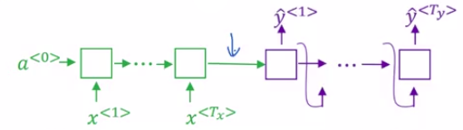
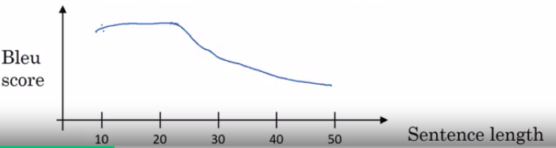
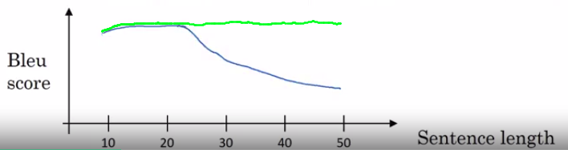
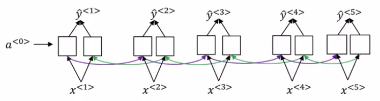
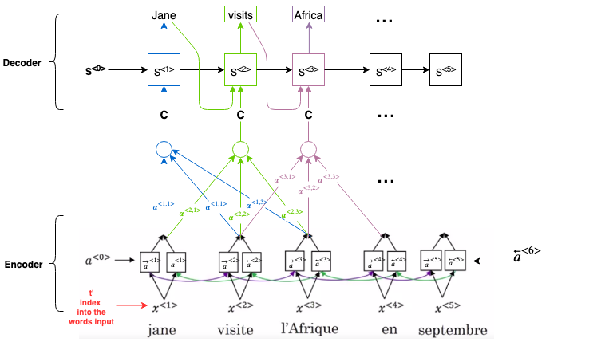

# Attention Model Intuition

The Attention Model papers:

- [Neural Machine Translation by Jointly Learning to Align and Translate by Dzmitry Bahdanau, Kyunghyun Cho, Yoshua Bengio](https://arxiv.org/abs/1409.0473v7)
- [Show, Attend and Tell: Neural Image Caption Generation with Visual Attention by Kelvin Xu, Jimmy Ba, Ryan Kiros, Kyunghyun Cho, Aaron Courville, Ruslan Salakhutdinov, Richard Zemel, Yoshua Bengio](https://arxiv.org/abs/1502.03044)

Even though it was obviously developed for machine translation, it spreads to many other application areas as well. This is really a very influential and seminal paper in the deep learning literature.

## The problem of long sequences

| Example |
|---------|
| Jane s'est rendue en Afrique en septembre dernier, a apprécié la culture et a rencontré beaucoup de gens merveilleux; elle est revenue en parlant comment son voyage était merveilleux, et elle me tente d'y aller aussi. |
| Jane went to Africa last September, and enjoyed the culture and met many wonderful people; she came back raving about how wonderful her trip was, and is tempting me to go too. |

Given a very long French sentence like this.

What we are asking this green encoder in your network to do is:

- To read in the whole sentence and then memorize the whole sentences.
- Store it in the activations conveyed here.

Then for the purple network, the decoder network will then generate the English translation.

The way a human translator would translate this sentence is not to first read the whole French sentence and then memorize the whole thing and then regurgitate an English sentence from scratch.

| Instead, what the human translator would do is |
|------------------------------------------------|
| Read the first part of it, maybe generate part of the translation |
| Look at the second part, generate a few more words. |
| Look at a few more words, generate a few more words. |
| And so on. |

You kind of work part by part through the sentence, because it's just really difficult to memorize the whole long sentence like that.

What you see for the Encoder-Decoder architecture above is that, it works quite well for short sentences but for very long sentences, maybe longer than 30 or 40 words, the performance comes down.

Long sentences, it doesn't do well on because it's just difficult to get in your network to memorize a super long sentence.

The Attention Model may be a bit more like humans.

Because by working one part of the sentence at a time, you don't see this huge dip in the ability of a neural network to memorize a long sentence:

I want to just give you some intuition about how attention works and then we'll flesh out the details in the next video.

## The Attention Model

The Attention Model papers:

- [Neural Machine Translation by Jointly Learning to Align and Translate by Dzmitry Bahdanau, Kyunghyun Cho, Yoshua Bengio](https://arxiv.org/abs/1409.0473v7)
- [Show, Attend and Tell: Neural Image Caption Generation with Visual Attention by Kelvin Xu, Jimmy Ba, Ryan Kiros, Kyunghyun Cho, Aaron Courville, Ruslan Salakhutdinov, Richard Zemel, Yoshua Bengio](https://arxiv.org/abs/1502.03044)

Even though it was obviously developed for machine translation, it spreads to many other application areas as well. This is really a very influential and seminal paper in the deep learning literature.

Let's illustrate this with a short sentence, even though these ideas were maybe developed more for long sentences:

We have our usual sentence:

Jane visite l'Afrique en Septembre.

In this case, I'm going to use a bidirectional RNN like this:

Now, let's go ahead and generate the English translation.

- a: denote the activation
- S: to denote the hidden state in the upper part of the RNN

We hope in this model that the first word it generates will be Jane and the full sentence "Jane visits Africa in September".

Now, the question is:

- When you're trying to generate this first word (Jane), what part of the input French sentence should you be looking at?

Seems like you should be looking:

- primarily at this first word,
- maybe a few other words close by,
- but you don't need to be looking way at the end of the sentence.

|                  | What the Attention Model would be computing is a set of Attention weights: |
| ---------------- | -------------------------------------------------------------------------- |
| $\alpha^{<1,1>}$ | How much attention should we be paying to the first word from the input.   |
| $\alpha^{<1,2>}$ | How much attention should we be paying to the second word from the input.  |
| $\alpha^{<1,3>}$ | How much attention should we be paying to the third word from the input.   |
| ...              | ...                                                                        |

Together this will tell us what is exactly the **context C** that we should be paying attention to.

The context C is input to the RNN first unit that then try to generate the first word.

For the second step of this RNN we're going to have:

- a new hidden state $S^{<2>}$.
- a new set of the . We're going to have $\alpha^{<2,1>}$, $\alpha^{<2,2>}$.
- a new context C that depends on the various attention weights $\alpha^{<2,1>}$, $\alpha^{<2,2>}$, $\alpha^{<2,3>}$.
- And of course, the first word we generated (Jane) is also an input.

All that together will generate the second word and that leads us to the third step... and so on. 

|                             | The amounts that this RNN step should be paying attention to the French word at time t depends: |
| --------------------------- | ----------------------------------------------------------------------------------------------- |
| On the forward activations  | $\overrightarrow{a}^{\ <t>}$                                                                    |
| On the backward activations | $\overleftarrow{a}^{\ <t>}$                                                                     |
| State from the previous steps | $\overrightarrow{S}^{\ <t>}$  |
