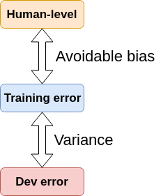

# Avoidable bias

## Human error < Training error

|              |          |
|--------------|----------|
| Humans error | 1% error |
| Training error | 8% error |
| Dev error | 10% error |

The fact: Huge error gap between training and humans.
Conclusion: Your training is bad. **You have to improve training. Focus on bias.**

How to improve training:

- Train a bigger neural network
- Run training set longer
- Do whatever you can to do better on training.

## Human error $approx$ Training error, but Dev error is bigger

|              |            |
|--------------|------------|
| Humans error | 7.5% error |
| Training error | 8% error |
| Dev error | 10% error |

The fact: Training $\approx$ humans but dev error is bigger.
Conclusion: You want to focus on reducing the variance in your learning algorithm.

How to improve variance:

- Try regularization to bring your dev error closer to your training error.
- Maybe getting more training data.
- etc.

## Avoidable bias and variance definition

|                                                                                                    |                                                                                                                                                                          |
|----------------------------------------------------------------------------------------------------|--------------------------------------------------------------------------------------------------------------------------------------------------------------------------|
| Think of human level error as a proxy or as a estimate for Bayes error or for Bayes optimal error. | By definition, human level error is worse than Bayes error because nothing could be better than Bayes error but human level error might not be too far from Bayes error. |

So we can decide that Humans $\approx$ Bayes Error

| Term | Definition | Formula |
|------|------------|---------|
| **Avoidable bias** | Difference between Bayes error (Humans) and Training error | $AvoidableBias = TrainingError - Bayes\_error$ |
| **Variance** | Difference between Training error and Dev error | $Variance = TrainingError - DevError$ |

- **The difference between Bayes error (Humans) and Training error is the avoidable bias.**
- **The difference between Training error and Dev error is the variance error.**

| Example | Result                                                       |
|---------|--------------------------------------------------------------|
| Example 1 | $AvoidableBias = TrainingError - Bayes\_error\_Humans$  = 8% - 1% = 7% |
| Example 2 | $AvoidableBias = TrainingError - Bayes\_error\_Humans$  = 8% - 7.5% = 0.5%  |
| Example 1 | $Variance = TrainingError - DevError =$ 10% - 8% = 2%  |
| Example 2 | $Variance = TrainingError - DevError =$ 10% - 8% = 2%  |

## Guideline

|                                          |                                                                                 |
|------------------------------------------|---------------------------------------------------------------------------------|
| If you approximate Human error that's ok | An **avoidable bias** error of 0.5 is ok. You approximately perform as a human. |

|                                                                                                                             |
|-----------------------------------------------------------------------------------------------------------------------------|
| **The most important thing is to focus your efforts on the biggest error difference first (Avoidable bias or variance).** |