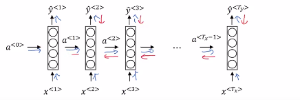

# Backpropagation through time

- Blue line: Forward propagation
- Red line: Backward propagation

| Loss function                                                                                                        |
|----------------------------------------------------------------------------------------------------------------------|
| $\mathcal{L}^{<t>}(\hat{y}^{<t>},y^{<t>})=-y^{<t>} \log{(\hat{y}^{<t>})} - (1-\hat{y}^{<t>})\log{(1-\hat{y}^{<t>})}$ |

| Total Loss function                                                                                                        |
|----------------------------------------------------------------------------------------------------------------------|
| $\mathcal{L}^{<t>}(\hat{y}, y)=\displaystyle \sum_{t=1}^{t=T_{x}} \mathcal{L}^{<t>}(\hat{y}^{<t>},y^{<t>})$ |

Now, in this back propagation procedure, the most significant message or the most significant recursive calculation is this one, which goes from right to left, and that's why it gives this algorithm as well, a pretty fast full name called backpropagation through time.

And the motivation for this name is that for **forward prop, you are scanning from left to right, increasing indices of the time, t,** whereas, **the backpropagation, you're going from right to left, you're kind of going backwards in time**.
