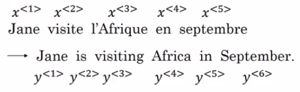
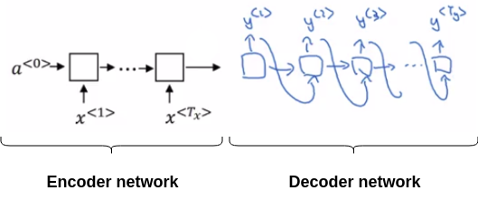
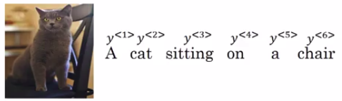
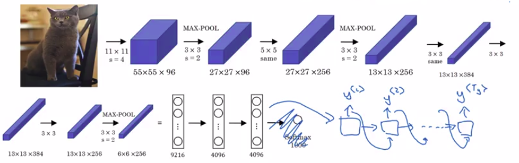

# Basic models

Let's say you want to translate a French sentence like:

How can you train a new network to input the sequence x and output the sequence y?

Papers:

- [Sequence to Sequence Learning with Neural Networks by Ilya Sutskever, Oriol Vinyals, Quoc V. Le](https://arxiv.org/abs/1409.3215)
- [Learning Phrase Representations using RNN Encoder-Decoder for Statistical Machine Translation by Kyunghyun Cho, Bart van Merrienboer, Caglar Gulcehre, Dzmitry Bahdanau, Fethi Bougares, Holger Schwenk, Yoshua Bengio](https://arxiv.org/abs/1406.1078)

| Encoder network |
|---------|
| **Its job it is to find an encoding of the input French sentence** |
| Built as a RNN (this could be a GRU and LSTM) |
| We feed in the input French words one word at a time. |
| And after ingesting the input sequence, the RNN then offers a vector that represents the input sentence. |

## Simple architecture

| Decoder network |
|---------|
| **A decoder network to then generate the corresponding English translation** |
| Takes as input the encoding output by the encoder network |
| Can be trained to output the translation one word at a time until eventually it outputs say, the end of sequence or end the sentence token |
| As usual we could take the generated tokens and feed them to the next layer in the sequence (like in synthesizing text using the language model) |

One of the most remarkable recent results in deep learning is that this model works (given enough pairs of French and English sentences).

## Image captioning architecture

Papers:

- This type of model was first proposed by:
  - [Deep Captioning with Multimodal Recurrent Neural Networks (m-RNN) by Junhua Mao, Wei Xu, Yi Yang, Jiang Wang, Zhiheng Huang, Alan Yuille](https://arxiv.org/abs/1412.6632)
- Although there were multiple groups coming up with very similar models independently and at about the same time. So two other groups that had done very similar work:
  - [Show and Tell: A Neural Image Caption Generator by Oriol Vinyals, Alexander Toshev, Samy Bengio, Dumitru Erhan](https://arxiv.org/abs/1411.4555)
  - [Deep Visual-Semantic Alignments for Generating Image Descriptions by Andrej Karpathy, Li Fei-Fei](https://arxiv.org/abs/1412.2306)

You want to generate the caption automatically as:

- A cat sitting on a chair

From the earlier course you've seen how you can input an image into a convolutional network (for example a pre-trained AlexNet) and have the NN learn an encoding or learn a set of features of the input image.

So, this is actually the AlexNet architecture:

- And if we get rid of this final Softmax unit:
  - the pre-trained AlexNet can give you a 4096-dimensional feature vector of which to represent this picture of a cat.
  - And so this pre-trained network can be the **encoder network** for the image and you now have a 4096-dimensional vector that represents the image.
- You can then take this and feed it to an RNN, whose job it is to generate the caption one word at a time.

So similar to what we saw with machine translation translating from French to English:

- You can now input a feature vector describing the input
- And then have it generate an output sequence or output set of words one word at a time.

And this actually works pretty well for image captioning, especially if the caption you want to generate is not too long.
