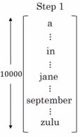
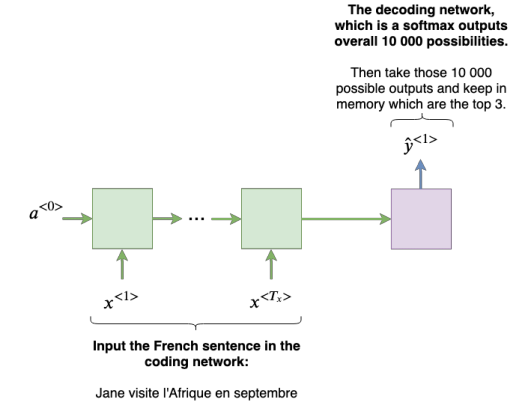
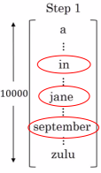
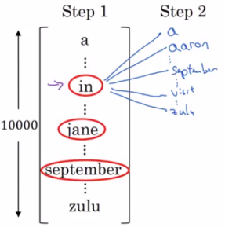
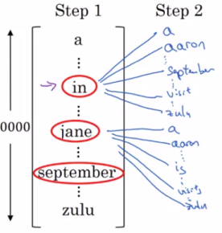
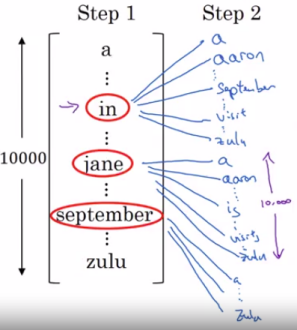
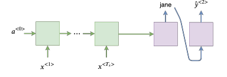
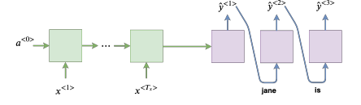

# Beam search

| Example to be translated from French to English |
|---------|
| Jane visite l'Afrique en septembre. |

Machine translation:

- Given an input French sentence, you don't want to output a random English translation, you want to output the best and the most likely English translation. 

Speech recognition:

- The same is also true for  where given an input audio clip, you don't want to output a random text transcript of that audio, you want to output the best, maybe the most likely, text transcript.

Beam search is the most widely used algorithm to do this.

## Beam search algorithm explaination

So here I've listed, say, 10,000 words into vocabulary.

Let's ignore capitalization.

### First step of Beam Search

The first step is to try to find the first word: $P(y^{<1>}|x)$
  
Whereas greedy search will pick only the one most likely words and move on:

- **Beam Search instead can consider multiple alternatives.**
- **Beam Search algorithm has a parameter called B**
  - **B is called the beam width** and for this example I'm going to **set the beam width to be 3**.
  - And what this means is Beam search will generate **not just one possibility but consider 3 at the time**.

Here is how beam search works for the first step:

Let's say evaluating this probability over different choices for the first words:

- It finds that the choices "in", "Jane" and "September" are the most likely 3 possibilities for the first words in the English outputs.

Then Beam search will store in computer memory that it wants to try all of these 3 words.

**To summarize:**

In order to perform this first step of Beam search, what you need to do is run the input French sentence through this encoder network and then this first step will then decode the network, this is a softmax output overall 10,000 possibilities. Then you would take those 10,000 possible outputs and keep in memory which were the top three.

### Second step of Beam Search

Beam search has picked:

- "in", "Jane" and "September" as the three most likely choice of the first word.

What Beam search will do now is:

- For each of these three choices consider what should be the second word.
  - We are then loking for the pair $y^{<1>}, y^{<2>}$
  - $P(y^{<1>}, y^{<2>}|x)=P(y^{<1>}|x)P(y^{<2>}|x,y^{<1>})$
- so after "in" maybe a second word is "a" or maybe "Aaron" or "September" (I'm just listing words from the from the dictionary).

| Given the word: in |  |
|-------------------------------------|-------------|
|  |  |

| Given the word: jane |  |
|-------------------------------------|-------------|
|  |  |

| Given the word: september |  |
|-------------------------------------|-------------|
|  |  |

So for this second step of beam search because we're continuing to use a beam width of three:

Because there are 10,000 words in the vocabulary:

- You'd end up considering three times 10 000 = 30 000 possibilities.

What you do is you evaluate all of these 30 000 options according to the probably the first and second words and then pick the top three.

So let's say that in the 30,000 choices the most likely were:

- "in September"
- "Jane is"
- "Jane visits"

These 3 choices are what Beam's search would memorize away and take on to the next step.

**Notice one thing**:

- If beam search decides that the most likely choices are:
  - The first and second words are "in September", or "Jane is", or "Jane visits".
- Then what that means is that it is now **rejecting September as a candidate for the first word** of the output English translation.

Before going onto the third step of beam search, we're now down to:

- 2 possibilities for the first words
- but we still have a beam width of three keeping track of 3 choices for pairs of $y^{<1>}, y^{<2>}$
  - which are "in September", "Jane is", "Jane visits".

|  Just notice that because of beam width is equal to 3, every step you instantiate **3 copies of the network** to evaluate these partial sentence fragments and the output. |
|---------------------------------------------------------------------|
|  |
|  |
|  |

And it's because beam width $B = 3$ that you have 3 copies of the network with different choices for the first words, but these three copies of the network can be very efficiently used to evaluate all 30,000 options for the second word.

So just don't instantiate 30,000 copies of the network.

### One more step

So said that the most likely choices for first two words were:

- in september
- Jane is
- Jane visits

And for each of these pairs of words which we should have saved in the computer memory the probability $P(y^{<1>}, y^{<2>}|x)$.

So similar to before, we now want to consider what is the third word.

| Step 3 |
|----------------|----------------------------------------------------|
| $P(y^{<3>}|x, "in september")$ |  |
| $P(y^{<3>}|x, "jane is")$ |  |
| $P(y^{<3>}|x, "jane visitis")$ |  |

### And again

Then it keeps going and then you go onto the fourth step of beam search you add one more word and on it goes...

And the outcome of this process hopefully will be that adding one word at a time that Beam search will decide that.

Jane visits Africa in September will be terminated by:

- **the end of sentence symbol $<EOS>$ (using that system is quite common)**.

| Number of possibilities each step |
|-----------------------------------|
| So with a beam of three being searched considers three possibilities at a time. |
| Notice that if the beam width was said to be equal to one, say cause there's only one, then this essentially becomes the greedy search algorithm which we have discussed before |
| By considering multiple possibilities say three or ten or some other number at the same time beam search will usually find a much better output sentence than greedy search. |
