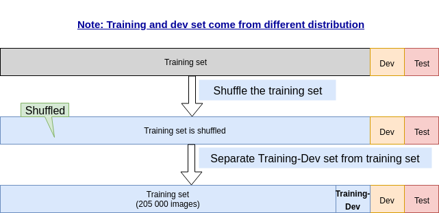

# Bias and Variance with mismatched data distributions

Cat classifier example

|              | |                   |
|--------------|-|-------------------|
| Humans error | |$\approx$ 0% error | 
| Training error | Training set was really easy because it was high res, very clear images | 1% error |   
| Dev error | Dev set images are not that good | 10% error | 

When **your training data and your dev data comes from a different distribution**, you can **no longer safely say you have a variance problem**. 

Maybe that just reflect that **the dev set contains images that are much more difficult** to classify accurately.

When you went from the training error to the dev error, two things changed at a time.

1. The algorithm saw data in the training set but not in the dev set.
2. The distribution of data in the dev set is different.

## Avoid the issue with traing-dev set

### Example 1 and 2

**Traing-dev set**: Same distribution as training set, but not used for training.

Now we have:

| Set   | Example 1       |   Example 2   |
|-------|-----------------|---------------|
| Training error | 1% error | 1% error |
| Training-Dev error | 9% error | 1.5% error |  
| Dev error | 10% error | 10% error |

----
__Example 1: First column__

You have a big difference between training error an training-dev error.

As Training and Training-Dev data come from the same shuffled set, **now we can conclude that you have a variance problem**.

----
__Example 2: Second column__

You have low difference between training error an training-dev error.

So **it is not a variance problem**.

You have big difference between Training-Dev and Dev error, so **this is a mismatch data error**.

So somehow your algorithm has learned to do well on a different distribution.

### A few more examples

| Set   | Example 3       |   Example 4   |
|-------|-----------------|---------------|
| Humans error | 0% error | 0% error |
| Training error | 10% error | 10% error |
| Training-Dev error | 11% error | 11% error |  
| Dev error | 12% error | 20% error |

----
__Example 3: First column__

Clearly you have a big difference between humans error and training error: This is clearly an **avoidable bias problem**.

So this is really a **high bias setting**.

----
__Example 4: Second column__

You have a big difference between humans error and training error: This is clearly an **avoidable bias problem**.

You have a low difference between Training error and Training-Dev error, so this is **NOT a variance problem**.

You have a big difference between Training-Dev error and Dev error, so **you have a data mismatch error**.

Conclusion:

You have a **large bias or avoidable bias problem** and a **data mismatch problem**.

## Guideline to what you have to look at

## More general formulation

Dev/Test error = 6% means:

- Dev error = 6%
- and Test error = 6%