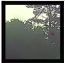
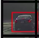
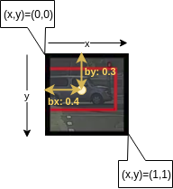
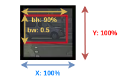

## Bounding bound prediction

 With sliding windows, you take this three sets of locations and run the crossfire through it. And in this case, none of the boxes really match up perfectly with the position of the car. So, maybe that box is the best match.

And also, it looks like in drawn through, the perfect bounding box isn't even quite square, it's actually has a slightly wider rectangle or slightly horizontal aspect ratio.

## YOLO algorithm

YOLO stands for: **You Only Look Once**. 

And is an algorithm due to Joseph Redmon, Santosh Divvala, Ross Girshick and Ali Farhadi. 

### Grid

First, we define a grid:

|                |   |                                                                                                                                             |
|----------------|---|---------------------------------------------------------------------------------------------------------------------------------------------|
|  | For the purposes of illustration, we use a 3 by 3 grid. Although in an actual implementation, you use a finer one, like maybe a 19x19 grid. |

### Labels for training

Then you apply the image classification and localization algorithm to each of the nine grids (see [Object localization](./object_localization.md)).

So for each of the grid cells you will have an output like this: 

| Output | Example Image 1 |    | Example Image 2 |    |
|--------|-----------------|----|-----------------|----|
| $\begin{bmatrix}p_{c} \\b_{x} \\b_{y} \\b_{h} \\b_{w} \\c_{1} \\c_{2} \\c_{3} \\\end{bmatrix}$ |  | $\begin{bmatrix}0 \\? \\? \\? \\? \\? \\? \\? \\\end{bmatrix}$ |  | $\begin{bmatrix}1 \\b_{x} \\b_{y} \\b_{h} \\b_{w} \\0 \\1 \\0 \\\end{bmatrix}$ |

And what the YOLO algorithm does is it takes the midpoint of reach of the two objects and then assigns the object to the grid cell containing the midpoint.

So the left car is assigned to this grid cell, and the car on the right, which is this midpoint, is assigned to this grid cell. 

And so even though the central grid cell has some parts of both cars, we'll pretend the central grid cell has no interesting object (vector with no object).

### Output

So the total output of the convnet implementation (as in [Convolutional Implementation of Sliding Windows](./convolutional_implementation_of_sliding_windows.md)) is:

### Summary

So the advantage of this algorithm is that the neural network outputs precise bounding boxes with $b_{x},b_{y},b_{h},b_{w}$.

And so long as you don't have more than one object in each grid cell, this algorithm should work okay.

|                |   |                                                                                                                                                                                                                                                                                       |
|----------------|---|---------------------------------------------------------------------------------------------------------------------------------------------------------------------------------------------------------------------------------------------------------------------------------------|
|  | Remember for the purposes of illustration, we use a 3 by 3 grid. Although in an actual implementation, you use a finer one, like maybe a 19x19 grid. **Indeed by making your grid much finer, it reduces the chance that there are multiple objects assigned to the same grid cell.** |

## Specify the bounding boxes coordinates

The convention is that:

- The coordinates are (x,y).
- The upper left point is (0,0).
- The lower right point is (1,1).

| Coordinates searched | Image | Image coordinates | Explanation | Range |
|----------------------|-------|-------------------|-------------|-------|
| (bx,by) |  | (0.4,0.3) | bx and by are defined as the central point coordinates of the car. | Between 0 and 1 |
| (bh,bw) |  | (90%,50%)=(0.9,0.5) | The height or width of the bounding box is specified as a percentage of the overall width or height of this box. | Could be > 1 if the car takes multiple boxes. |

|               |   |                                                                                                                                                                                                                                                                                                                                                                                                                  |
|---------------|---|------------------------------------------------------------------------------------------------------------------------------------------------------------------------------------------------------------------------------------------------------------------------------------------------------------------------------------------------------------------------------------------------------------------|
|  | Although, there are some more complicated parameterizations involving sigmoid functions to make sure this is between 0 and 1. And using an explanation parameterization to make sure that these are non-negative, since 0.9, 0.5, this has to be greater or equal to zero. There are some other more advanced parameterizations that work things a little bit better, but the one you saw here should work okay. |

## Paper

[https://arxiv.org/abs/1506.02640](https://arxiv.org/abs/1506.02640)

Although, just one warning, if you take a look at these papers which is the YOLO paper is one of the harder papers to read.

Andrew NG: I remember, when I was reading this paper for the first time, I had a really hard time figuring out what was going on.

And I wound up asking a couple of my friends, very good researchers to help me figure it out, and even they had a hard time understanding some of the details of the paper. So, if you look at the paper, it's okay if you have a hard time figuring it out.

I wish it was more uncommon, but it's not that uncommon, sadly, for even senior researchers, that review research papers and have a hard time figuring out the details.

And have to look at open source code, or contact the authors, or something else to figure out the details of these outcomes. 