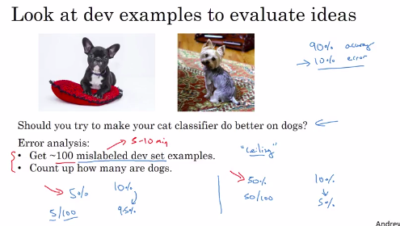

# Carrying out error analysis

You're working on your cat classifier:

- You've achieved 90% accuracy (10% error, on your dev set).
- This is much worse than you're hoping to do.

Lookin at some of the examples that the algorithm is misclassifying and you notice:

-  That it is **miscategorizing some dogs as cats**.

So the question is does it worth the effort to spend months improving your results?

- Your error might go down from 10% error, down to only 9.5%.

Of course if your error was 50% of the images are dogs classified as cats, in this case it would worth the time to improve results.

## Evaluate multiple ideas in parallel

Ideas for cat detection:

- Fix picture of dogs being recognized as cats.
- Fix great cats (lions, panthers, etc...) being misrecognized.
- Improve performance on blurry images.

In fact, if you're looking at 100 mislabeled dev set examples, you can use a table to check what was wrong:

- It was a dog, not a cat
- The image was too blurry

## Conclusion

- A lot of the mistakes we made on blurry images
- Quite a lot on were made on great cat images. 

Consequently:

- No matter how much better you do on dog images, it will not improve much.
- The potential improvement: You can to better on great cat images, or blurry images.

