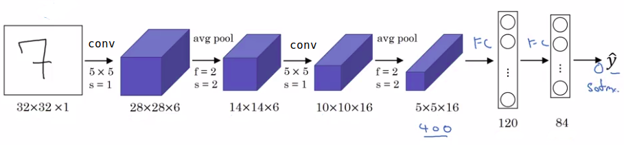
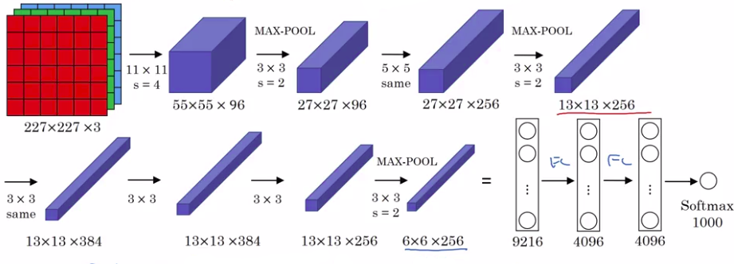
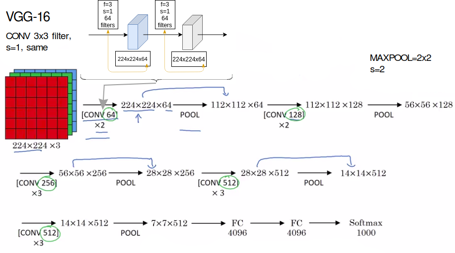

# Classic networks

## LeNet-5 (1998)

Original design (original paper):

$\hat{y}$ took on 10 possible values

__Original design back then (section II and III of the paper):__

- There was no padding.
- There was no softmax layer but a different classifier at the output. A more modern approac would be to use softmax classification output.
- There was about 60k parameters, today you often see neural networks with 10 million to 100 million parameters.
- People used sigmoid and tanh nonlinearities. They were NOT using ReLU.
- There was a a non-linearity after pooling (sigmoid).

**From left to right:** $n_{H}$ and $n_{W}$ **goes down** / $n_{C}$ **goes up**.

CONV -> pool -> CONV -> pool -> FC -> FC -> output

## AlexNet (2012) (Alex Krizhevsky)

- Similar to LeNet but much bigger. LeNet-5 had 60k parameters but AlexNet had 60M (million) parameters.
- It used ReLu.
- It was training on 2 GPUs.
- It had a special layer called Local Response Normalization but this kind of layer is not used much anymore, that's why we don't talk about it. 

__Why Local Response Normalization is not used any more:__

The basic idea is that if you take one of the block you have on top (13*13*256 for ex), it would look at one position height and width, and look down this across all the channels, and normalize the 256 numbers.  

The motivation for this Local Response Normalization was that for each position in this 13 by 13 image, maybe you don't want too many neurons with a very high activation. But subsequently, many researchers have found that this doesn't help that much.

__Why AlexNet paper was important?__

I think even before AlexNet, deep learning was starting to gain traction in speech recognition and a few other areas, but it was really this paper that convinced a lot of the computer vision community to take a serious look at deep learning to convince them that deep learning really works in computer vision.

And then it grew on to have a huge impact not just in computer vision but beyond computer vision as well.

__AlexNet is one of the easiest to read:__

Here is the link to the paper: (https://papers.nips.cc/paper/4824-imagenet-classification-with-deep-convolutional-neural-networks.pdf)

## VGG or VGG-16

**VGG-16 because it has 16 layers that weights.**

Instead of having so many hyperparameters (like in AlexNet) let's have a much simpler network where you focus on just having:

- conv-layers that are just 3 by 3 filters
- with a stride of one 
- and always use same padding.
- and make all your max pulling layers two-by-two with a stride of two.
- **138 Millions parameters. Pretty large NN.**

Pooling layers reduce heigth and width.
As you go deeper, height and width goes down (by a factor of 2 each time) whereas the number of channel increases.

Paper: https://arxiv.org/pdf/1409.1556.pdf
