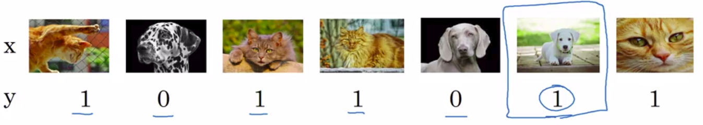

# Cleaning up incorrectly labeled data

## Incorrectly labeled examples

- x: image
- y: output (y=1=is a cat, y=0=is not a cat)

Squared blue image is an example of a **incorrect label**.

Of course you will take care of **incorrect label if it is big enough**.

## Error analysis

**Add an extra column** in your error analysis to take care of the **incorrectly labeled** issue:

| Group | Error rate |
|-------|------------|
| Overall dev set error | 10% |
| Overall errors due to incorrect labels | 10% of 6% = 0.6% |
| Overall errors due to other causes | 10% - 0.6% = 9.4% |

----

Let's imagine another example:

| Group | Error rate |
|-------|------------|
| Overall dev set error | 2% |
| Overall errors due to incorrect labels | 0.6% |
| Overall errors due to other causes | 2% - 0.6% = 1.4% |

The goal of dev set is to help you select between 2 classifiers A & B.

In our last case: **70% of the overall error are linked to incorrect labels**. This is a good reason to go in and **fix the incorrect labels in your dev set**.

## Guideline: Correcting incorrect dev/test set examples

|                                                                                                                 |
|-----------------------------------------------------------------------------------------------------------------|
| **Apply same process to your dev and test sets to make sure they continue to come from the same distribution.** |
| **Consider examining examples your algorithm got right as well as ones it got wrong.** If you have 98% right and 2% wrong: So it's much easier to examine and validate the labels on 2% of the data and it takes much longer to validate labels on 98% of the data. |
| **Train and dev/set data may now come from slightly different distributions.** Remember we said that at this other video that it's actually less important to correct the labels in your training set. Dev and test set on the other hand are often smaller than the training set, so you might invest an extra effort to correct the labels in these sets. |

I've seen some engineers and researchers be reluctant to manually look at the examples. Maybe it's not the most interesting thing to do, to sit down and look at a 100 or a couple hundred examples to counter the number of errors. But this is something that I so do myself.

