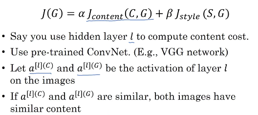

# Content cost function

Overall cost function of the neural style transfer algorithm: 
$J(G)=\alpha J_{Content}(C,G)+\beta J_{Style}(S,G)$

|   |                                                                                                         |
|---|---------------------------------------------------------------------------------------------------------|
| 1 | Let's say you use hidden layer $l$ to compute content cost. You then have to choose which layer is $l$. |

- If $l$ is a very small number, if you use hidden layer one, then it will really force your generated image to pixel values very similar to your content image.
- Whereas, if you use a very deep layer, then it's just asking, "Well, if there is a dog in your content image, then make sure there is a dog somewhere in your generated image." 

**So in practice, layer $l$ should be chosen to be somewhere in the middle of the layers of the neural network**, neither too shallow nor too deep.

|   |                                                                                                                             |
|---|-----------------------------------------------------------------------------------------------------------------------------|
| 2 | Now, what you can do is then use a pre-trained ConvNet (maybe a VGG network or could be some other neural network as well). |

|   |                                                                                                                   |
|---|-------------------------------------------------------------------------------------------------------------------|
| 3 | And now, you want to measure, given a content image and given a generated image, how similar are they in content. |

$l$ is the layer chosen in the pre-trained convnet.

We input the content image C in the convnet and keep the activation results of $a^{[l](C)}$.

We input the generated image G in the convnet and keep the activation results of $a^{[l](G)}$.

So let's let this $a^{[l](C)}$ and this be the activations of layer $l$ on these two images, on the images C and G.

|   |                                                                                  |
|---|----------------------------------------------------------------------------------|
| 4 | If $a^{[l](C)}$ and $a^{[l](G)}$ are similar, both images have a similar content |

$J_{Content}(C,G)=\frac{1}{2}\left\lVert a^{[l](C)}-a^{[l](G)} \right\rVert^2$

You can have a normalization constant ($\frac{1}{2}$) or not, so it's just one of the two or something else. It doesn't really matter since this can be adjusted as well by this hyperparameter $\alpha$.

 So, just be clear on using this $\left\lVert a^{[l](C)}-a^{[l](G)} \right\rVert^2$: Just the element-wise sum of squared differences between these two activation. 

Differences between the activations in layer l, between the images in C and G.

|   |                                                                                                                                                                        |
|---|------------------------------------------------------------------------------------------------------------------------------------------------------------------------|
| 5 | When later you perform gradient descent on J(G) to try to find a value of G (so that the overall cost is low), this will incentivize the algorithm to find an image G. |

It will incentivize the algorithm to find **the hidden layer activations** who are similar to what you have for the content image.