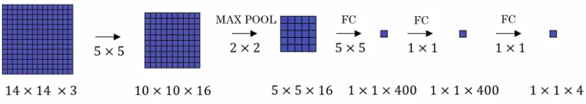
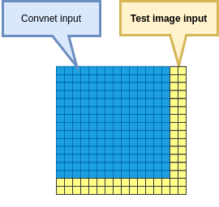
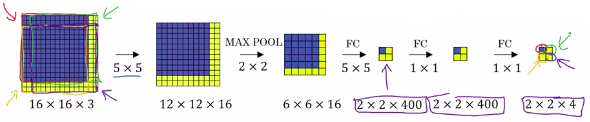
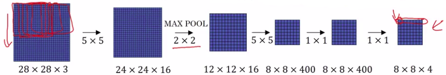

# Convolutional Implementation of Sliding Windows

## Turning fully connected layers into convolutional layers

Remember: A 5x5 filter is implemented as 5x5x16 because our convention is that the filter looks across all 16 channels.

|                        |                                                                                                                                                            |
|------------------------|------------------------------------------------------------------------------------------------------------------------------------------------------------|
| To replace a FC layer: | We use a **convolutional filter** with the **same** $n_{H}$ $n_{W}$ **dimensions that the input** AND the **number of filters of the** $n_{C}$ **output**. |

## Convolutional Implementation of Sliding Windows

The presentation on this slide is based on the OverFeat paper, referenced at the bottom, by Pierre Sermanet, David Eigen, Xiang Zhang, Michael Mathieu, Robert Fergus and Yann Lecun.

Let's take the previous example.

**(We will not represent volumes to simplify the drawing).**

The convnet:

- Inputs: 14x14x3 volume.
- Outputs: 1x1x4 volume.

------------------

But our test set image input is: 16x16x3

So sliding windows are:

## Explanation big example 

 So what the convolution implementation does is:

- Rather than forcing you to run 4 propagation on 4 subsets of the input image independently
- Instead, it combines all 4 into one form of computation and shares a lot of the computation in the regions of image that are common. 

If we input the full 16x16x3 into the ConvNet we find that the results of the 4 windows are in the output of the 2x2x4 matrix.

## Bigger example 

## Summary

So just to recap, to implement sliding windows, previously, what you do is you crop out a region.

Let's say this is 14 by 14 and run that through your convnet and do that for the next region over, then do that for the next 14 by 14 region, then the next one, then the next one, then the next one, then the next one and so on, until hopefully that one recognizes the car. 

But now, instead of doing it sequentially, with this convolutional implementation that you saw in the previous slide, you can implement the entire image, all maybe 28 by 28 and convolutionally make all the predictions at the same time by one forward pass through this big convnet and hopefully have it recognize the position of the car. 

So that's how you implement sliding windows convolutionally and it makes the whole thing much more efficient. Now, there is still one weakness:

- The position of the bounding boxes is not going to be too accurate.