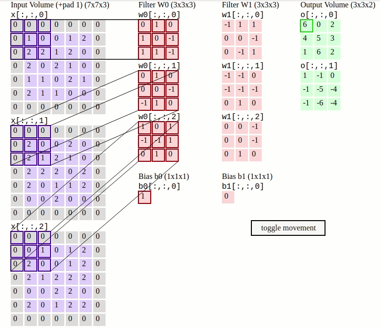

# Convolutional layer by standford

This is taken from CS231n course: http://cs231n.github.io/convolutional-networks/

Below is a running demo of a CONV layer. Since 3D volumes are hard to visualize:

- all the volumes (the input volume (in blue)
- the weight volumes (in red)
- the output volume (in green))

|                  |           |
|------------------|-----------|
| The input volume | **5x5x3** |
| Padding P | **1** (So the final input is: **7x7x3**) |
| Filter F | 3 (3x3) |
| Number of filters | 2 |
| Stride S | 2 |

