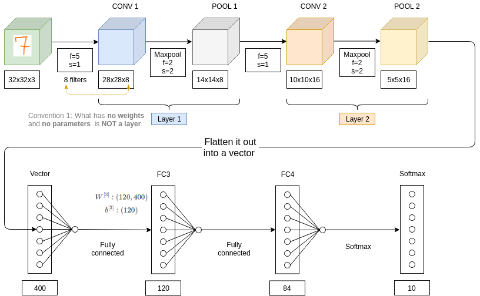

# Convolutional Network Example

Let's say you're:

- Inputting an image which is 32 x 32 x 3 (so it's an RGB image)
- Trying to do handwritten digit recognition.

|                                                     |
|-----------------------------------------------------|
| This example is inspired by LeNet-5 from Yann LeCun |

## Convention on what you wall a layer

So, it turns out that in the literature of a ConvNet there are two conventions which are inside the inconsistent about what you call a layer. 

| Convention | Definition | Often used? | Example above |
|------------|------------|-------------|---------------|
| Convention 1 | **Layers have weights, parameters.** Pooling has no weights, no parameters so it is not a layer.| Usually used | CONV1 + POOL1 = 1 layer |
| Convention 2 | Layers can have bo weights, no parameters. So Pooling in convention 2 is a layer.| Less used but can appear in articles online or in research papers. | CONV1 = 1 layer and POOL1 = 1 layer |

## Shapes, activation size and number of parameters

### Shape of convolution layers

| Size | Formula |
|------|---------|
| $n_{H}^{[l]}$ | $=\lfloor \frac{n_{H}^{[l-1]}+2p^{[l]}-f^{[l]}}{s^{[l]}}+1 \rfloor$ |
| Or similarly |    |
|--------------|----|
| $n_{W}^{[l]}$ | $=\lfloor \frac{n_{W}^{[l-1]}+2p^{[l]}-f^{[l]}}{s^{[l]}}+1 \rfloor$ |

| Layer | Size | Calculus |
|-------|------|----------|
| CONV1     | $n_{H}^{[l]}=n_{W}^{[l]}$ | $=\lfloor \frac{n_{H}^{[l-1]}+2p^{[l]}-f^{[l]}}{s^{[l]}}+1 \rfloor = \lfloor \frac{32+2*0-5}{1}+1 \rfloor = 28$ |
| CONV2     | $n_{H}^{[l]}=n_{W}^{[l]}$ | $=\lfloor \frac{n_{H}^{[l-1]}+2p^{[l]}-f^{[l]}}{s^{[l]}}+1 \rfloor = \lfloor \frac{14+2*0-5}{1}+1 \rfloor = 10$ |

### Summary formulas for Number of parameters

| CONV layer |    ||
|------------|----||
| Number of parameters OR shape of the matrix | Formula |    |
| $W\_CONV\_parameters$ = W.shape| $f^{[l]}\times{f^{[l]}}\times{n_{C}^{[l-1]}}\times{n_{C}^{[l]}}$ ||
| $b\_CONV\_parameters$ = b.shape | $n_{C}^{[l]}$ OR $(1,1,1,n_{C}^{[l]})$ | The right version is for the code. |
| $total\_CONV\_parameters$ | $(f^{[l]}\times{f^{[l]}}\times{n_{C}^{[l-1]}}+1)\times{n_{C}^{[l]}}$ ||

Fully-connected layers: In a fully-connected layer, all input units have a separate weight to each output unit. For n inputs and m outputs, the number of weights is n*m. Additionally, you have a bias for each output node, so you are at (n+1)*m parameters.

|   |                                         |
|---|-----------------------------------------|
| n | Input size of the Fully Connected layer |
| m | Output size of the Fully Connected layer |

| FC layer OR SoftMax |    |
|---------------------|----|
| Number of parameters OR shape of the matrix | Formula |
| $W\_parameters$ = W.shape| $n\times{m}$ |
| $b\_parameters$ = b.shape | $m$ |
| $total\_parameters$ | $(n+1)\times{m}$ |

### Calculus

|  | Calculus |
|--|----------|
| CONV1 | $total\_CONV\_parameters=(f^{[l]}\times{f^{[l]}}\times{n_{C}^{[l-1]}}+1)\times{n_{C}^{[l]}}=(5*5*3 + 1)*8=608$ |
| CONV2 | $total\_CONV\_parameters=(f^{[l]}\times{f^{[l]}}\times{n_{C}^{[l-1]}}+1)\times{n_{C}^{[l]}}=(5*5*8 + 1)*16=3216$ |
| FC3 | $total\_parameters=(n+1)*m=(400 + 1)*120=48120$ |
| FC4 | $total\_parameters=(n+1)*m=(120 + 1)*84=10164$ |
| SoftMax | $total\_parameters=(n+1)*m=(84 + 1)*10=850$ |

### Result table

|                  | Activation shape  | Activation size  | # (Number) of parameters  |
|------------------|-------------------|------------------|---------------------------|
| Input            | (32,32,3)         | 3 072            | 0                         |
| CONV1 (f=5,s=1)  | (28,28,8)         | 6 272            | 608                       |
| POOL1            | (14,14,8)         | 1 568            | 0                         |
| CONV2 (f=5,s=1)  | (10,10,16)        | 1 600            | 3 216                     |
| POOL2            | (5,5,16)          | 400              | 0                         |
| FC3              | (120,1)           | 120              | 48 120                    |
| FC4              | (84,1)            | 84               | 10 164                    |
| Softmax          | (10,1)            | 10               | 850                       |

### What we notice looking at the result table

- MaxPooling layers have no parameters
- CONV layers have fex parameters.
- FC layers have a lot of parameters.
- The activation size tends to go down gradually as you go deeper in the NN.

|                    |                                                                                                     |
|--------------------|-----------------------------------------------------------------------------------------------------|
|  | If the activation size drops too quickly as you go deeper in the NN, performance is getting poorer. |

## What you usually see in ConvNets

|               |                                              |
|---------------|----------------------------------------------|
| $n_{H},n_{W}$ | Tend to decrease as you go deeper in the NN. |
| $n_{C}$ | tend to increase as you go deeper in the NN. |

Common patterns:

|      |                       |
|------|-----------------------|
| Conv | is followed by a Pool | 
| Conv+Pool | is followed by other Conv+Pool| 
| multiple conv + pool | Multiple CONV layers followed by a POOL layer |
| Conv+Pool | is followed by multiple FC |
| FC | is followed by SoftMax |

