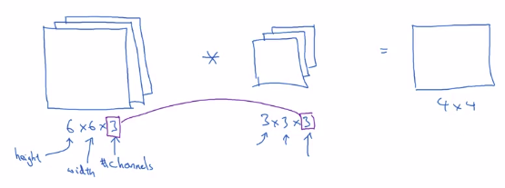
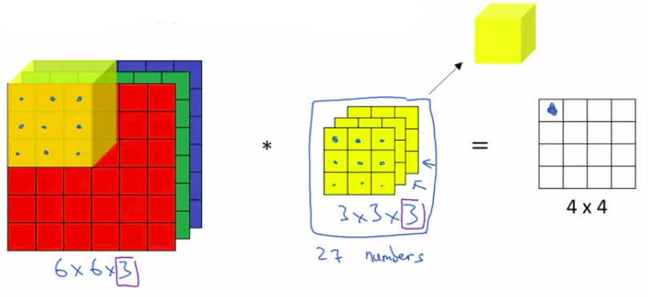
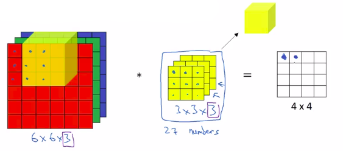
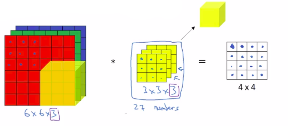
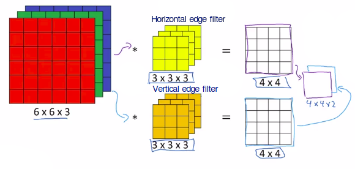

# Convolutions Over Volume

## Convolutions on RGB images

### Convolution operation with RGB channel

Below * means convolution operation
$finalMatrix_{1,1} = inputLayer1 * filterLayer1 + inputLayer2 * filterLayer2 + inputLayer3 * filterLayer3$

Below * means convolution operation
$finalMatrix_{1,1} = inputLayer1 * filterLayer1 + inputLayer2 * filterLayer2 + inputLayer3 * filterLayer3$

$\vdots$

## RGB filters

### Simple filters

Filter 3 by 3 by 3 matrix:

- **Vertical edges red channel only detection**

| Red matrix |   |   |    | Green matrix |   |   |   | Blue matrix |   |   |   |
|------------|---|---|----|--------------|---|---|---|-------------|---|---|---|
|            | 1 | 0 | -1 |              | 0 | 0 | 0 |             | 0 | 0 | 0 |
|            | 1 | 0 | -1 |              | 0 | 0 | 0 |             | 0 | 0 | 0 |
|            | 1 | 0 | -1 |              | 0 | 0 | 0 |             | 0 | 0 | 0 |

- **Vertical edges whatever the color detection**

| Red matrix |   |   |    | Green matrix |   |   |    | Blue matrix |   |   |   |
|------------|---|---|----|--------------|---|---|----|-------------|---|---|---|
|            | 1 | 0 | -1 |              | 1 | 0 | -1 |             | 1 | 0 | -1 |
|            | 1 | 0 | -1 |              | 1 | 0 | -1 |             | 1 | 0 | -1 |
|            | 1 | 0 | -1 |              | 1 | 0 | -1 |             | 1 | 0 | -1 |

### Mutiple filters

You can create a (4,4,2) final matrix by superposing the result of the filter Vertical edge and the result of the filter Horizontal edge.

## Summary

- number of channel (sometimes called the depth of the volume) = nc 
- originalInputMatrix = (n,n,nc)
- filter = (f,f,nc)
- number of times a filter is applied: nf

| $finalMatrix=(n-f+1,n-f+1,nf)$ |
|--------------------------------|
| $finalMatrix=(4,4,2)$ |
