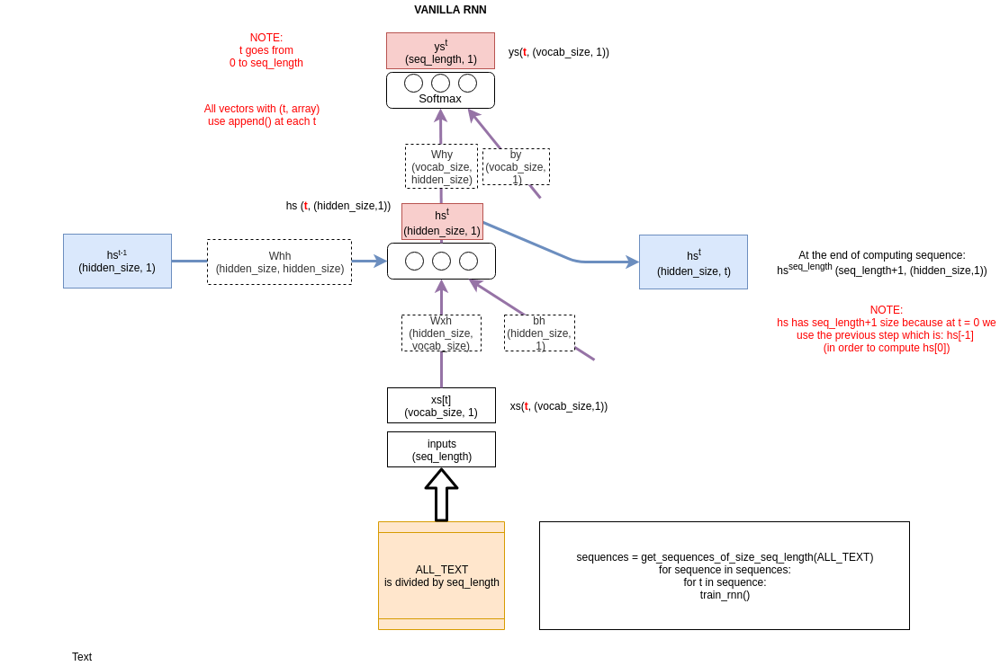

# cs224n NLP

A special note first:

- Dear Xin Rong, thank you for [wevi: word embedding visual inspector](https://ronxin.github.io/wevi/), it is very visual and useful for understanding. Rest in peace, Xin Rong.

Another special note:

- We will use the amazing work made by [Jay Alammar](https://jalammar.github.io/).
This man has the incredible faculty to make things visual an understandable.

## Notation

capital Z is a normalization term that is used to turn things into probabilities.

- o: context word
- c: center word
- $u_o$: vector for context word o
- $v_c$: vector for center word c
- $u_o^T \cdot v_c$: Dot product compares similarity of o and c. Similarity means vector loking the same. Similar vectors means similar meanings of the words.

## Infos to memorize

More data helps, Wikipedia is better than news texts.
Furthermore Wikipedia quality his better: Wikipedia explains concepts so it makes it a quality dataset to build word vectors (searching for concepts).

## Python

[<a href="../cs224n_course/python-review.pdf">Python review</a>]

## Introduction and Word Vectors

Xin Rong, wevi-slides: http://bit.ly/wevi-slides

- [<a href="../cs224n_course/cs224n-2019-lecture01-wordvecs1.pdf">slides</a>]
- [<a href="https://youtu.be/8rXD5-xhemo">video</a>]
- [<a href="../cs224n_course/cs224n-2019-notes01-wordvecs1.pdf">notes</a>]

Gensim word vectors example:

- [<a href="../cs224n_course/materials/Gensim word vector visualization.ipynb">code ipynb</a>]
- [<a href="../cs224n_course/materials/Gensim%20word%20vector%20visualization.html">preview ipynb in html</a>]
- [<a href="https://youtu.be/8rXD5-xhemo?t=4461">Code demo on youtube</a>]

Suggested Readings:

- <a href="http://mccormickml.com/2016/04/19/word2vec-tutorial-the-skip-gram-model/">Word2Vec Tutorial - The Skip-Gram Model</a>
- <a href="http://arxiv.org/pdf/1301.3781.pdf">Efficient Estimation of Word Representationsin Vector Space</a>(original word2vec paper)
- <a href="http://papers.nips.cc/paper5021-distributed-representations-of-words-and-phrases-and-their-compositionalitypdf">Distributed Representations of Words and Phrases and their Compositionality</a>(negative sampling paper)

Assignment 1:

- [<a href="assignments/a1.zip">code</a>]
- [<a href="assignments/a1_preview/exploring_word_vectors.html">preview</a>]

## Word Vectors 2 and Word Senses

- [<a href="../cs224n_course/cs224n-2019-lecture02-wordvecs2.pdf">slides</a>]
- [<a href="https://youtu.be/kEMJRjEdNzM">video</a>]
- [<a href="../cs224n_course/cs224n-2019-notes02-wordvecs2.pdf">notes</a>]

Suggested Readings:

- <a href="../cs224n_course/glove.pdf">GloVe: Global Vectors for Word Representation  (original GloVe paper)</a>
- <a href="http://www.aclweb.org/anthology/Q15-1016">Improving Distributional Similarity with Lessons Learned from Word Embeddings</a>
- <a href="http://www.aclweb.org/anthology/D15-1036">Evaluation methods for unsupervised word embeddings</a>

Additional Readings:

- <a href="http://aclweb.org/anthology/Q16-1028">A Latent Variable Model Approach to PMI-based Word Embeddings</a>
- <a href="https://transacl.org/ojs/index.php/tacl/article/viewFile/1346/320">Linear Algebraic Structure of Word Senses, with Applications to Polysemy</a>
- <a href="https://papers.nips.cc/paper/7368-on-the-dimensionality-of-word-embedding.pdf">On the Dimensionality of Word Embedding.</a>

## Word Window Classification, Neural Networks, and Matrix Calculus

- [<a href="../cs224n_course/cs224n-2019-lecture03-neuralnets.pdf">slides</a>]
- [<a href="https://youtu.be/8CWyBNX6eDo">video</a>]
- [<a href="../cs224n_course/gradient-notes.pdf">matrix calculus notes</a>]
- [<a href="../cs224n_course/cs224n-2019-notes03-neuralnets.pdf">notes (lectures 3 and 4)</a>]

Suggested Readings:

- <a href="http://cs231n.github.io/optimization-2/">CS231n notes on backprop</a>
- <a href="../cs224n_course/review-differential-calculus.pdf">Review of differential calculus</a>

Additional Readings:

- <a href="http://www.jmlr.org/papers/volume12/collobert11a/collobert11a.pdf">Natural Language Processing (Almost) from Scratch</a>

Assignment 2:

- [<a href="assignments/a2.zip">code</a>]
- [<a href="assignments/a2.pdf">handout</a>]

## Backpropagation and Computation Graphs

- [<a href="../cs224n_course/cs224n-2019-lecture04-backprop.pdf">slides</a>]
- [<a href="https://youtu.be/yLYHDSv-288">video</a>]
- [<a href="../cs224n_course/cs224n-2019-notes03-neuralnets.pdf">notes (lectures 3 and 4)</a>]

Suggested Readings:

- <a href="http://cs231n.github.io/neural-networks-1/">CS231n notes on network architectures</a>
- <a href="http://www.iro.umontreal.ca/~vincentp/ift3395/lectures/backprop_old.pdf">Learning Representations by Backpropagating - Errors</a>
- <a href="http://cs231n.stanford.edu/handouts/derivatives.pdf">Derivatives, Backpropagation, and Vectorization</a>
- <a href="https://medium.com/@karpathy/yes-you-should-understand-backprop-e2f06eab496b">Yes you should understand backprop</a>

## Linguistic Structure: Dependency Parsing

- [<a href="../cs224n_course/cs224n-2019-lecture05-dep-parsing.pdf">slides</a>]
- [<a href="../cs224n_course/cs224n-2019-lecture05-dep-parsing-scrawls.pdf">scrawled-on slides</a>]
- [<a href="https://youtu.be/nC9_RfjYwqA">video</a>]
- [<a href="../cs224n_course/cs224n-2019-notes04-dependencyparsing.pdf">notes</a>]

Suggested Readings:

- <a href="https://www.aclweb.org/anthology/W/W04/W04-0308.pdf">Incrementality in Deterministic Dependency Parsing</a>
- <a href="http://cs.stanford.edu/people/danqi/papers/emnlp2014.pdf">A Fast and Accurate Dependency Parser using Neural Networks</a>
- <a href="http://www.morganclaypool.com/doi/abs/10.2200/S00169ED1V01Y200901HLT002">Dependency Parsing</a>
- <a href="https://arxiv.org/pdf/1603.06042.pdf">Globally Normalized Transition-Based Neural Networks</a>
- <a href="http://nlp.stanford.edu/~manning/papers/USD_LREC14_UD_revision.pdf">Universal Stanford Dependencies: A cross-linguistic - typology</a>
- <a href="http://universaldependencies.org/">Universal Dependencies website</a>

Assignment 3:

- [<a href="assignments/a3.zip">code</a>]
- [<a href="assignments/a3.pdf">handout</a>]

## The probability of a sentence? Recurrent Neural Networks and Language Models

- [<a href="../cs224n_course/cs224n-2019-lecture06-rnnlm.pdf">slides</a>]
- [<a href="https://youtu.be/iWea12EAu6U">video</a>]
- [<a href="../cs224n_course/cs224n-2019-notes05-LM_RNN.pdf">notes (lectures 6 and 7)</a>]

[min-char-rnn.py](cs224n/min-char-rnn.py)
See also coursera exam: Building a Recurrent Neural Network - Step by Step

Suggested Readings:

- <a href="https://web.stanford.edu/~jurafsky/slp3/3.pdf">N-gram Language Models</a> (textbook chapter)
- <a href="http://karpathy.github.io/2015/05/21/rnn-effectiveness/">The Unreasonable Effectiveness of Recurrent Neural Networks</a> - (blog post overview)
- <a href="http://www.deeplearningbook.org/contents/rnn.html">Sequence Modeling: Recurrent and Recursive Neural Nets</a> (Sections - 10.1 and 10.2)
- <a href="http://norvig.com/chomsky.html">On Chomsky and the Two Cultures of Statistical Learning</a>

## Vanishing Gradients and Fancy RNNs

- [<a href="../cs224n_course/cs224n-2019-lecture07-fancy-rnn.pdf">slides</a>]
- [<a href="https://youtu.be/QEw0qEa0E50">video</a>]
- [<a href="../cs224n_course/cs224n-2019-notes05-LM_RNN.pdf">notes (lectures 6 and 7)</a>]

Suggested Readings:

- <a href="http://www.deeplearningbook.org/contents/rnn.html">Sequence Modeling: Recurrent and Recursive Neural Nets</a> (Sections - 10.3, 10.5, 10.7-10.12)
- <a href="http://ai.dinfo.unifi.it/paolo//ps/tnn-94-gradient.pdf">Learning long-term dependencies with gradient descent is difficult</- a> (one of the original vanishing gradient papers)
- <a href="https://arxiv.org/pdf/1211.5063.pdf">On the difficulty of training Recurrent Neural Networks</a> (proof of vanishing - gradient problem)
- <a href="https://web.stanford.edu/class/archive/cs/cs224n/cs224n.1174/lectures/vanishing_grad_example.html">Vanishing Gradients - Jupyter Notebook</a> (demo for feedforward networks)
- <a href="http://colah.github.io/posts/2015-08-Understanding-LSTMs/">Understanding LSTM Networks</a> (blog post overview)

Assignment 4:

- [<a href="assignments/a4.zip">code</a>]
- [<a href="assignments/a4.pdf">handout</a>]
- [<a href="https://docs.google.com/document/d/1MHaQvbtPkfEGc93hxZpVhkKum1j_F1qsyJ4X0vktUDI/edit">Azure Guide</a>]
- [<a href="https://docs.google.com/document/d/1z9ST0IvxHQ3HXSAOmpcVbFU5zesMeTtAc9km6LAPJxk/edit">Practical Guide to VMs</a>]

## Machine Translation, Seq2Seq and Attention

- [<a href="../cs224n_course/cs224n-2019-lecture08-nmt.pdf">slides</a>]
- [<a href="https://youtu.be/XXtpJxZBa2c">video</a>]
- [<a href="../cs224n_course/cs224n-2019-notes06-NMT_seq2seq_attention.pdf">notes</a>]

Suggested Readings:

- <a href="https://web.stanford.edu/class/archive/cs/cs224n/cs224n.1162/syllabus.shtml">Statistical Machine Translation slides, CS224n - 2015</a> (lectures 2/3/4)
- <a href="https://www.cambridge.org/core/books/statistical-machine-translation/94EADF9F680558E13BE759997553CDE5">Statistical Machine - Translation</a> (book by Philipp Koehn)
- <a href="https://www.aclweb.org/anthology/P02-1040.pdf">BLEU</a> (original paper)
- <a href="https://arxiv.org/pdf/1409.3215.pdf">Sequence to Sequence Learning with Neural Networks</a> (original seq2seq NMT paper)
- <a href="https://arxiv.org/pdf/1211.3711.pdf">Sequence Transduction with Recurrent Neural Networks</a> (early seq2seq speech - recognition paper)
- <a href="https://arxiv.org/pdf/1409.0473.pdf">Neural Machine Translation by Jointly Learning to Align and Translate</a> (original - seq2seq+attention paper)
- <a href="https://distill.pub/2016/augmented-rnns/">Attention and Augmented Recurrent Neural Networks</a> (blog post overview)
- <a href="https://arxiv.org/pdf/1703.03906.pdf">Massive Exploration of Neural Machine Translation Architectures</a> (practical advice for hyperparameter choices)

## Practical Tips for Final Projects

- [<a href="../cs224n_course/cs224n-2019-lecture09-final-projects.pdf">slides</a>]
- [<a href="https://youtu.be/fyqm8fRDgl0">video</a>]
- [<a href="../cs224n_course/final-project-practical-tips.pdf">notes</a>]

Suggested Readings:

- <a href="https://www.deeplearningbook.org/contents/guidelines.html">Practical Methodology</a> (<i>Deep Learning</i> book chapter)

## Question Answering and the Default Final Project

- [<a href="../cs224n_course/cs224n-2019-lecture10-QA.pdf">slides</a>]
- [<a href="https://youtu.be/yIdF-17HwSk">video</a>]
- [<a href="../cs224n_course/cs224n-2019-notes07-QA.pdf">notes</a>]

Project Proposal:

- [<a href="project/project-proposal-instructions.pdf">instructions</a>]

Default Final Project

- [<a href="project/default-final-project-handout.pdf">handout</a>]
- [<a href="https://github.com/chrischute/squad">code</a>]

## ConvNets for NLP

- [<a href="../cs224n_course/cs224n-2019-lecture11-convnets.pdf">slides</a>]
- [<a href="https://youtu.be/EAJoRA0KX7I">video</a>]
- [<a href="../cs224n_course/cs224n-2019-notes08-CNN.pdf">notes</a>]

Suggested Readings:

- <a href="https://arxiv.org/abs/1408.5882">Convolutional Neural Networks for Sentence Classification</a>
- <a href="https://arxiv.org/pdf/1404.2188.pdf">A Convolutional Neural Network for Modelling Sentences</a>

## Information from parts of words: Subword Models

- [<a href="../cs224n_course/cs224n-2019-lecture12-subwords.pdf">slides</a>]
- [<a href="https://youtu.be/9oTHFx0Gg3Q">video</a>]

Suggested readings:

- Minh-Thang Luong and Christopher Manning. <a href="https://arxiv.org/abs/1604.00788">Achieving Open Vocabulary Neural Machine Translation with Hybrid Word-Character Models</a>

Assignment 5

- [<a href="https://stanford.box.com/s/t4nlmcc08t9k6mflz6sthjlmjs7lip6p">original code (requires Stanford login)</a> / <a href="assignments/a5_public.zip">public version</a>]
- [<a href="assignments/a5.pdf">handout</a>]

## Modeling contexts of use: Contextual Representations and Pretraining

- [<a href="../cs224n_course/cs224n-2019-lecture13-contextual-representations.pdf">slides</a>]
- [<a href="https://youtu.be/S-CspeZ8FHc">video</a>]

Suggested readings:

- Smith, Noah A. <a href="https://arxiv.org/abs/1902.06006">Contextual Word Representations: A Contextual Introduction</a>. (Published just in time for this lecture!)
- <a href="http://jalammar.github.io/illustrated-bert/">The Illustrated BERT, ELMo, and co.</a>

## Transformers and Self-Attention For Generative Models

- (guest lecture by <a href="https://ai.google/research/people/AshishVaswani">Ashish Vaswani</a> and <a href="https://ai.google/research/people/105787">Anna Huang</a>)
- [<a href="../cs224n_course/cs224n-2019-lecture14-transformers.pdf">slides</a>]
- [<a href="https://youtu.be/5vcj8kSwBCY">video</a>]

Suggested readings:

- <a href="https://arxiv.org/pdf/1706.03762.pdf">Attention is all you need</a>
- <a href="https://arxiv.org/pdf/1802.05751.pdf">Image Transformer</a>
- <a href="https://arxiv.org/pdf/1809.04281.pdf">Music Transformer: Generating music with long-term structure</a>

## Project Milestone

- [<a href="project/project-milestone-instructions.pdf">instructions</a>]

## Natural Language Generation

- [<a href="../cs224n_course/cs224n-2019-lecture15-nlg.pdf">slides</a>]
- [<a href="https://youtu.be/4uG1NMKNWCU">video</a>]

## Reference in Language and Coreference Resolution

- [<a href="../cs224n_course/cs224n-2019-lecture16-coref.pdf">slides</a>]
- [<a href="https://youtu.be/i19m4GzBhfc">video</a>]

## Multitask Learning: A general model for NLP? 

- (guest lecture by <a href="https://www.socher.org/">Richard Socher</a>)
- [<a href="../cs224n_course/cs224n-2019-lecture17-multitask.pdf">slides</a>]
- [<a href="https://youtu.be/M8dsZsEtEsg">video</a>]

## Constituency Parsing and Tree Recursive Neural Networks

- [<a href="../cs224n_course/cs224n-2019-lecture18-TreeRNNs.pdf">slides</a>]
- [<a href="https://youtu.be/6Z4A3RSf-HY">video</a>]
- [<a href="../cs224n_course/cs224n-2019-notes09-RecursiveNN_constituencyparsing.pdf">notes</a>]

Suggested Readings:

- <a href="http://www.aclweb.org/anthology/P13-1045">Parsing with Compositional Vector Grammars.</a>
- <a href="https://arxiv.org/pdf/1805.01052.pdf">Constituency Parsing with a Self-Attentive Encoder</a>

## Safety, Bias, and Fairness

- (guest lecture by <a href="http://www.m-mitchell.com/">Margaret Mitchell</a>)
- [<a href="../cs224n_course/cs224n-2019-lecture19-bias.pdf">slides</a>]
- [<a href="https://youtu.be/XR8YSRcuVLE">video</a>]

## Future of NLP + Deep Learning

- [<a href="../cs224n_course/cs224n-2019-lecture20-future.pdf">slides</a>]
- [<a href="https://youtu.be/3wWZBGN-iX8">video</a>]

## Final Project Report

- [<a href="project/project-report-instructions.pdf">instructions</a>]
- [<a href="project/project-postervideo-instructions.pdf">postervideo instructions</a>]
