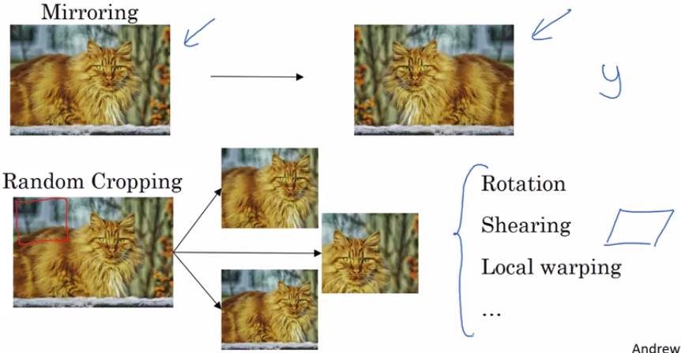
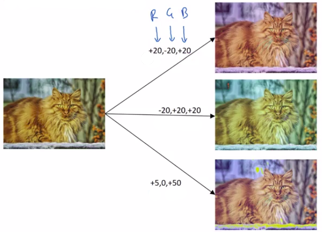
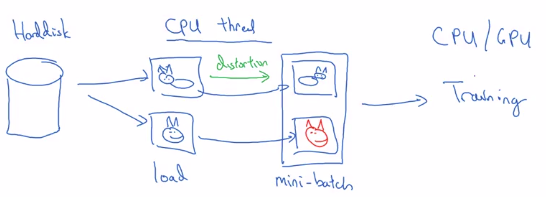

# Data Augmentation

when you're training in computer vision model, often data augmentation will help. And this is true whether you're using transfer learning or using someone else's pre-trained ways to start, or whether you're trying to train something yourself from scratch.

## Mirroring

Perhaps the simplest data augmentation method is mirroring on the vertical axis, where if you have this example in your training set, you flip it horizontally to get that image on the right.

## Random cropping

Random cropping: You take a part of the original image and create a new image with it.

So random cropping isn't a perfect data augmentation. What if you randomly end up taking that crop which will look much like a cat but in practice and worthwhile so long as your random crops are reasonably large subsets of the actual image.

## Rotation/shearing/warping

- Rotation of the image
- Shearing of the image
- Local warping
- ...

In practice they are used a bit less (perhaps because of their complexity).

## Color shifting

Given a picture, let's say you add to the RGB channels different distortions. 

In this example we are adding to the red and blue channels and subtracting from the green channel.

For illustration purposes, I'm making somewhat dramatic changes to the colors and practice, you draw RGB from some distribution that could be quite small as well.

### Color shifting with PCA

One of the ways to implement color distortion uses an algorithm called PCA: **Principles Component Analysis**. 

The details of this are actually given in the AlexNet paper, and sometimes called PCA Color Augmentation.

But the rough idea is for example: 

- If your image is mainly purple(mainly red and blue tints), and very little green
- Then PCA Color Augmentation, will add and subtract a lot to red and blue, and relatively little to the green.

## Implementing distortions during training

Use a CPU thread to load and transform your images before sending it to training.

## What you can do

And similar to other parts of training a deep neural network, the data augmentation process also has a few hyperparameters such as how much color shifting do you implement and exactly what parameters you use for random cropping? 

So, similar to elsewhere in computer vision, a good place to get started might be to use someone else's open source implementation for how they use data augmentation.

But of course, if you want to capture more in variances, then you think someone else's open source implementation isn't, it might be reasonable also to use hyperparameters yourself.
