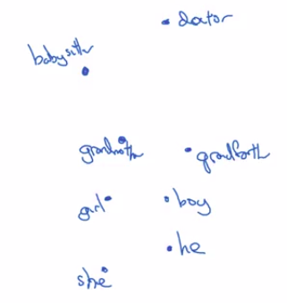

# Debiasing word embedding

Machine learning and AI algorithms are increasingly trusted to help with, or to make, extremely important decisions.

And so we like to make sure that as much as possible that they're free of undesirable forms of bias, such as gender bias, ethnicity bias and so on.

The objective of this lesson is to show you some of the ideas for diminishing or eliminating these forms of bias in word embeddings.

Bias ins this lesson means gender, ethnicity, sexual orientation bias etc.

But mostly the problem, we talked about how word embeddings can learn analogies like man is to woman as king is to queen.

But what if you ask it, man is to computer programmer as woman is to what?

The authors of this paper found a somewhat horrifying result where a learned word embedding might output Man: Computer Programmer as Woman:Homemaker.

Paper: [Man is to Computer Programmer as Woman is to Homemaker? Debiasing Word Embeddings by Tolga Bolukbasi, Kai-Wei Chang, James Zou, Venkatesh Saligrama, Adam Kalai](https://arxiv.org/abs/1607.06520)

And that just seems wrong and it enforces a very unhealthy gender stereotype.

It'd be much more preferable to have algorithm output man is to computer programmer as a woman is to computer programmer.

And they found also, Father: Doctor as Mother is to what?

- And the really unfortunate result: is that some learned word embeddings would output Mother:Nurse.

| Warning | Bias from the text used to train the model |
|---------|----------------------------------|
|  | So word embeddings can reflect the gender, ethnicity, age, sexual orientation, and other biases of the text used to train the model. |

Another example could be socioeconomic status (whether you come from a wealthy family, or a low income family, or anywhere in between.

And because machine learning algorithms are being used to make very important decisions (college admissions, to the way people find jobs, to loan applications, whether your application for a loan gets approved, to in the criminal justice system, even sentencing guidelines etc.):

- then it's important that we try to change learning algorithms to diminish as much as is possible
- or ideally, eliminate these types of undesirable biases.

## Example with gender bias

And so how do you identify the direction corresponding to the bias?

| 1: Identify gender bias direction |
|-----------------------------------|
| $e_{he} - e_{she}$ |
| $e_{male} - e_{female}$ |
| $e_{boy} - e_{girl}$ |
| ... |

For the case of gender, what we can do is take the embedding vector for he and subtract the embedding vector for she, because that differs by gender.
And take a few of these differences and basically average them. And this will allow you to figure out in this case that what looks like the direction is:

- the bias direction.
- the non-bias direction.

And in this case, the bias direction, think of this as a 1D subspace whereas a non-bias direction, this will be 299-dimensional subspace.

Okay, and I've simplified the description a little bit in the original paper.

The bias direction can be higher than 1-dimensional, and rather than take an average (as we are describing it here),
 it's actually found using a more complicated algorithm called:

- SVU, a singular value decomposition.
  - Which is closely related to: PCA (Principle component analysis)

| 2: Neutralize |
|-----------------------------------|
| For every word that is not definitional, project to get rid of bias. |

There are some words that intrinsically capture gender.

So words like "grandmother", "grandfather", "girl", "boy", "she", "he" a gender is intrinsic in the definition.

Whereas there are other word like doctor and babysitter that we want to be gender neutral like "doctor" or "babysitter" to be sexual orientation neutral.

So for words like "doctor" and "babysitter", let's just project them onto this axis to reduce their components or to eliminate their component, in the bias direction. So reduce their component in this horizontal direction.

| 3: Equalize pairs |
|-----------------------------------|
| For every word that is not definitional, project to get rid of bias. |

And then the final step is called equalization in which you might have pairs of words such as grandmother and grandfather, or girl and boy:

- where you want the only difference in their embedding to be the gender.

And so, why do you want that?

In this example, the distance (or the similarity) :

- between **babysitter <----and----> grandmother** is actually smaller
- than the distance between **babysitter <----and----> grandfather**.

And so this maybe reinforces an undesirable bias that grandmothers end up babysitting more than grandfathers.

So in the final equalization step:

- We want words like grandmother and grandfather have both exactly the same similarity (same distance) from words that should be gender neutral, such as babysitter or doctor.

So there are a few linear algebra steps for that.

But what it will basically do is move grandmother and grandfather to a pair of points that are **equidistant from this axis in the middle**. 

And so the effect of that is that now the distance between babysitter, compared to these two words, will be exactly the same.

And so, in general, there are many pairs of words like this grandmother-grandfather, boy-girl, sorority-fraternity, girlhood-boyhood, sister-brother, niece-nephew, daughter-son, that you might want to carry out through this equalization step.

## What word do we neutralize

So the final detail is, how do you decide what word to neutralize?

So for example, the word doctor seems like a word you should neutralize to make it non-gender-specific or non-ethnicity-specific.

Whereas the words grandmother and grandmother should not be made non-gender-specific.

And there are also words like beard, right, that it's just a statistical fact that men are much more likely to have beards than women, so maybe beards should be closer to male than female.

And so what the authors did is train a classifier to try to figure out what words are definitional, what words should be gender-specific and what words should not be.

And it turns out that **most words in the English language are not definitional**, meaning that gender is not part of the definition.

And so a linear classifier can tell you what words to pass through the neutralization step to project out this bias direction, to project it on to this essentially 299-dimensional subspace.

And then, finally, the number of pairs you want to equalize, that's actually also relatively small, and is, at least for the gender example, it is quite feasible to **hand-pick most of the pairs you want to equalize**.

So the full algorithm is a bit more complicated than I present it here, you can take a look at the paper for the full details: [Man is to Computer Programmer as Woman is to Homemaker? Debiasing Word Embeddings by Tolga Bolukbasi, Kai-Wei Chang, James Zou, Venkatesh Saligrama, Adam Kalai](https://arxiv.org/abs/1607.06520)

