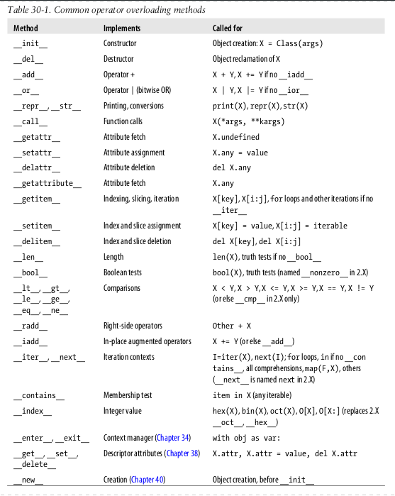

# Deep Learning Programmation Hints


## Common operator overloading methods



## Reminder about inspecting an object

- ```dir([object])```

Without arguments, return the list of names in the current local scope. With an argument, attempt to return a list of valid attributes for that object.

If the object does not provide ```__dir__()```, the function tries its best to gather information from the object’s ```__dict__``` attribute, if defined, and from its type object. The resulting list is not necessarily complete, and may be inaccurate when the object has a custom ```__getattr__()```.

```python
for i in dir(train_dataset):
    print(i)
```

- ```inspect.getmembers(object[, predicate])```

Return all the members of an object in a list of (name, value) pairs sorted by name. If the optional predicate argument is supplied, only members for which the predicate returns a true value are included.

```python
import inspect
for (name, value) in inspect.getmembers(train_dataset):
    print(name, ":\t\t", value)
```

- ```__dict__``` contains the dynamic attributes of an object (Generally ```__dict__``` is supposed to contain user defined attributes).

```python
for name in train_dataset.__dict__.keys():
    print(name, ":\t\t", getattr(train_dataset, name))
```

## Create matrices of different shapes

```python
import numpy as np

a = np.random.randn(19*19, 5, 1)
b = np.random.randn(19*19, 5, 80)
c = a * b # shape of c will be (19*19, 5, 80)
```

## Filter matrices by keeping only the interesting values

you want to filter the values of a matrix that are >= 0.4
The filter will be a matrix of booleans [true,false,true,true ...]
Then you can apply the filter (with tf.boolean_mask) to any matrix of same dimension in order to keep only the corresponding true values of the matrix

```python
import tensorflow as tf

filtering_mask = box_class_scores>=0.4

scores = tf.boolean_mask(box_class_scores, filtering_mask)
boxes = tf.boolean_mask(boxes, filtering_mask)
classes = tf.boolean_mask(box_classes, filtering_mask)
```

## Return value if positive otherwise return 0

```python
max(value,0)
```

## Apply a function to everything in a list

```python
list1 = ["1","10","3","22","23","4","2","200"]
# Apply a function to everything in a list
list1 = [int(x) for x in list1]
list1.sort()

print(list1)
# [1, 2, 3, 4, 10, 22, 23, 200]
```

## argmax(): Returns the indices of the maximum values along an axis

```python
# Step 1: Create the one-hot vector x for the first character (initializing the sequence generation). (≈1 line)
x = np.zeros((vocab_size, 1))

test = [np.array([[0, 2, 6, 4]], dtype=np.float32),
        np.array([[1, 5, 3, 4]], dtype=np.float32)]

# axis = 0: means first axis (rows)
# axis = 1: means second axis (columns)
# etc
# axis = -1: means last axis
# axis = -2: means axist previous to the last axis
# etc

# numpy.argmax(a, axis=None, out=None)[source]
# Returns the indices of the maximum values along an axis.
indices = np.argmax(test[0], axis=-1)
```

## flatten

### flatten(): Return a copy of the array collapsed into one dimension

```python
test = np.array([[0, 2, 6, 4],[0, 2, 6, 4],[0, 2, 6, 4],[0, 2, 6, 4]], dtype=np.float32)
print('original:')
print(test)
print('flatten:')
print(test.flatten())

# original:
# [[0. 2. 6. 4.]
#  [0. 2. 6. 4.]
#  [0. 2. 6. 4.]
#  [0. 2. 6. 4.]]
# 
# flatten:
# [0. 2. 6. 4. 0. 2. 6. 4. 0. 2. 6. 4. 0. 2. 6. 4.]
```

### ravel(): Return a contiguous flattened array

```python
import numpy as np

y = softmax(z)
p = y.ravel()
idx = np.random.choice(list(range(vocab_size)), p=p)
```

## Clip(): Limit the values in an array

```python
# for truc in [a, b, c, d]:
    print(truc.shape)
    np.clip(truc, 1, 3, out=truc)

print([a, b, c, d])
```

## Mutable and immutables objects

```python
# There is no way to change the value of an immutable object inside a function
#
# Usually the workaround are:
# - to simply return the object that you want:
# - to pass the variable in a container which can be mutated (list for example). But this is ugly/clumsy at best, but you're not going to do any better in Python.

# list, set and dictionnary are mutable objects
# If you pass a mutable object into a method, the method gets a reference to that same object and you can mutate it to your heart's delight,
# but if you rebind the reference in the method, the outer scope will know nothing about it,
# and after you're done, the outer reference will still point at the original object.

def try_to_change_list_contents(the_list):
    print('got', the_list)
    the_list.append('four')
    print('changed to', the_list)


def try_to_change_list_reference(the_list):
    print('got', the_list)
    the_list = ['and', 'we', 'can', 'not', 'lie']
    print('set to', the_list)


outer_list = ['one', 'two', 'three']

print('contents: before, outer_list =', outer_list)
try_to_change_list_contents(outer_list)
print('contents: after, outer_list =', outer_list)


print('reference: before, outer_list =', outer_list)
try_to_change_list_reference(outer_list)
print('reference: after, outer_list =', outer_list)

# Output
# contents: before, outer_list = ['one', 'two', 'three']
# got ['one', 'two', 'three']
# changed to ['one', 'two', 'three', 'four']
# contents: after, outer_list = ['one', 'two', 'three', 'four']
# reference: before, outer_list = ['one', 'two', 'three', 'four']
# got ['one', 'two', 'three', 'four']
# set to ['and', 'we', 'can', 'not', 'lie']
# reference: after, outer_list = ['one', 'two', 'three', 'four']

print("---------------")
# String - an immutable type. We cannot us append()
# It's immutable, so there's nothing we can do to change the contents of the string
def try_to_change_string_reference(the_string):
    print('got', the_string)
    the_string = 'In a kingdom by the sea'
    print('set to', the_string)


outer_string = 'It was many and many a year ago'

print('before, outer_string =', outer_string)
try_to_change_string_reference(outer_string)
print('after, outer_string =', outer_string)

# before, outer_string = It was many and many a year ago
# got It was many and many a year ago
# set to In a kingdom by the sea
# after, outer_string = It was many and many a year ago

# How do we get around this?
# You could return the new value. This doesn't change the way things are passed in, but does let you get the information you want back out:
def return_a_whole_new_string(the_string):
    new_string = something_to_do_with_the_old_string(the_string)
    return new_string

my_string = return_a_whole_new_string(my_string)
```

## isinf(): Test element-wise for positive or negative infinity.

```python
myvalues[np.isinf(myvalues)] = 0

# All infinite values in the array are now equal to 0

```

## Diagonal matrices and sparse matrices

### eye(): Sparse matrix with ones on diagonal

```python
import scipy.sparse as sp

sparsematrix = sp.eye(5,5)
print('\n', sparsematrix.todense())

sparsematrix = sp.eye(5,4)
print('\n', sparsematrix.todense())

# [[1. 0. 0. 0. 0.]
# [0. 1. 0. 0. 0.]
# [0. 0. 1. 0. 0.]
# [0. 0. 0. 1. 0.]
# [0. 0. 0. 0. 1.]]
#
# [[1. 0. 0. 0.]
# [0. 1. 0. 0.]
# [0. 0. 1. 0.]
# [0. 0. 0. 1.]
# [0. 0. 0. 0.]]
```

### diags(): Construct a diagonal sparse matrix from an array of values and filled with 0

Origin: [11,13,55,54,28]

Result: $\begin{bmatrix}11&0&0&0&0\\0&13&0&0&0\\0&0&55&0&0\\0&0&0&54&0\\0&0&0&0&28\\\end{bmatrix}$

```python
import scipy.sparse as sp

sparsematrix = sp.diags([11,13,55,54,28])
print(sparsematrix.toarray())

# [[11.  0.  0.  0.  0.]
#  [ 0. 13.  0.  0.  0.]
#  [ 0.  0. 55.  0.  0.]
#  [ 0.  0.  0. 54.  0.]
#  [ 0.  0.  0.  0. 28.]]
```

### csr_matrix: Compressed Sparse Row matrix

```python
print(sp.csr_matrix((data, (row, col)), shape=(3, 3)).toarray())
print('\ncsr_matrix print format is: (row, col)\tcell_value')
print(sp.csr_matrix((data, (row, col)), shape=(3, 3)))

# [[1 0 2]
#  [0 0 3]
#  [4 5 6]]
#
# csr_matrix print format: (row, col)	cell_value
#   (0, 0)	1
#   (0, 2)	2
#   (1, 2)	3
#   (2, 0)	4
#   (2, 1)	5
#   (2, 2)	6
```