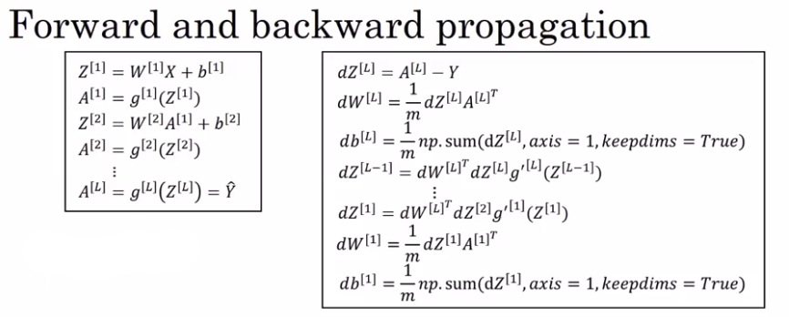

# Deep Neural Networks

## Deep L-Layer neural network

| Notation   | Meaning                       | Example above                                                      |
|------------|-------------------------------|--------------------------------------------------------------------|
|  L         | Number of layers              | L=4                                                                |
| $n^{[l]}$  | Number of units in layer $l$  | $n^{[0]}=n_{x}=3,n^{[1]}=5,n^{[2]}=5,n^{[3]}=3,n^{[4]}=n^{[l]}=1$  |
| $a^{[l]}$  | Activations in layer $l$      | $a^{[l]}=g^{[l]}(z^{[l]})$                                         |
| $W^{[l]}$  | Weights in layer $l$          |                                                                    |

## Forward Propagation in a Deep Network

### Forward propagation general rule for m inputs:

|                                    |
|------------------------------------|
| $Z^{[l]}=W^{[l]}A^{[l-1]}+b^{[l]}$ |
| $A^{[l]}=g^{[l]}(Z^{[l]})$ |

## Getting your matrix dimensions right

### Not vectorized

$W^{[l]}:(n^{[l]}, n^{[l-1]})$

$b^{[l]}:(n^{[l]}, 1)$

$dW^{[l]}:(n^{[l]}, n^{[l-1]})$

$db^{[l]}:(n^{[l]}, 1)$

$W^{[l]}:(n^{[l]}, n^{[l-1]})$

$Z^{[l]}:g^{[l]}(a^{[l]})$

### Vectorized

m is the number of training examples

$X:(n^{[0]}, m)$

$W^{[l]}:(n^{[l]}, n^{[l-1]})$

$b^{[l]}:(n^{[l]}, 1)$ but with broadcasting it will be $(n^{[l]}, m)$ during calculus.

$Z^{[l]},A^{[l]}: (n^{[l]}, m)$ with the exception when l=0

$A^{[0]}: (n^{[0]}, m)$

$dZ^{[l]},dA^{[l]}: (n^{[l]}, m)$ with the exception when l=0

## Why deep representations?

THE DEEPER THE NN THE MORE COMPLEX THINGS ARE DONE.
For example: First layer find image edges and last layer recognize face

In a shallow NN the first layer would be hudge.
## Building blocks of deep neural networks

## Forward and backward functions

### Forward propagation layer l

Non vectorized version:

Vectorized version:

$dZ^{[l]}=dA^{[l]}*g'^{[l]}(Z^{[l]})$

$dW^{[l]}=\frac{1}{m}dZ^{[l]}.A^{[l-1]T}$

$db^{[l]}=\frac{1}{m}np.sum(dZ^{[l]},axis=1,keepdims=True)$

$dA^{[l-1]}=W^{[l]T}.dZ^{[l]}$

#### Summary

$da^{[l]}=-\frac{y}{a}+\frac{1-y}{1-a}$

Vectorized version:

$dA^{[l]}=(-\frac{y{[1]}}{a{[1]}}+\frac{1-y{[1]}}{1-a{[1]}}\cdots-\frac{y{[m]}}{a{[m]}}+\frac{1-y{[m]}}{1-a{[m]}})$

----

----

## Parameters vs Hyperparameters

Parameters: 

$W^{[1]}, b^{[1]}, W^{[2]}, b^{[1]}, W^{[3]}, b^{[3]}\cdots$

Hyperparameters:

* Learning rate $\alpha{}$
* Number of Iterations
* Number of hidden layers L
* Number of hidden units $n^{[1]}, n^{[2]}, \cdots$
* Choice of activation function
* Momentum
* Minibatch size
* Various forms of regularization parameters

You have to try values to find the best hyperparameters values.

## Quizz

