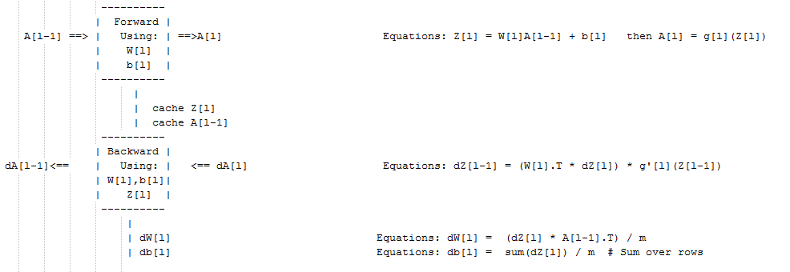

### Gradient descent for Neural Networks

- In this section we will have the full back propagation of the neural network (Just the equations with no explanations).
- Gradient descent algorithm:
  - NN parameters:
    - `n[0] = Nx`
    - `n[1] = NoOfHiddenNeurons`
    - `n[2] = NoOfOutputNeurons = 1`
    - `W1` shape is `(n[1],n[0])`
    - `b1` shape is `(n[1],1)`
    - `W2` shape is `(n[2],n[1])`
    - `b2` shape is `(n[2],1)`
  - Cost function `I =  I(W1, b1, W2, b2) = (1/m) * Sum(L(Y,A2))`
  - Then Gradient descent:

    ```
    Repeat:
    		Compute predictions (y'[i], i = 0,...m)
    		Get derivatives: dW1, db1, dW2, db2
    		Update: W1 = W1 - LearningRate * dW1
    				b1 = b1 - LearningRate * db1
    				W2 = W2 - LearningRate * dW2
    				b2 = b2 - LearningRate * db2
    ```

- Forward propagation:

  ```
  Z1 = W1A0 + b1    # A0 is X
  A1 = g1(Z1)
  Z2 = W2A1 + b2
  A2 = Sigmoid(Z2)      # Sigmoid because the output is between 0 and 1
  ```

- Backpropagation (derivations):   
  ```
  dZ2 = A2 - Y      # derivative of cost function we used * derivative of the sigmoid function
  dW2 = (dZ2 * A1.T) / m
  db2 = Sum(dZ2) / m
  dZ1 = (W2.T * dZ2) * g'1(Z1)  # element wise product (*)
  dW1 = (dZ1 * A0.T) / m   # A0 = X
  db1 = Sum(dZ1) / m
  # Hint there are transposes with multiplication because to keep dimensions correct
  ```

### Random Initialization


- If we initialize all the weights with zeros in NN it won't work (initializing bias b with zero is OK):
  - all hidden units will be completely identical (symmetric) - compute exactly the same function
  - on each gradient descent iteration all the hidden units will always update the same

- To solve this we initialize the W's with a small random numbers:

```python
W1 = np.random.randn((2,2)) * 0.01    # 0.01 to make it small enough
b1 = np.zeros((2,1))                  # its ok to have b as zero, it won't get us to the symmetry breaking problem
```

- We need small values because in sigmoid (or tanh), for example, if the weight is too large you are more likely to end up even at the very start of training with very large values of Z. Which causes your tanh or your sigmoid activation function to be saturated, thus slowing down learning. If you don't have any sigmoid or tanh activation functions throughout your neural network, this is less of an issue.

- Constant 0.01 is alright for 1 hidden layer networks, but if the NN is deep this number can be changed but it will always be a small number.

## Deep Neural Networks

### Deep L-layer neural network

- **Shallow NN is a NN with one or two layers.**
- **Deep NN is a NN with three or more layers.**
- We will use the notation `L` to denote the number of layers in a NN.
- $n^{[l]}$ is the number of neurons in a specific layer `l`.
- $n^{[0]}$ denotes the number of neurons in the input layer. $n^{[L]}$ denotes the number of neurons in the  output layer.
- $g^{[l]}$ is the activation function.
- $a^{[l]} = g^{[l]}(z^{[l]})$
- $w^{[l]}$ weights is used for $z^{[l]}$
- $x = a^{[0]}$, $y = a^{[L]}$

### Forward Propagation in a Deep Network

- Forward propagation general rule for one input:

|                                        |
|----------------------------------------|
| $z^{[l]} = W^{[l]}a^{[l-1]} + b^{[l]}$ |
| $a^{[l]} = g^{[l]}(a^{[l]})$ |


- Forward propagation general rule for `m` inputs:

|                                        |
|----------------------------------------|
| $Z^{[l]} = W^{[l]}A^{[l-1]} + b^{[l]}$ |
| $A^{[l]} = g^{[l]}(Z^{[l]})$ |

### Getting your matrix dimensions right

- The best way to debug your matrices dimensions is by a pencil and paper.
- Dimension of W is $(n^{[l]},n^{[l-1]})$. Can be thought by right to left.
- Dimension of b is $(n^{[l]},1)$
- dw has the same shape as W, while db is the same shape as b
- Dimension of $Z^{[l]}$, $A^{[l]}$, $dZ^{[l]}$, and $dA^{[l]}$  is $(n^{[l]},m)$


## Caching values

During **forward propagation** we keep the values of $Z^{[l]}$ and $A^{[l]}$ so we can use them to calculate derivatives during the **backward propagation**.



### Forward and Backward Propagation

- Pseudo code for forward propagation for layer l:

```
Input  A[l-1]
Z[l] = W[l]A[l-1] + b[l]
A[l] = g[l](Z[l])
Output A[l], cache(Z[l])
```

- Pseudo  code for back propagation for layer l:

```
Input da[l], Caches
dZ[l] = dA[l] * g'[l](Z[l])
dW[l] = (dZ[l]A[l-1].T) / m
db[l] = sum(dZ[l])/m                # Dont forget axis=1, keepdims=True
dA[l-1] = w[l].T * dZ[l]            # The multiplication here are a dot product.
Output dA[l-1], dW[l], db[l]
```

- If we have used our loss function then:

$dA^{[L]} = (-(y/a) + ((1-y)/(1-a)))$


## Extra: Ian Goodfellow interview

- Ian is one of the world's most visible deep learning researchers.
- Ian is mainly working with generative models. He is the creator of GANs.
- We need to stabilize GANs. Stabilized GANs can become the best generative models.
- Ian wrote the first textbook on the modern version of deep learning with Yoshua Bengio and Aaron Courville.
- Ian worked with [OpenAI.com](https://openai.com/) and Google on ML and NN applications.
- Ian tells all who wants to get into AI to get a Ph.D. or post your code on Github and the companies will find you.
- Ian thinks that we need to start anticipating security problems with ML now and make sure that these algorithms are secure from the start instead of trying to patch it in retroactively years later.