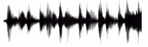
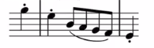
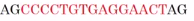

# Different types of RNNs

## Why different types of RNNs

So far, you've seen an RNN architecture where the number of inputs, $T_{x}$, is equal to the number of outputs, $T_{y}$.

For other applications, Tx and Ty may not always be the same.

| Type                    | Input X | Output Y |
|-------------------------|---------|----------|
| Speech recognition      |  | The quick brown fox jumped ofver the lazy dog. |
| Music generation      | Empty set, or it can be a single integer, maybe referring to the genre of music you want to generate or maybe the first few notes of the piece of music you want.        |  |
| Sentiment classification      | "There is nothing to like in this movie" |  |
| DNA analysis      | AGCCCCTGTGAGGAACTAG |  |
| Machine translation | "Voulez-vous chanter avec moi?" | "Do you want to sing with me?" |
| Video activity recognition |  | Running |
| Name entity recognition | Yesterday Harry Potter met Hermione Granger. | Yesterday **Harry Potter** met **Hermione Granger**. |

Some differences:

| Example                 | Difference            |
|-------------------------|--------------------|
| Music generation | **Tx can be length one or even an empty set** |
| Sentiment classification | **The output y could be just an integer from 1 to 5** and **The input x is a sequence** |
| Entity recognition | **The input length and the output length are identical** |
| Machine translation | **Input and output can be different** (2 different number of words) |

We then need different architectures to adress these different problems.

This course about how to address all of these problems is inspired by a blog post by **Andrej Karpathy** titled: [The Unreasonable Effectiveness of Recurrent Neural Networks](https://karpathy.github.io/2015/05/21/rnn-effectiveness/).

| Architectures summary    |
|--------------------------|
|  |

### One to many 1

| One to many (Music generation) |
|--------------|
| - x could be maybe just an integer telling what genre of music you want  - or what is the first note of the music you want  - or if you don't want to input anything, x could be a null input or could be vector zeroes. |
| y = notes of a musical piece |
| **Architecture 1** |
|  |
| **Architecture 2** When you're actually generating sequences, often you take these first synthesized output and feed it to the next layer as well |
|  |

### Many to one

| Many to one (Sentiment classification) |
|--------------|
| $X=Text$ |
| $y=0/1$ (positive/negative review)   or $y=1...5$ (One to 5 stars review) |
|  |

### Many to many 1

| Many to many $(T_{x}=T_{y})$ (Name entry recognition) |
|--------------|
|  |

### Many to many 2

| Many to many 2 $(T_{x} \neq T_{y})$ (Machine translation) |  |
|--------------|--------------|
|  | Or  |

