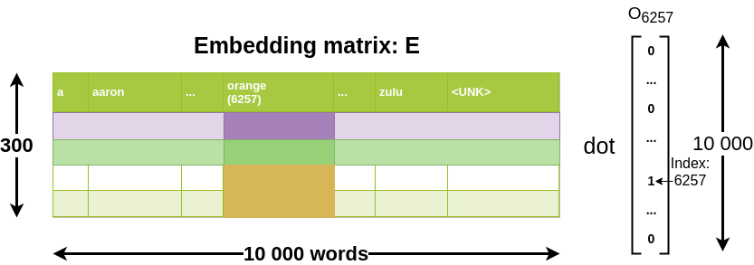
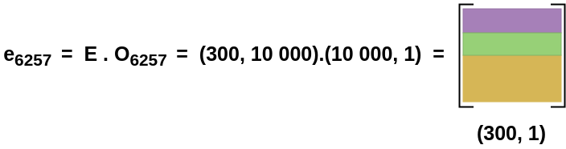

# Embedding matrix

## Find the embeddings for word j

Let's start to formalize the problem of learning a good word embedding.

When you implement an algorithm to learn a word embedding, what you end up learning is an embedding matrix.

Let's say, as usual we're using our 10,000-word vocabulary.

- Embedding matrix E has: 10,000 words vocabulary
- One-hot vector $0_{6257}$ has zeros everywhere except in position 6257

Will give the following result:

We can summarize it with:

| embedding for word j |
|----------------------|
| $Embedding\ for\ word\ j = e_j = E . O_{j}$ |

## In practice

It is not efficient to actually implement this mass matrix vector multiplication because:

- One-hot vectors have a relatively high dimensional vector and most of these elements are zero.

So, it's actually not efficient to use a matrix vector multiplication to implement this because:

- If we multiply a whole bunch of things by zeros it is a lot of computational power used for nothing.

| Solution |
|----------|
| Use a specialized function to just look up a column of the Matrix E rather than do this with the matrix multiplication. |

So, in Keras for example there is a embedding layer for this which:

- more efficiently just pulls out the column you want from the embedding matrix rather than using a much slower matrix vector multiplication.
