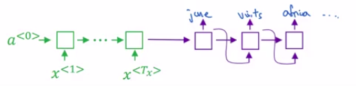

# Error analysis in beam search

| Example                                        |           |
| ---------------------------------------------- | --------- |
| Input: Jane visite l'Afrique en septembre.     | x         |
| Human: Jane visits Africa in September.        | $y^{*}$   |
| Algorithm: Jane visited Africa last september. | $\hat{y}$ |

Then let's say that when you run beam search on your learned RNN model and your learned translation model, it ends up with the above translation ($y^{*}$).

It actually changes the meaning of the original sentence in French, so it's not a good translation.

Now, your model has two main components:

- The neural network model. the sequence to sequence model. We shall just call this your RNN model. It's really an encoder and a decoder.
- The beam search algorithm, which you're running with some beam width B.

And wouldn't it be nice if you could attribute this error (bad translation) to one of these two components?

- And what you saw in the third course of the sequences is that it's always tempting to collect more training data (that never hurts).
- In similar way, it's always tempting to increase the beam width thinking that it never hurts.

- But just as getting more training data by itself might not get you to the level of performance you want.
- In the same way, increasing the beam width by itself might not get you to where you want to go.

## How to decide whether or not improving the search algorithm is a good use of your time

| Example                                        |           |
| ---------------------------------------------- | --------- |
| Human: Jane visits Africa in September.        | $y^{*}$   |
| Algorithm: Jane visited Africa last september. | $\hat{y}$ |

What you do is:

- You inject $y^{*}$ in the decoder part of the RNN. Like this:

The RNN computes $P(\hat{y}|x)$.

| Remember the objective is to know the value of y in which $P(y \mid x)$ is maximized |
|------------------------------------------------------------|
| $\displaystyle \arg \max_y P(y \mid x)$ |

| warning                     | length normalization                                                                                                                                                                                 |
| --------------------------- | ---------------------------------------------------------------------------------------------------------------------------------------------------------------------------------------------------- |
|  | There's some subtleties pertaining to length normalizations that I'm glossing over.                                                                                                                  |
|                             | And if you are using some sort of length normalization, instead of evaluating these probabilities, you should be evaluating the optimization objective that takes into account length normalization. |

Let's compare it to $P(y^{*}|x)$ to see which is bigger.

| Case 1: $P(y^{*} \mid x) \gt P(\hat{y} \mid x)$ |
|---------------------------------------|
| Beam search chose $\hat{y}$ but $y^{*}$ attains higher $P(y \mid x)$  |
| Conclusion: Beam search is at fault |
| Conclusion: Spend more time on the Beam search. |

| Case 2: $P(y^{*} \mid x) \leq P(\hat{y} \mid x)$ |
|---------------------------------------|
| $y^{*}$ is a better translation than $\hat{y}$. But the RNN predicted $P(y^{*} \mid x) \leq P(\hat{y} \mid x)$ |
| RNN thinks that $\hat{y}$ is a better translation which is wrong|
| Conclusion: The RNN model is at fault |
| Conclusion: Spend more time on the RNN model. |

## Error process analysis

So the error analysis process looks as follows.

You go through the development set and find the mistakes that the algorithm made in the development set:

- and you classify the fault involved according to the probabilities:

| Mistake   | Human                                                                | Algorithm                         | $P(y^{*} \mid x)$   | $P(\hat{y} \mid x)$ | At fault?   |
| --------- | -------------------------------------------------------------------- | --------------------------------- | ------------------- | ------------------- | ----------- |
| Mistake 1 | Jane visits Africa in September                                      | Jane visted Africa last September | $2 \times 10^{-10}$ | $1 \times 10^{-10}$ | Beam search |
| Mistake 2 | Anything below this temperature will result to an undercooked steak. | ...                               | ...                 | ...                 | RNN model   |
| ...       | ...                                                                  | ...                               | ...                 | ...                 | Beam search |
| ...       | ...                                                                  | ...                               | ...                 | ...                 | RNN model   |
| ...       | ...                                                                  | ...                               | ...                 | ...                 | RNN model   |

And through this process, you can then carry out error analysis to figure out what fraction of errors are due to **beam search versus the RNN model**.

And through this, you can try to figure out which of these two components is responsible for more errors.

And **only if you find that beam search is responsible for a lot of errors**:

- then maybe it's worth working hard to increase the beam width

Whereas in contrast, if you find that the RNN model is at fault, then you could do a deeper layer of analysis to try to figure out if you want to:

- Add regularization
- Or get more training data
- Or try a different network architecture
- Or something else. And so a lot of the techniques that you saw in the third course in the sequence will be applicable there.

