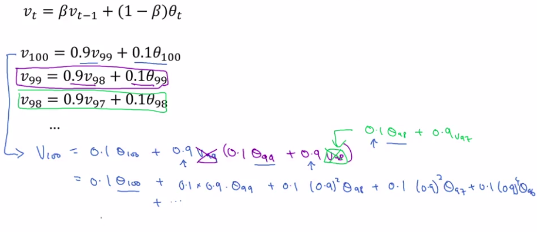

# Exponentially weighted average

## Basics

Here are the temperatures of London during the year:

Let's try to smooth it:

|                    |           |                                         |
|--------------------|-----------|-----------------------------------------|
|  Formula | $V_{t}=\beta V_{t-1}+(1-\beta)\theta_t$ |

|             |                                                        |
|-------------|--------------------------------------------------------|
| $\beta$     | Factor                                                 |
| $V_{t}$     | New calculated temperature for day t                   |
| $V_{t-1}$   | New calculated temperature for the previous day (t-1)  |
| $\theta_t$  | Real observed value for day t                          |

----

When you compute this you can think of VT as approximately averaging over, something like one over one minus beta, day's temperature.

$\approx \frac{1}{(1-\beta)}$ days temperature

Example: 

$\beta=0.9\approx 10$ days temperature

$\beta=0.98\approx 50$ days temperature

----

Let'see with examples:

| Beta            | Days temperature | Color in graph  |
|-----------------|------------------|-----------------|
| $\beta = 0.9$   | $\approx \frac{1}{(1-0.9)}=10$ days average   | Red             |
| $\beta = 0.98$  | $\approx \frac{1}{(1-0.98)}=50$ days average  | Green           |
| $\beta = 0.5$  | $\approx \frac{1}{(1-0.98)}=2$ days average  | Yellow           |

## Understanding exponentially weighted average

$V_{100}=0.1\theta_{100}+0.1\times0.9\times\theta_{99}+0.1\times0.9^2\times\theta_{98}+0.1\times0.9^3\times\theta_{97}+0.1\times0.9^4\times\theta_{96}+\cdots$

And finally, you might wonder, how many days temperature is this averaging over?

Well, it turns out that 0.9 to the power of 10, is about 0.35 and this turns out to be about $\frac{1}{e}$.

$0.9^{10} \approx 0.35 \approx \frac{1}{e}$

Remember:

|                                                   |
|---------------------------------------------------|
| $(1-\epsilon)^{1 / \epsilon} \approx \frac{1}{e}$ |

----

$(1-\epsilon) = 0.9$

So $\epsilon =1-0.9=0.1$

Then: $(1-\epsilon)^{1 / \epsilon} \approx \frac{1}{e}$

$(0.9)^{1/0.1} \approx \frac{1}{e}$

$(0.9)^{10}$ so 10 days

----

$(1-\epsilon) = 0.98$

So $\epsilon =1-0.98=0.02$

Then: $(1-\epsilon)^{1 / \epsilon} \approx \frac{1}{e}$

$(0.98)^{1/0.02} \approx \frac{1}{e}$

$(0.98)^{50}$ so 50 days weighted averaged

----

$(1-\epsilon) = 0.5$

So $\epsilon =1-0.5=0.5$

Then: $(1-\epsilon)^{1 / \epsilon} \approx \frac{1}{e}$

$(0.5)^{1/0.5} \approx \frac{1}{e}$

$(0.5)^{2}$ so 2 days weighted averaged

## Implementing exponentially weighted averages

Remember: $V_{t}=\beta V_{t-1}+(1-\beta)\theta_t$ 

Algorithm:

----

$v_{\theta} = 0$

Repeat {

Get next $\theta_t$

$v_{\theta}=\beta v_{\theta} + (1-\beta)\theta_t$

}

----

## Bias correction in exponentially weighted averages

### The bias in the first values of the exponentially weighted averages

| Beta  | Color of the line | Info |
|-------|-------------------|------|
| 0.9   |  Red  |      |
| 0.98  |  Green  |  The drawing is false. The formula $V_{t}=\beta V_{t-1}+(1-\beta)\theta_t$ would create a bias in the first values. |
| 0.98  |  Violet  |  The drawing is RIGHT. The formula $V_{t}=\beta V_{t-1}+(1-\beta)\theta_t$ would create a bias in the first values. This is the real drawing with the formula. |

Why are the first values biased?

Simple:

$V_{t}=\beta V_{t-1}+(1-\beta)\theta_t$ 

$V_{0}=0$

$V_{1}=0.98V_{0}+0.02\theta_{1}$

Because $V_{0}=0$ then $V_{1}=0.02\theta_{1}$ The result gives a very low value!!!! Much less that the real $\theta_{1}$.

Let's go on:

$V_{2}=0.98V_{1}+0.02\theta_{2}=0.98*(0.02\theta_{1})+0.02\theta_{2}=0.0196\theta_{1}+0.02\theta_{2}$ still gives a low value!!! Still much less that the real $\theta_{2}$.

It takes time until the algorithm warms up and the violet line becomes similar to the green one.

### Bias correction solution to avoid first values bias

|         |                             |
|---------|-----------------------------|
| Formula | $\frac{V_{t}}{1-\beta^{t}}$ |

Let's see with t=2:

$\frac{V_{2}}{1-0.98^{2}}=\frac{V_{2}}{0.0396}=\frac{0.98V_{1}+0.02\theta_{2}}{0.0396}=\frac{0.0196\theta_{1}+0.02\theta_{2}}{0.0396}=0.49\theta_{1}+0.05\theta_{2}$

This bias implementation allows you to go from the violet line to the green one.