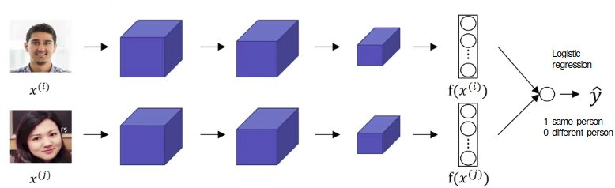
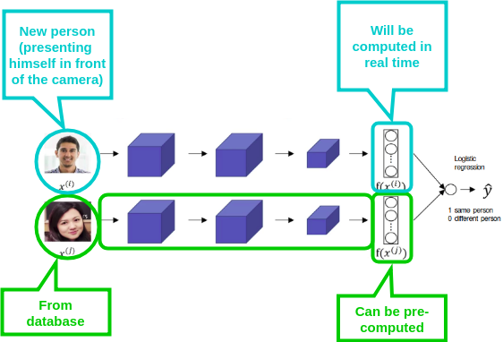

# Face Verification and Binary Classification

## Siamese network with logistic regression

**Siamese networks are 2 NN that share the same parameters. They are identical.**

Another way to train a neural network, is to take this pair of neural networks (Siamese Network):

- Have them both compute these embeddings (maybe 128 dimensional embeddings)
- Then have these be input to a **logistic regression** unit to then just make a prediction.
- The target output $\hat{y}$ will be:
  - 1 if both of these are the same persons.
  - 0 if both of these are of different persons. 

|                                                                                         |
|-----------------------------------------------------------------------------------------|
| $\hat{y}=\sigma(\sum_{k=1}^{128} w_{i} \lvert f(x^{(i)})_k - f(x^{(j)})_k \rvert + b )$ |

With:

- $\sigma()$ sigmoid function
- $k$ iterator of the embeddings
- $i$ first person
- $j$ second person
- $w_{i}$ weight
- $b$ bias a scalar

Think of it as a logistic regression, remember:

$z=\sum_{i}^{m} w_{i}x_{i} + b$

### Another version with chi squared

|                                                                               |
|-------------------------------------------------------------------------------|
| $\hat{y}=\sigma(\sum_{k=1}^{128} w_{i} (f(x^{(i)})_k - f(x^{(j)})_k)^2 + b )$ |

|                                            |                                                                  |
|--------------------------------------------|------------------------------------------------------------------|
| $\chi^2 = (f(x^{(i)})_k - f(x^{(j)})_k)^2$ | is sometimes called the chi square form or chi square similarity |
| $\chi^2$ | is said $chi\ squared$ |

## Computational trick to help neural deployment significantly

Instead of having to compute, the known persons embedding every single time you can actually pre-compute it.

So when the new employee walks in, what you can do is use this upper components to compute that encoding and use it, then compare it to your pre-computed encoding and then use it to make a prediction $hat{y}$.

Because you don't need to store the raw images and also because if you have a very large database of employees, you don't need to compute these encodings every single time for every employee database. This can save a significant computation.

And this type of pre-computation works both for this type of Siamese Central architecture where you treat face recognition as a binary classification problem, as well as, when you were learning encodings maybe using the Triplet Loss function as described before. 