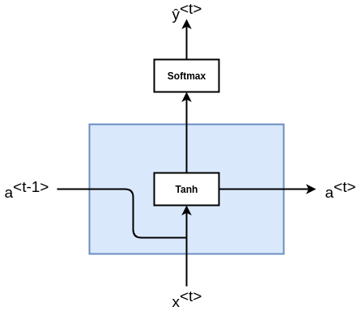
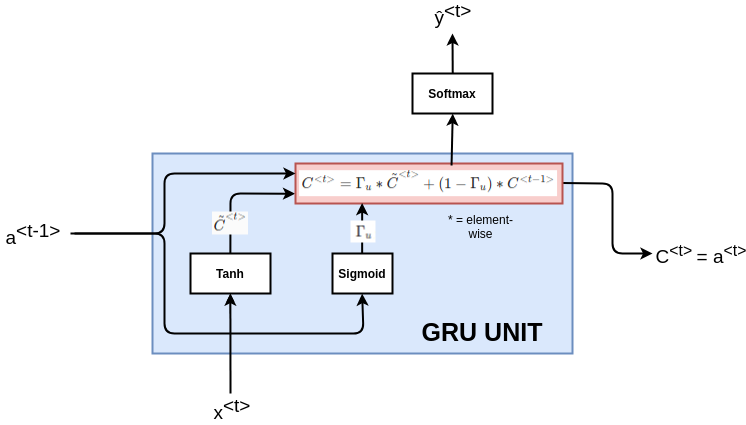

# Gated Recurrent Unit (GRU)

Gated Recurrent Unit which is **a modification to the RNN hidden layer** that makes it **much better capturing long range connections** and **helps** a lot with the **vanishing gradient problems**.

Based on paper:

- [On the Properties of Neural Machine Translation: Encoder–Decoder Approaches](https://arxiv.org/pdf/1409.1259.pdf) by Kyunghyun Cho, Bart van Merrienboer, Dzmitry Bahdanau.
- [Empirical Evaluation of Gated Recurrent Neural Networks on Sequence Modeling](https://arxiv.org/pdf/1412.3555v1.pdf) by Junyoung Chung, Caglar Gulcehre, KyungHyun Cho, Yoshua Bengio.

## Previous architecture without GRU

You've already seen the formula for computing the activations at time t of RNN:

$a^{<t>}=g(W_{a} [a^{<t-1>}, x^{<t>}]+b_{a})$

With g()=tanh

## What is Gated Recurrent Unit

Remember the example: "The cat, which already ate... was full."

So as we read in this sentence from left to right, the GRU unit is going to have a new variable called C which stands for memory cell.

|                           c: Memory cell, bit of memory to remember      |
|--------------------------------------------------------------------------|
| What a **memory cell** do is to provide a **bit of memory to remember**. |

For example, whether cat was singular or plural, so that when it gets much further into the sentence it can still work under consideration whether the subject of the sentence was singular or plural.

And so at time t the memory cell will have some value $c^{<t>}$

At every time-step, we're going to consider overwriting the memory cell with a value $\tilde{c}$.

|                         $\tilde{c}$: candidate value for $c$ |
|--------------------------------------------------------------------------|
| $\tilde{c}=tanh(W_{c}[c^{<t-1>}, x^{<t>}])$ |
| A candidate for replacing $c^{<t>}$. ||
| And we're going to compute this using an activation function tanh of Wc. |

And then the key, really the important idea of the GRU it will be that we have a gate.

|                         $\Gamma_{u}$: 0/1 gate value, decide or not if we have to update $c$ by $\tilde{c}$                                    |
|--------------------------------------------------------------------------|
| $\Gamma_{u}=\sigma (W_{u}[c^{<t-1>}, x^{<t>}]+b_{u})$ |
| $\Gamma_{u}$: Gamma subscript u is the gate value. |
| u in $\Gamma_{u}$ stands for update gate. |
| $\Gamma_{u}$ will decide whether or not we actually update $c^{<t>}$ by $\tilde{c}$. |
| $\Gamma_{u}$ will then be a value zero or one, although in practice, your compute it with a sigmoid function applied to this. |

Then the process of updating c can be summarized with this formula:

|                         $\Gamma_{u}$: Updating c final formula           |
|--------------------------------------------------------------------------|
| $c^{<t>} = \Gamma_{u} * \tilde{c}^{<t>} + (1-\Gamma_{u})*c^{<t-1>}$ |
| * int the formula means element-wise |

#### Vectors dimensions

In the equations I've written, $c^{<t>}$ can be a vector.

So if you have 100 dimensional or hidden activation value then $c^{<t>}$ can be a 100 dimensional.

And so:

Dimension of $c^{<t>}$ = Dimension of $\tilde{c}^{<t>}$ = Dimension of $\Gamma_u$

### Example application

Remember the example: "The cat, which already ate... was full."

When you see the phrase, "The cat", you know that you're talking about a new concept: the subject of the sentence cat. So that would be a good time to update the cell memory  and then maybe when you're done using it at the end of the sentence you don't need to memorize anymore.

Then when you see **"The cat"** or **"The cats"**:

- $\Gamma_{u}$ is activated.
- $c^{<t>}$ **is set to either zero or one** (depending on whether the word in this sentence is singular or plural).

Let's say:

- "cat": $c^{<t>}$ = 1
- "cats": $c^{<t>}$ = 0

|              | The | cat | which | already | ate | ... | was | full |
| ------------ | --- | --- | ----- | ------- | --- | --- | --- | ---- |
| $\Gamma_{u}$ | =0  | =1  | =0    | =0      | =0  | =0  | =0  | =0   |
| $c^{<t>}$    | =0  | =1  | =1    | =1      | =1  | =1  | =1  | =1   |

### GRU unit

GRU unit: Equivalent of formula above

## Full GRU units

We add anoter gater for the full GRU unit:

| Formulas                                                     |
|-------------------------------------------------------------|
| $\tilde{c}^{<t>}=tanh(W_{c}[\Gamma_{r}*c^{<t-1>}, x^{<t>}]+b_c)$ |
| $\Gamma_{r}$: You can think of r as standing for relevance. So this gate gamma r tells you how relevant is $c^{<t-1>}$ to computing the next candidate for $c^{<t>}$. |
| $\Gamma_{r}=\sigma (W_{r}[c^{<t-1>}, x^{<t>}]+b_{r})$ |
| $\Gamma_{u}=\sigma (W_{u}[c^{<t-1>}, x^{<t>}]+b_{u})$ |
| $c^{<t>} = \Gamma_{u} * \tilde{c}^{<t>} + (1-\Gamma_{u})*c^{<t-1>}$ |

ALternative notation in some papers:

| Our notation | Alternative notation |
| ------------ | -------------------- |
| $\tilde{c}$  | $\tilde{h}$          |
| $\Gamma_{u}$ | $u$                  |
| $\Gamma_{r}$ | $r$                  |
| $c^{<t>}$    | $h$                  |

And why do we have $\Gamma_{r}$?

Why not use a simpler version from the previous slides?

So it turns out that over many years researchers have experimented with many, many different possible versions of how to design these units.

But at the end the GRU is one of the most commonly used versions that researchers have converged to and found as robust and useful for many different problems.

If you wish you could try to invent new versions of these units if you want, but the GRU is a standard one. Although you can imagine that researchers have tried other versions that are similar but not exactly the same as what I'm writing down here as well.

And the other common version is called an LSTM which stands for Long Short Term Memory which we'll talk about in the next lesson.