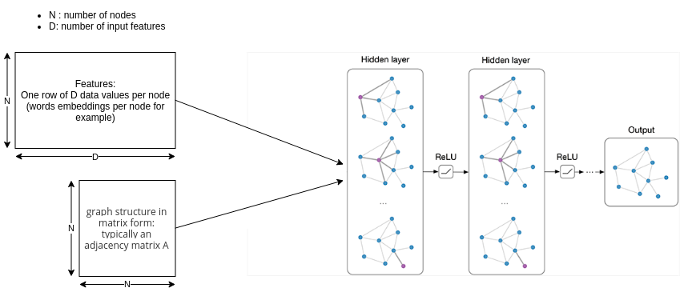
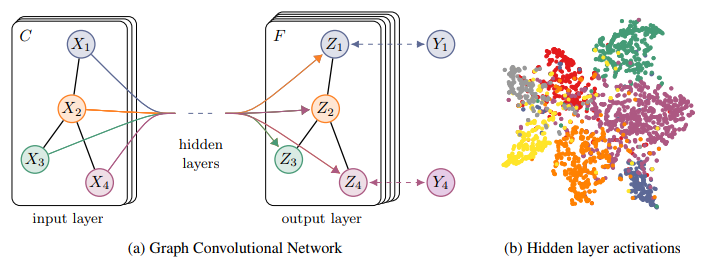

# GCN my explaination

paper Thomas N. Kipf: https://arxiv.org/pdf/1609.02907.pdf

## Objective of Kipf's GCN

The objective is to classy nodes (such as documents) in a graph (such as a citation
network), where labels are only available for a small subset of nodes.

Cora example:

- Documents are papersId

Currently, most graph neural network models have a somewhat universal architecture in common. I will refer to these models as Graph Convolutional Networks (GCNs):
- **Convolutional**, because filter parameters are typically shared over all locations in the graph (or a subset thereof as in Duvenaud et al., NIPS 2015).

- N: denotes the number of graph nodes.
- D: Number offeatures

For these models, the goal is then to learn a function of signals/features on a graph $\mathcal{G}=(\mathcal{V}, \mathcal{E})$ which takes as input:

- A feature description $x_i$ for every node i; summarized in a N×D feature matrix X (N: number of nodes, D: number of input features).
- A representative description of the graph structure in matrix form; typically in the form of an adjacency matrix A (or some function thereof).
- and produces a node-level output Z (an N×F feature matrix, where F is the number of output features per node).

Every neural network layer can then be written as a non-linear function:

$H^{(l+1)} = f(H^{(l)}, A)$

with:

- L number of layers
- H(0)=X
- H(L)=Z

##  FAST APPROXIMATE CONVOLUTIONS ON GRAPHS

Layer propagation rule:

$f(H^{(l)}, A) = \sigma\left( AH^{(l)}W^{(l)}\right)$

- $H^{(l)}$ activations for layer l.
- $W{(l)}$ is a weight matrix for the l-th neural network layer and 
- $\sigma()$ is a non-linear activation function like ReLU

Two limitations of this simple model:

- multiplication with A means that, for every node, we sum up all the feature vectors of all neighboring nodes but not the node itself (unless there are self-loops in the graph). Indeed an adjency matrice is a diagonal of zeros (in a graph: node 0 to node 0 =0, node 1 to node 1 =0, etc). We can "fix" this by enforcing self-loops in the graph: we simply add the identity matrix to A.
- The second major limitation is that A is typically not normalized and therefore the multiplication with A will completely change the scale of the feature vectors (we can understand that by looking at the eigenvalues of A).
  - Normalizing A such that all rows sum to one, i.e. $D^{−1}A$, where D is the diagonal node degree matrix, gets rid of this problem. Multiplying with $D^{−1}A$ now corresponds to taking the average of neighboring node features.
  - In practice, dynamics get more interesting when we use a symmetric normalization, i.e. $D^{-\frac{1}{2}}AD^{-\frac{1}{2}}$ (as this no longer amounts to mere averaging of neighboring nodes).

Combining these two tricks, we essentially arrive at the propagation rule introduced in Kipf & Welling (ICLR 2017).

$f(H^{(l)}, A) = \sigma\left( \hat{D}^{-\frac{1}{2}}\hat{A}\hat{D}^{-\frac{1}{2}}H^{(l)}W^{(l)}\right)$

Where:

- $\hat{A} = A + I$ , where I is the identity matrix and D^ is the diagonal node degree matrix of A^.

Explainations here: https://towardsdatascience.com/how-to-do-deep-learning-on-graphs-with-graph-convolutional-networks-7d2250723780