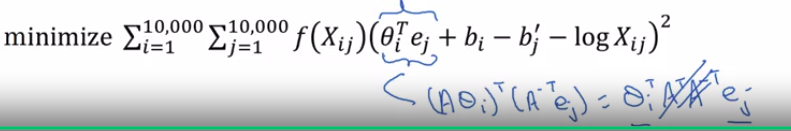

# GloVe word vector

Another algorithm that has some momentum in the NLP community is the GloVe algorithm. 

| important                  |                                                                                                                                            |
| -------------------------- | ------------------------------------------------------------------------------------------------------------------------------------------ |
| [important](img/important.png) | This is not used as much as the Word2Vec or the skip-gram models, but it has some enthusiasts. Because I think, in part of its simplicity. |

The GloVe algorithm was created with this paper: [GloVe: Global Vectors for Word Representation by Jeffrey Pennington, Richard Socher, Christopher D. Manning](https://nlp.stanford.edu/pubs/glove.pdf)

## GloVe model

So, let's say:

$X_{ij} = \#\ of\ times\ i\ appears\ in\ context\ of\ j$

And so, here:

- i play the role of t
- j play the role of c

You can go through your training corpus and just count up:

- how many words does a word i appear in the context of a different word j.
- which also means how many times does the word t appear in context of different words c.

And depending on the definition of context and target words, you might have:

- $X_{ij}=X_{ji}$

And in fact, if you're defining context and target in terms of:

- whether or not they appear within plus minus 10 words of each other, then it would be a symmetric relationship.

For the purposes of the GloVe algorithm, we can define context and target as whether or not the two words appear in close proximity (say within plus or minus 10 words of each other).

So, $X_{ij}$ is a count that captures how often do words i and j appear with each other, or close to each other.

## GloVe model optimization objective

| What the GloVe model optimizes is the following formula: |
|----------------------|
| $\min \sum_{i=1}^{10000} \sum_{j=1}^{10000} f(X_{ij}) (\theta_{i}^{T}e_{j} + b_{i} + b_{j}' - \log{X_{ij}})^2$ |

This formula should tell you is:

- How related are words i and j as measured by how often they occur with each other.
- Which is affected by this $X_{ij}$

| How the formula works |
|----------------------|
|  |

And so, what we're going to do is, solve for parameters theta and e using gradient descent to minimize the sum over i equals one to 10,000 sum over j from one to 10,000 of this difference. So you just want to learn vectors, so that their end product is a good predictor for how often the two words occur together.

So this means the sum is sum only over the pairs of words that have co-occurred at least once in that context-target relationship.

The other thing that $f(X_{ij})$ does is that:

- There are some words that appear very often in the English language like "this", "is", "of", "a", and so on.
- Sometimes we used to call them stop words but there's really a continuum between frequent and infrequent words.
- And then there are also some infrequent words like durion, which you actually still want to take into account, but not as frequently as the more common words.
- And so the weighting factor $f(X_{ij})$ can be a function that gives a meaningful amount of computation, even to the less frequent words like durion, and gives more weight but not an unduly large amount of weight to words like, "this", "is", "of", "a", "which" just appear lost in language.

| How to create $f(X_{ij})$ |
|---------------------------|
| And so, there are various heuristics for choosing this weighting function F that need or gives these words too much weight nor gives the infrequent words too little weight. |

You can take a look at the GloVe paper if you want the details of how F can be chosen to be a heuristic to accomplish this: [GloVe: Global Vectors for Word Representation by Jeffrey Pennington, Richard Socher, Christopher D. Manning](https://nlp.stanford.edu/pubs/glove.pdf)

And then, finally, one funny thing about this algorithm is that the roles of $\theta$ and $e$ are now completely symmetric.

So:

- $\theta_i$ and $e_j$ are symmetric

 If you look at the math, they play pretty much the same role and you could reverse them or sort them around, and they actually end up with the same optimization objective.

One way to train the algorithm is to initialize $\theta$ and $e$ both uniformly around gradient descent to minimize its objective, and then when you're done for every word, to then take the average.

For a given words w:

$e_w^{(final)}=\frac{e_w+\theta_w}{2}$

 you can have e final to be equal to the embedding that was trained through this gradient descent procedure, plus theta trained through this gradient descent procedure divided by two, because theta and e in this particular formulation play symmetric roles unlike the earlier models we saw in the previous lesson, where theta and e actually play different roles and couldn't just be averaged like that.

## Summmary

That's it for the GloVe algorithm. I think one confusing part of this algorithm is, if you look at this equation, it seems almost too simple.

How could it be that just minimizing a square cost function like this allows you to learn meaningful word embeddings? But it turns out that this works.

And the way that the inventors end up with this algorithm was, they were building on the history of much more complicated algorithms like the newer language model, and then later, there came the Word2Vec skip-gram model, and then this came later.

The objective was really to simplify all of the earlier algorithms.

## One last note on the featurization view of word embeddings

We started off with this featurization view as the motivation for learning word vectors.

We said, "Well, maybe the first component of the embedding vector to represent gender, the second component to represent how royal it is, then the age and then whether it's a food, and so on."

But when you learn a word embedding using one of the algorithms that we've seen, such as the GloVe algorithm that we just saw on the previous slide, what happens is:

- You cannot guarantee that the individual components of the embeddings are interpretable.

Why is that? Well, let's say that there is some space where the first axis is gender and the second axis is royal.

What you can do is guarantee that the first axis of the embedding vector is aligned with this axis of meaning, of gender, royal, age and food.

And in particular, the learning algorithm might choose this to be axis of the first dimension.

So, given maybe a context of words, so the first dimension might be this axis and the second dimension might be this. Or it might not even be orthogonal, maybe it'll be a second non-orthogonal axis, could be the second component of the word embeddings you actually learn.

And when we see this, if you have a subsequent understanding of linear algebra is that, if there was some invertible matrix A, then this could just as easily be replaced with A times theta i transpose A inverse transpose $e_j$. Because we expand this out, this is equal to theta i transpose A transpose A inverse transpose times $e_j$. And so, the middle term cancels out and we're left with $\theta_i$ transpose $e_j$, same as before.

Don't worry if you didn't follow the linear algebra, but that's a brief proof that shows that with an algorithm like this:

- you can't guarantee that the axis used to represent the features will be well-aligned with what might be easily humanly interpretable axis.
- In particular, the first feature might be a combination of gender, and royal, and age, and food, and cost, and size, is it a noun or an action verb, and all the other features.

**It's very difficult to look at individual components, individual rows of the embedding matrix and assign the human interpretation to that.** But despite this type of linear transformation, the parallelogram map that we worked out when we were describing analogies, that still works. And so, despite this potentially arbitrary linear transformation of the features, you end up learning the parallelogram map for figure analogies still works.
