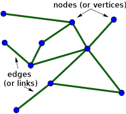

# Graphs

## Datasets

| Task                 | Dataset  | Model    | Metric name |
| -------------------- | -------- | -------- | ----------- |
| Node Classification  | Citeseer | APPNP    | Accuracy    |
| Graph Classification | COLLAB   | GCN      | Accuracy    |
| Node Classification  | Cora     | APPNP    | Accuracy    |
| Graph Classification | IMDb-B   | GIN-0    | Accuracy    |
| Graph Classification | MUTAG    | GIN-0    | Accuracy    |
| Graph Classification | PROTEINS | DiffPool | Accuracy    |
| Node Classification  | Pubmed   | APPNP    | Accuracy    |
| Graph Classification | REDDIT-B | DiffPool | Accuracy    |

## Graph applications

| graph               | vertices                       | edges                        |
| ------------------- | ------------------------------ | ---------------------------- |
| communication       | telephones, computers          | fiber optic cables           |
| circuits            | gates, registers, processors   | wires                        |
| mechanical          | joints                         | rods, beams, springs         |
| hydraulic           | reservoirs, pumping stations   | pipelines                    |
| financial           | stocks, currency               | transactions                 |
| transportation      | street intersections, airports | highways, airway routes      |
| scheduling          | tasks                          | precedence constraints       |
| software systems    | functions                      | function calls               |
| internet            | web pages                      | hyperlinks                   |
| games               | board positions                | legal moves                  |
| social relationship | people, actors                 | friendships, movie casts     |
| neural networks     | neurons                        | synapses                     |
| protein networks    | proteins                       | protein-protein interactions |
| chemical compounds  | molecules                      | bonds                        |

## Graph definition

[introduction-to-graphs](http://btechsmartclass.com/data_structures/introduction-to-graphs.html)

### Graphs types

- **Undirected Graph**: A graph with only undirected edges is said to be undirected graph.
- **Directed Graph**: A graph with only directed edges is said to be directed graph.
- **Mixed Graph**: A graph with both undirected and directed edges is said to be mixed graph.
- **End vertices or Endpoints**: The two vertices joined by edge are called end vertices (or endpoints) of that edge.
- **Simple Graph**: A graph is said to be simple if there are no parallel and self-loop edges.

### Edges are three types

- **Undirected Edge** - An undirected egde is a bidirectional edge. If there is undirected edge between vertices A and B then edge (A , B) is equal to edge (B , A).
- **Directed Edge** - A directed egde is a unidirectional edge. If there is directed edge between vertices A and B then edge (A , B) is not equal to edge (B , A).
- **Weighted Edge** - A weighted egde is a edge with value (cost) on it.

## Graphs Vocabulary

- **Origin**: If a edge is directed, its first endpoint is said to be the origin of it.
- **Destination**: If a edge is directed, its first endpoint is said to be the origin of it and the other endpoint is said to be the destination of that edge.
- **Adjacent**: If there is an edge between vertices A and B then both A and B are said to be adjacent. In other words, vertices A and B are said to be adjacent if there is an edge between them.
- **Incident**: Edge is said to be incident on a vertex if the vertex is one of the endpoints of that edge.
- **Outgoing Edge**: A directed edge is said to be outgoing edge on its origin vertex.
- **Incoming Edge**: A directed edge is said to be incoming edge on its destination vertex.
- **Degree**: Total number of edges connected to a vertex is said to be degree of that vertex.
- **Indegree**: Total number of incoming edges connected to a vertex is said to be indegree of that vertex.
- **Outdegree**: Total number of outgoing edges connected to a vertex is said to be outdegree of that vertex.
- **Parallel edges or Multiple edges**: If there are two undirected edges with same end vertices and two directed edges with same origin and destination, such edges are called parallel edges or multiple edges.
- **Self-loop**: Edge (undirected or directed) is a self-loop if its two endpoints coincide with each other.
- **Path**: A path is a sequence of alternate vertices and edges that starts at a vertex and ends at other vertex such that each edge is incident to its predecessor and successor vertex.

## Representation of Graphs: Adjacency Matrix and Adjacency List

### Adjacency Matrix

A graph G = (V, E) where v= {0, 1, 2, . . . n-1} can be represented using two dimensional integer array of size n x n.

- $adj[20][20]$ can be used to store a graph with 20 vertices
- $adj[i][j] = 1$, indicates presence of edge between two vertices i and j.
- $adj[i][j] = 0$, indicates absence of edge between two vertices i and j.

Representation:
- A graph is represented using square matrix.
- Adjacency matrix of an undirected graph is always a symmetric matrix, i.e. an edge (i, j) implies the edge (j, i).
- Adjacency matrix of a directed graph is never symmetric, adj[i][j] = 1 indicates a directed edge from vertex i to vertex j.

An example of adjacency matrix representation of an undirected and directed graph is given below:

#### Adjacency Matrix Representation of Undirected Graph

#### Adjacency Matrix Representation of Directed Graph

#### Adjacency Matrix Representation of Weighted Graph

For weighted graph, the matrix $adj[ ][ ]$ is represented as:
- If there is an edge between vertices i and j then $adj[i][j] = weight\ of\ the\ edge\ (i, j)$ otherwise $adj[i][j] = 0$.

Adjacency matrix representation of graphs is very simple to implement.

- Memory requirement: Adjacency matrix representation of a graph wastes lot of memory space. Such matrices are found to be very sparse.
  - This representation requires space for n2 elements for a graph with n vertices. If the graph has e number of edges then n2 –
e elements in the matrix will be 0.
- Presence of an edge between two vertices Vi
and Vj can be checked in constant time.
  - if(adj[i][j] == 1) then edge is present between vertices i and j, else edge is absent between vertices i and j
- Degree of a vertex can easily be calculated by counting all non-zero entries in the corresponding row of the adjacency matrix.

### Adjacency List

A graph can also be represented using a linked list.

For each vertex, a list of adjacent vertices is maintained using a linked list. It creates a separate linked list for each vertex Vi in the graph G = (V, E).

Adjacency list of a graph with n nodes can be represented by an array of pointers. Each pointer points to a linked list of the corresponding vertex. Below figure shows the adjacency list representation of a graph.

- **Adjacency list representation of a graph is very memory efficient when the graph has a large number of vertices but very few edges.**

- For an undirected graph with n vertices and e edges, total number of nodes will be n + 2e. If e is large then due to overhead of maintaining pointers, adjacency list representation does not remain cost effective over adjacency matrix representation of a graph.
- Degree of a node in an undirected graph is given by the length of the corresponding linked list.
- Finding indegree of a directed graph represented using adjacency list will require O (e) comparisons. Lists pointed by all vertices must be examined to find the indegree of a node in a directed graph.
- Checking the existence of an edge between two vertices i and j is also time consuming. Linked list of vertex i must be searched for the vertex j.

