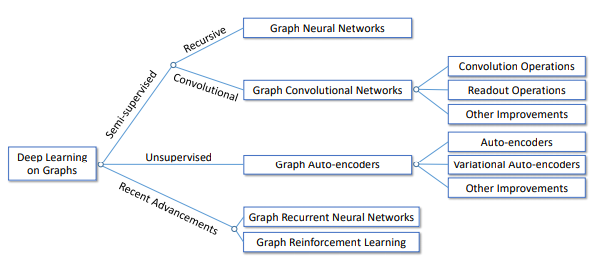
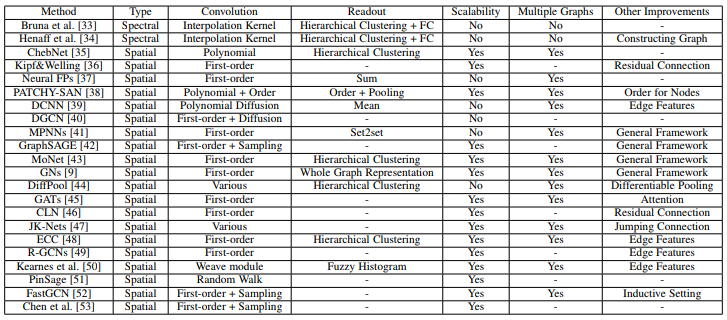

# Graphs NN

State of the art: [Deep Learning on Graphs: A Survey](https://arxiv.org/pdf/1812.04202.pdf)

Some Main Distinctions of Deep Learning Methods on Graphs:

| Category                        | Type            | Node Attributes/Labels | Counterparts in Traditional Domains   |
| ------------------------------- | --------------- | ---------------------- | ------------------------------------- |
| Graph Neural Networks           | Semi-supervised | Yes                    | Recursive Neural Networks             |
| Graph Convolutional Networks    | Semi-supervised | Yes                    | Convolutional Neural Networks         |
| Graph Autoencoders              | Unsupervised    | Partial                | Autoencoders/Variational Autoencoders |
| Graph Recurrent Neural Networks | Various         | Partial Recurrent      | Neural Networks                       |
| Graph Reinforcement Learning    | Semi-supervised | Yes                    | Reinforcement Learning                |

Comparison of Different Graph Convolutional Networks (GCNs)

## Notations

| Notation                                               | Description                                                                         |
| ------------------------------------------------------ | ----------------------------------------------------------------------------------- |
| $\mathcal{G}=(\mathcal{V}, \mathcal{E})$               | A graph                                                                             |
| N, M                                                   | number of nodes and edges                                                           |
| D                                                      | number of input features                                                            |
| X                                                      | $N \times D$ feature matrix X                                                       |
| Z                                                      | node-level output                                                                   |
| $\rho()$ or $\sigma()$                                 | A non-linear activation function like ReLU                                          |
| $W^{(l)}$                                              | is a weight matrix for the l-th neural network layer                                |
| $\mathcal{V}=\{\mathcal{v}_1,\ \dots, \mathcal{v}_N\}$ | The set of nodes                                                                    |
| $F^{V}, F^E$                                           | Attributes/features for nodes and edges                                             |
| A                                                      | Adjency matrix: A representative description of the graph structure in matrix form. |
| $D(i, i) = \sum_{j \neq i} A(i, j)$                    | The diagonal degree matrix                                                          |
| $L = D − A$                                            | The Laplacian matrix                                                                |
| $Q \Lambda Q^T = L$                                    | The eigen-decomposition of L                                                        |
| $P=D^{-1}A$                                            | The transition matrix                                                               |
| $\mathcal{N_{k}}(i),\mathcal{N(i)}$                    | k-step and 1-step neighbors of $v_i$                                                |
| $H^l$                                                  | The hidden representation of $l^{th}$ layer                                         |
| $f_l$                                                  | The number of dimensions of $H^{l}$                                                 |
| $X_1 \odot X_2$                                        | Element-wise product                                                                |
| $\Theta$                                               | Learnable parameters                                                                |

## Intro

For these models, the goal is then to learn a function of signals/features on a graph $\mathcal{G}=(\mathcal{V}, \mathcal{E})$ which takes as input:

- $x_i$ : A feature description for every node i; summarized in a $N \times D$ feature matrix X (N: number of nodes, D: number of input features)

Every neural network layer can then be written as a non-linear function:

$H^{(l+1)} = f(H^{(l)}, A) \, ,$

