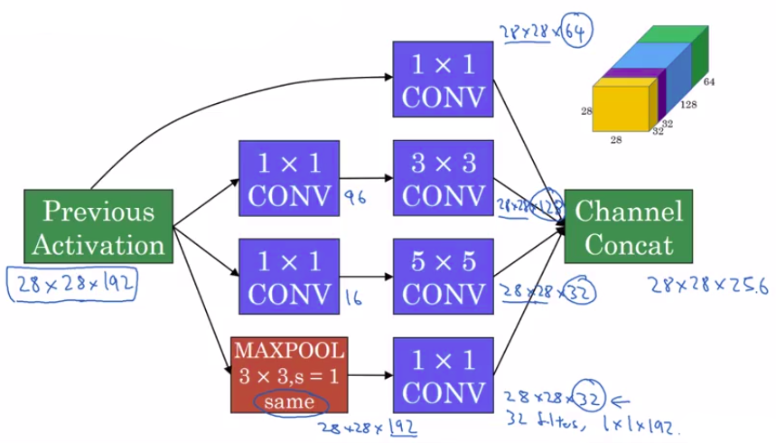
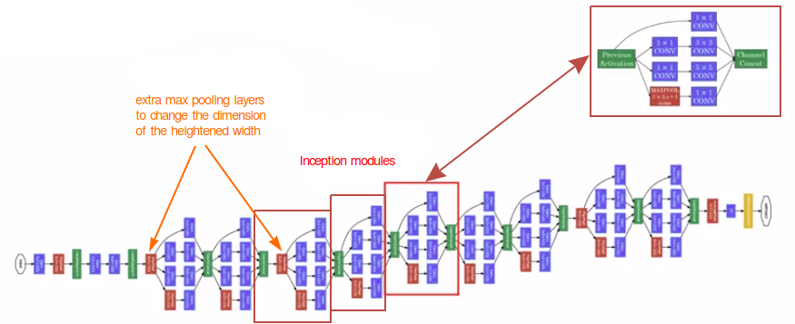
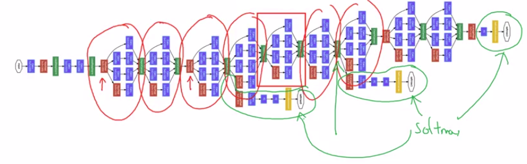

# Inception Network

## Inception module

## Inception network

Here's a picture of the inception network, taken from the paper by Szegedy & al.

We can see that an inception network is made of multiple inception modules.

## Inception network original paper

It turns out that there's one last detail to the inception network if we read the optional research paper. Which is that there are these additional side-branches that I just added (In green circles).

So what do they do? Well, the last few layers of the network is a fully connected layer followed by a softmax layer to try to make a prediction. What these side branches do is it takes some hidden layer and it tries to use that to make a prediction. So this is actually a softmax output and so is that. And this other side branch, again it is a hidden layer passes through a few layers like a few connected layers. And then has the softmax try to predict what's the output label.

And you should think of this as maybe just another detail of the inception that's worked. But what is does is it helps to ensure that the features computed. Even in the heading units, even at intermediate layers. That they're not too bad for protecting the output cause of a image. And this appears to have a regularizing effect on the inception network and helps prevent this network from overfitting.

## New versions

Since the development of the original inception module, the author and others have built on it and come up with other versions as well. So there are research papers on newer versions of the inception algorithm. And you sometimes see people use some of these later versions as well in their work, like inception v2, inception v3, inception v4.

There's also an inception version. This combined with the resonant idea of having skipped connections, and that sometimes works even better. But all of these variations are built on the basic idea that you learned about this in the previous video of coming up with the inception module and then stacking up a bunch of them together.
