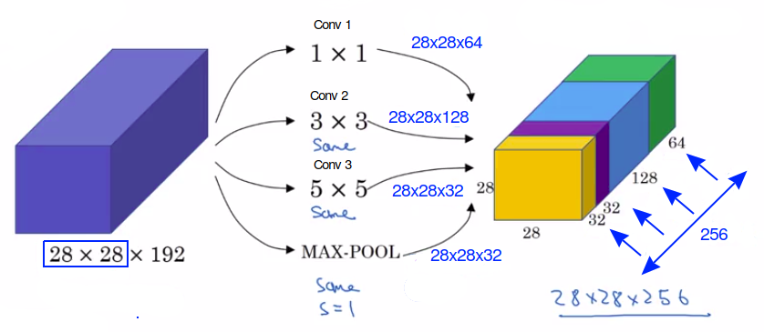
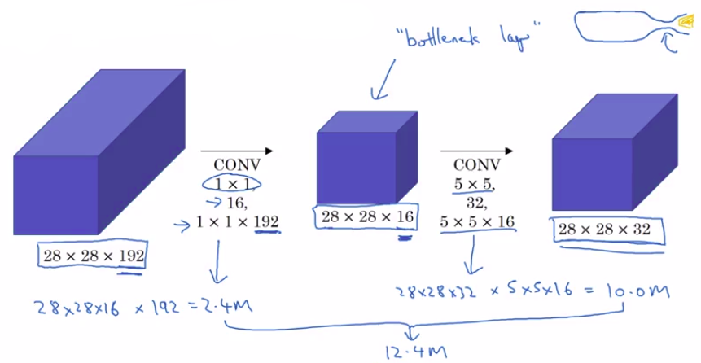

# Inception Network Motivation

Paper "Going deeper with convolution" by: Christian Szegedy, Wei Liu, Yangqing Jia, Pierre Sermanet, Scott Reed, Dragomir Anguelov, Dumitru Erhan, Vincent Vanhoucke and Andrew Rabinovich.

## What is an inception network?

When designing a layer for a ConvNet, you might have to ask yourself, do you want a:

- 1 by 3 filter?
- or a 3 by 3 filter?
- or a 5 by 5
- or a pooling layer?

**So the basic idea of Inception Network is that instead of you needing to pick one filter sizes or pooling and commiting to that, you can:**

- **Do them all and just concatenate all the outputs.**
- **Let the network learn whatever parameters it wants to use, whatever the combinations of these filter sizes it wants.**

Let's imagine the following inception layer:

- So what if you can use a 1 by 1 convolution, and that will output a 28x28x64.
- But maybe you also want to try a 3x3 and that might output a 20x20x128. To make the dimensions match up, let's make this a same convolution.
- And maybe you might say well I want to hedge my bets. Maybe a 5 by 5 filter works better. So let's do that too and have that output a 28x28x32.
- Let's apply pooling, and that has some other output and let's stack that up as well. And here pooling outputs 28x28x32. Now in order to make all the dimensions match, you actually need to use padding for max pooling. 

But with a inception module like this, you can input 28x28x192 and output 28x28x256 (32+32+128+64).

## The computation cost problem of inception network

Let's look at "Conv 3".

"Conv 3" has:

- 32 filters
- Each filter is: 5x5x192
- The output is: 28x28x32

So the total number of multiplies that you need to compute is:

$computationalCost=(28\times{28}\times{32})\times{(5\times{5}\times{192})}=120Million$

### Using 1x1 convolution to reduce computation cost

Rather than doing a 5x5x192 with 32 filter.

Let's replace it by:

1. A 1x1x192 convolution with 32 filters: We obtain a much smaller volume: 28x28x16. This added layer is sometimes called the bottleneck layer.
1. Then we run a 5x5x16 convolution with 16 filters: We obtain a: 28x28x32 volume.

$computationalCost=(28\times{28}\times{16})\times{(1\times{1}\times{192})}+(28\times{28}\times{32})\times{(5\times{5}\times{16})}$

$=2.4Million+10Million=12.4Million$

**We can see that this computational cost is $\frac{1}{10}th$ of the computational cost of the "Conv 3" computional cost.**

So:

Transforming the "Conv 3" architecture by adding a bottleNetck layer has significantly reduced the computational cost ($\frac{1}{10}th$).

## To summarize

So to summarize, if you are building a layer of a neural network and you don't want to have to decide, do you want a 1 by 1, or 3 by 3, or 5 by 5, or pooling layer, the inception module let's you say let's do them all, and let's concatenate the results. 

And then we run to the problem of computational cost. And what you saw here was how using a 1 by 1 convolution, you can create this bottleneck layer thereby reducing the computational cost significantly.

Now you might be wondering, does shrinking down the representation size so dramatically, does it hurt the performance of your neural network? It turns out that so long as you implement this bottleneck layer so that within reason, you can shrink down the representation size significantly, and it doesn't seem to hurt the performance, but saves you a lot of computation.
