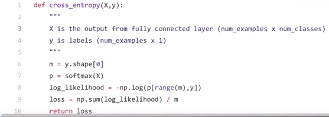

# Information theory

## Choosing your loss function

There is no universal loss function that works for all kinds of data. It depends on a lot of factors like:

- the presence of outliers
- the choice of machine learning algorithm
- the time and efficiency of gradient descent
- the confidence of predictions.

## Entropy

The Shannon entropy equation provides a way to estimate the average minimum number of bits needed to encode a string of symbols, based on the frequency of the symbols.

In the Shannon entropy equation, $P_{i}$ is the probability of a given symbol.

The measure of information entropy associated with each possible data value is the negative logarithm of the probability mass function for the value:

$S=\displaystyle -\sum _{i=0}^{N-1}P_{i}\log {P_{i}}$

Where:

- $P_{i}$ is the probability of character number i appearing in the stream of characters of the message.

When the data source produces a **low-probability value** (when a low-probability event occurs), the event carries more "information" ("surprisal") than when the source data produces a high-probability value.

**Generally, entropy refers to disorder or uncertainty, and the definition of entropy used in information theory is directly analogous to the definition used in statistical thermodynamics.**

### Entropy Example 1

The minimum average number of bits is per symbol is

If we have a symbol set {A,B,C,D,E} where the symbol occurnce frequencies are:

   A = 0.5
   B = 0.2
   C = 0.1
   D = 0.1
   E = 0.1

The average minimum number of bits needed to represent a symbol is

  H(X) = -[(0.5log20.5 + 0.2log20.2 + (0.1log20.1)*3)]
  H(X) = -[-0.5 + (-0.46438) + (-0.9965)]
  H(X) = -[-1.9]
  H(X) = 1.9

Rounding up, we get 2 bits/per symbol. To represent a ten character string AAAAABBCDE would require 20 bits if the string were encoded optimally. Such an optimal encoding would allocate fewer bits for the highest frequency occuring symbols (e.g., A and B) and long bit sequences for the more infrequent symbols (C,D,E).

This example is borrowed from A Guide to Data Compression Methods by Solomon. Note that the frequence of the symbols also happens to match the frequence in the string. This will not usually be the case and it seems to me that there are two ways to apply the Shannon entropy equation:

The symbol set has a known frequency, which does not necessarily correspond to the frequency in the message string. For example, characters in a natural language, like english, have a particular average frequency. The number of bits per character can be calculated from this frequency set using the Shannon entropy equation. A constant number of bits per character is used for any string in the natural language.

Symbol frequency can be calculated for a particular message. The Shannon entropy equation can be used calculate the number of bits per symbol for that particular message.

Shannon entropy provides a lower bound for the compression that can be achieved by the data representation (coding) compression step. Shannon entropy makes no statement about the compression efficiency that can be achieved by predictive compression. Algorithmic complexity (Kolmogorov complexity) theory deals with this area. Given an infinite data set (something that only mathematicians possess), the data set can be examined for randomness. If the data set is not random, then there is some program that will generate or approximate it and the data set can, in theory, be compressed.

Note that without an infinite data set, this determination is not always possible. A finite set of digits generated for a pi expansion satisify tests for randomness. However, these digits must be pseudo-random, since they are generated from a deterministic process. Algorithmic complexity theory views a pi expansion of any number of digits as compressible to the function that generated the sequence (a relatively small number of bits).

### Entropy Example 2

Consider a simple digital circuit which has a two-bit input (X, Y) and a two-bit output (X and Y, X or Y).

Assuming that the two input bits X and Y have mutually independent chances of 50% of being HIGH, then the input combinations (0,0), (0,1), (1,0), and (1,1) each have a 1/4 chance of occurring, so the circuit's Shannon entropy on the input side is ${\displaystyle H(X,Y)=4{\Big (}-{1 \over 4}\log _{2}{1 \over 4}{\Big )}=2}$.

Then the possible output combinations are (0,0), (0,1), and (1,1) with respective chances of 1/4, 1/2, and 1/4 of occurring, so the circuit's Shannon entropy on the output side is $\displaystyle H(X{\text{ and }}Y,X{\text{ or }}Y)=2{\Big (}-{1 \over 4}\log _{2}{1 \over 4}{\Big )}-{1 \over 2}\log _{2}{1 \over 2}=1+{1 \over 2}$, so the circuit reduces (or "orders") the information going through it by half a bit of Shannon entropy due to its logical irreversibility.

### Cross entropy

Cross-entropy is commonly used to quantify the difference between two probability distributions.

So cross-entropy can only work under one-hot distribution?

- Yes. One-hot distribution just means that all the class probabilities are 0.0 except for one which is 1.0.

Usually the "true" distribution (the one that your machine learning algorithm is trying to match) is expressed in terms of a one-hot distribution.

For example, suppose for a specific training instance, the label is B (out of the possible labels A, B, and C). The one-hot distribution for this training instance is therefore:

| Pr(Class A) | Pr(Class B) | Pr(Class C) |
| ----------- | ----------- | ----------- |
| 0.0         | 1.0         | 0.0         |

You can interpret the above "true" distribution to mean that the training instance has 0% probability of being class A, 100% probability of being class B, and 0% probability of being class C.

Now, suppose your machine learning algorithm predicts the following probability distribution:

| Pr(Class A) | Pr(Class B) | Pr(Class C) |
| ----------- | ----------- | ----------- |
| 0.228       | 0.619       | 0.153       |

How close is the predicted distribution to the true distribution? That is what the cross-entropy loss determines. Use this formula:

$H(p,q)=-\sum_{x} p(x)\log_2{(x)}$

Where p(x) is the wanted probability, and q(x) the actual probability.

The sum is over the three classes A, B, and C. In this case the loss is 0.689 :

$H = - (0.0*log_2(0.228) + 1.0*log_2(0.619) + 0.0*log_2(0.153)) = 0.689$

So that is how "wrong" or "far away" your prediction is from the true distribution.

Note: My calculation is with base-2 log, but sometimes the calculation is done with 'ln'. In practice it doesn't matter as long as you use the same function consistently throughout. 

Cross entropy is one out of many possible loss functions (another popular one is SVM hinge loss). These loss functions are typically written as J(theta) and can be used within gradient descent, which is an iterative algorithm to move the parameters (or coefficients) towards the optimum values.

### Classification

### Regression

## Reminder

| Notation          | Definition                                                             |
| ----------------- | ---------------------------------------------------------------------- |
| $\forall x \in X$ | For all x in X                                                         |
| $P(A,B)$          | Is the probability that both A and B happen                            |
| $P(A \vert B)$    | Is the probability that A happens, knowing that B has already happened |

## Probability theory

Probability is a mathematical framework for representing uncertainty. It is very applicable in Machine learning and Artificial Intelligence as it allows to make uncertain statements and reason in the presence of uncertainty.

### Random Experiment, Sample Space and Random Variable

- When we repeat random experiment several times we call each of experiment a **trial**.
- The set of all possible outcomes of random experiment is know as **sample space S**.

0.4*log(0.4;2)

