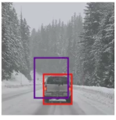
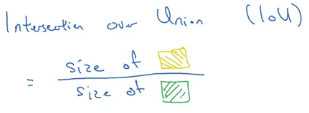

# Intersection Over Union

In the picture:

- The red bounding box is the reality where the car is.
- The purple bounding box is your algorithm output.  

So how do you tell if your object detection algorithm is working well?

The answer is: You use Intersection Over Union

## Calculating IoU

|                                                                              |
|------------------------------------------------------------------------------|
| $Intersection\_Over\_Union = \frac{Area\_Of\_Intersection}{Area\_Of\_Union}$ |

## Understanding results of IoU

| Result is | Condition |
|-----------|-----------|
| Correct | $Intersection\_Over\_Union \geq 0.5$ |  
| Bad | $Intersection\_Over\_Union \leq 0.5$ |  

If you want to be more stringent use 0.6 or higher instead:

| Result is | Condition |
|-----------|-----------|
| Correct | $Intersection\_Over\_Union \geq 0.6$ |  
| Bad | $Intersection\_Over\_Union \leq 0.6$ |  
