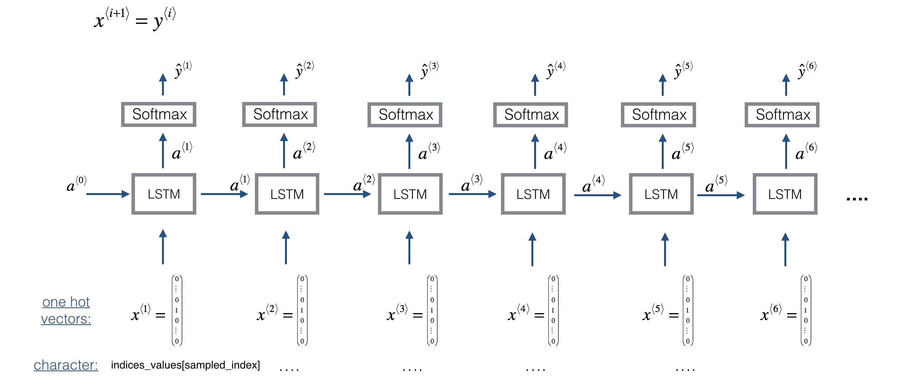

# Jazz Solo with an LSTM Network

- a: hidden state
- c: cell state
- a0:Initial hidden state, .........of shape (n_a, m)
- n_a: this is the size of 'a' in the RNN. In our example, we would have to experiment to see how big 'a' should be to represent the needed state.

- X: est un $(m,  T_{x} , 78)$.
  - m: Nombre d'exemples.
  - $T_{x}=30$  Longueur de la séquence(Ici: Nombre de notes de musique de la séquence). Nous avons donc t=$1, \dots, T_{x}$.
  - n_values=78: You can informally think of each "value" as a note, which comprises a pitch and a duration. The number of unique values in this dataset.
  - X[i,t,:] is a one-hot vector representating the value of the i-th example at time t. At each time step, the input is one of 78 different possible values, represented as a one-hot vector.
    - indices_values: python dictionary mapping from 0-77 to musical values.
- Y: This is essentially the same as X, but shifted one step to the left (to the past). Indeed we're interested in the network using the previous values to predict the next value, so our sequence model will try to predict  $y^{<t>}$ given $x^{<1>},\dots,x^{<t>}$ . However, the data in Y is reordered to be dimension $(Ty,m,78)$, where $Ty=T_{x}$. This format makes it more convenient to feed to the LSTM later.

- $n_{a} = 64$: LSTM with 64 dimensional hidden states

------------------

x -- Input data for every time-step, of shape (n_x, m, T_x).

- a0:Initial hidden state, .........of shape (n_a, m)
- Waa -- Weight matrix: numpy array of shape (n_a, n_a)
- Wax -- Weight matrix: numpy array of shape (n_a, n_x)
- Wya -- Weight matrix: numpy array of shape (n_y, n_a)
- ba --  Bias: numpy array of shape (n_a, 1)
- by --  Bias: numpy array of shape (n_y, 1)

n_x - the size x at each timestep. A one-hot vector of a word from our dictionary would be 1000 elements, so n_x is 1000.
m - the number of training examples. may also be called 'samples' or batch size or other things. Here it is 50
T_x - the number of time steps. Our examples have 20 words, so this is 20.