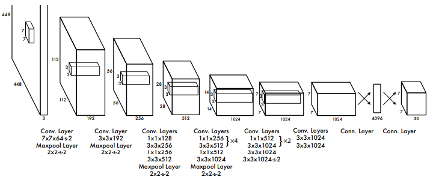
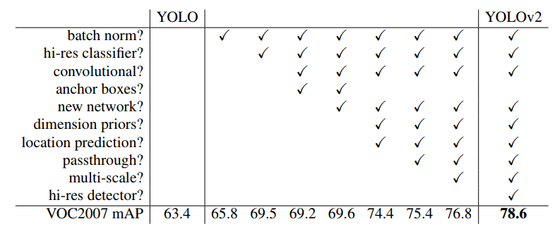

# Julien Reading the Yolo Paper

__**Understanding YOLO is the best read**:__ https://hackernoon.com/understanding-yolo-f5a74bbc7967

|            |                                                  |
|------------|--------------------------------------------------|
| Yolo paper | https://pjreddie.com/media/files/papers/yolo.pdf |
| YOLO9000: Better, Faster, Stronger (YOLO v2) | https://arxiv.org/abs/1612.08242 |
| YOLO v3 | https://pjreddie.com/media/files/papers/YOLOv3.pdf |

## Important links

|                                             |                   |
|---------------------------------------------|-------------------|
| https://www.youtube.com/watch?v=NM6lrxy0bxs | YOLO presentation |
| http://machinethink.net/blog/object-detection-with-yolo/ | Real-time object detection with YOLO |
| https://pjreddie.com/darknet/yolo/ | Original YOLO Open Source Neural Networks in C |
| https://github.com/thtrieu/darkflow | YOLO for tensorflow |
| https://timebutt.github.io/static/how-to-train-yolov2-to-detect-custom-objects/ | How to train YOLOv2 to detect custom objects |
| https://github.com/pjreddie/darknet/wiki/YOLO:-Real-Time-Object-Detection | YOLO: Real Time Object Detection |
| https://github.com/KleinYuan/easy-yolo | |
| https://medium.com/@xslittlegrass/almost-real-time-vehicle-detection-using-yolo-da0f016b43de | Real time vehicle detection using YOLO |
| https://medium.com/diaryofawannapreneur/yolo-you-only-look-once-for-object-detection-explained-6f80ea7aaa1e | YOLO — ‘You only look once’ for Object Detection explained |

## Training

__**Figure 3**__ 

Our detection network has 24 convolutional layers followed by 2 fully connected layers. Alternating 1×1
convolutional layers reduce the features space from preceding layers. We pretrain the convolutional layers on the ImageNet classification task at half the resolution (224×224 input image) and then double the resolution for detection.

The way I understand it:

|          |                                                                   |                                                                                                                                                                                                                                                 |
|----------|-------------------------------------------------------------------|-------------------------------------------------------------------------------------------------------------------------------------------------------------------------------------------------------------------------------------------------|
| Training | We pretrain our convolutional layers on the [ImageNet](http://image-net.org) 1000-class competition dataset. This is to recognize different kind of objects in an image.  For pretraining we use the first 20 convolutional layers from Figure 3 followed by an average-pooling layer and a fully connected layer. |
| Detection | We then convert the model to perform detection. We add 4 convolutional layers and 2 fully connected layers with randomly initialized weights. Detection often requires fine-grained visual information so we increase the input resolution of the network from 224×224 to 448×448. |

Our system divides the input image into a S × S grid.
If the center of an object falls into a grid cell, that grid cell is responsible for detecting tha object.

Each grid cell predicts B bounding boxes and C class probabilities for those bounding boxes.

## The bounding box prediction

The bounding box prediction has 5 components: (x, y, w, h, confidence)

__**x,y,w,h**__

- (x, y) coordinates represent the center of the box, relative to the grid cell location (remember that, if the center of the box does not fall inside the grid cell, than this cell is not responsible for it). These coordinates are normalized to fall between 0 and 1.
- The (w, h) box dimensions are also normalized to [0, 1], relative to the image size.

Let’s look at an example:

__**confidence score**__

$confidence=Pr(Object)\times{IOU_{pred}^{truth}}$

If no object exists in that cell, the confidence score should be zero.
Otherwise we want the confidence score to equal the **intersection over union** (IOU) between the predicted box and the ground truth.

----

**Remember that each grid cell makes B of those predictions!!**.

1 prediction=(x, y, w, h, c)

## The class prediction

The class is the type of image.

It is also necessary to predict the class probabilities, Pr(Class(i) | Object). This probability is conditioned on the grid cell containing one object.

In practice, it means that if no object is present on the grid cell, the loss function will not penalize it for a wrong class prediction, as we will see later. The network only predicts one set of class probabilities per cell, regardless of the number of boxes B. 

## Output tensor

Adding the class predictions to the output vector, we get a $S\times S\times (B\times 5+C)$ tensor as output.

- B: Bounding box prediction
- C: Class prediction

## YOLO V2

## YOLO V3

https://blog.paperspace.com/how-to-implement-a-yolo-object-detector-in-pytorch/