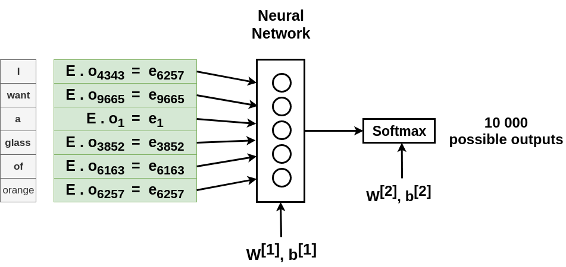
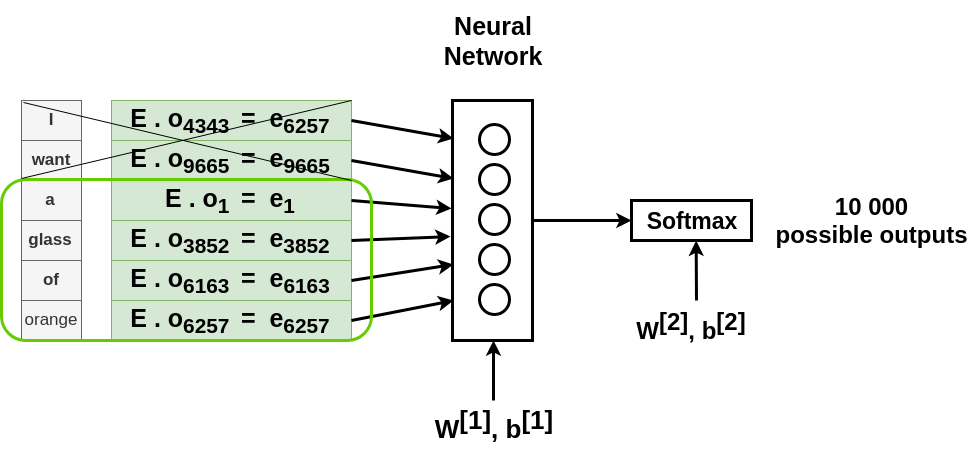
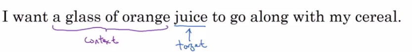
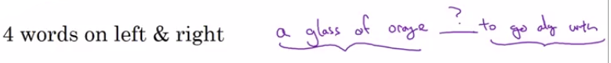
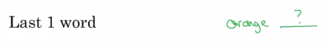

# Learning Word Embeddings

[Bengio et. al., 2003, A neural probabilistic language model

## History

In the history of deep learning as applied to learning word embeddings, people actually started off with relatively complex algorithms.

And then over time, researchers discovered they can use simpler and simpler and simpler algorithms and still get very good results especially for a large dataset.

But what happened is, some of the algorithms that are most popular today, they are so simple that if I present them first, it might seem almost a little bit magical:

- how can something this simple work? 

So, what I'm going to do is:

- start off with some of the slightly more complex algorithms to develop intuition about why they should work.
- and then we'll move on to simplify these algorithms and show you some of the simple algorithms that also give very good results.

## Neural language model

The ideas were due to Yoshua Bengio, Rejean Ducharme, Pascals Vincent, and Christian Jauvin.

Let's say you're building a language model and you do it with a neural network.

During training, you might want your neural network to do something like input:

- "I want a glass of orange \_\_\_\_\_"
- then predict the next word in the sequence

|  | I | want | a | glass | of | orange | \_\_\_\_\_ |
|--|-------|--------|-----|----------|---------|----------|---|
| **Index in the vocabulary:** | 4343   | 9665 | 1 | 3852 | 6163 | 6257  |  |

Building a neural language model is the small way to learn a set of embeddings:

What we're going to do is then have:

- A column vector O for each word. One-hot vector have zeros everywhere except in position of the index of word (will be 1).
- A common elbedding matrix E which contains all words.

To obtain te embedding matrix of each word we realize the following formula (j is the index of a word):

- $embedding\ for\ word\ j = e_j = E . O_{j}$

We then:

- Fill all of the embeddings into a neural network which has its own parameters ($W^{[1]}, b^{[1]}$).

To end:

- This neural network feeds to a softmax, which has it's own parameters as well ($W^{[2]}, b^{[2]}$).
- And a softmax classifies among the 10,000 possible outputs in the vocab for those final word we're trying to predict.

## Fix historical window

What's actually more commonly done is to have a fixed historical window.

Fix historical window: You always want to predict the next word **given the previous 4 words**

- Where 4 here is a hyperparameter of the algorithm.

In the picture you can then get rid of the first words and keep only the words in the historical windows (the last 4 words).

Using a fixed history, just means that you can deal with even arbitrarily long sentences because the input sizes are always fixed.

You can then perform gradient descent to maximize the likelyhood of your training set to just repeatedly predict:

- Given 4 words in a sequence, what is the next word in your text corpus?

And it turns out that this algorithm we'll learn pretty decent word embeddings.

if you have only a 300 dimensional feature vector to represent all of these words:

- the algorithm will find that it fits the training set fast.
- If apples, oranges, and grapes, and pears, durians will end up with similar feature vectors.

So, this is one of the earlier and pretty successful algorithms for learning word embeddings, for learning this matrix E. 

## Other context/target pairs

### Context last 4 words

Let's say that in your training set, you have this longer sentence: **I want a glass of orange juice to go along with my cereal.**

- What we saw on the last chapter was that the job of the algorithm was to predict some word juice (the target words).
- And it was given some context which was the last four words.

If it goes to build a language model then is natural for the context to be a few words right before the target word.

But if your goal isn't to learn the language model per se but to learn embeddings, then you can choose other contexts.

### Context 4 left 4 right

For example, you can pose a learning problem where the context is the four words on the left and the right.

And posing a learning problem like this where you have the embeddings of the left four words and the right four words feed into a neural network, similar to what we saw previously.

To try to predict the word in the middle, try to put it target word in the middle, this can also be used to learn word embeddings.

### Context last one word

Or if you want to use a simpler context, maybe you'll just use the last one word.

So given just the word orange, what comes after orange?

So this will be different learning problem where you tell it one word, orange, and will say well, what do you think is the next word.

### Context nearby one word

Or, one thing that works surprisingly well is to take a nearby one word.

Some might say, I saw the word glass and then there's another words somewhere close to glass, what do you think that word is?

So, that'll be using nearby one word as the context. And we'll formalize this after this lesson but this is the idea of a Skip-Gram model, and just an example of a simpler algorithm where the context is now much simpler.

## What researchers found

So what researchers found was that if you really want to build a language model:

- it's natural to use the last few words as a context.

But if your main goal is really to learn a word embedding:

- then you can use all of these other contexts and they will result in very meaningful work embeddings as well.