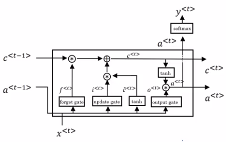
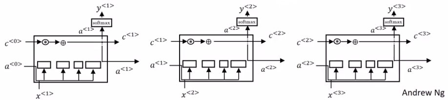

# Long Short Term Memory (LSTM)

| Formulas GRU |    |
|--------------------------------------------------------------|-----------|
| $\tilde{c}^{<t>}=tanh(W_{c}[\Gamma_{r}*c^{<t-1>}, x^{<t>}]+b_c)$ | $\tilde{c}^{<t>}=tanh(W_{c}[a^{<t-1>}, x^{<t>}]+b_c)$ |
| $\Gamma_{u}=\sigma (W_{u}[c^{<t-1>}, x^{<t>}]+b_{u})$ | $\Gamma_{u}=\sigma (W_{u}[a^{<t-1>}, x^{<t>}]+b_{u})$ |
| $\Gamma_{r}=\sigma (W_{r}[c^{<t-1>}, x^{<t>}]+b_{r})$ | $\Gamma_{f}=\sigma (W_{f}[a^{<t-1>}, x^{<t>}]+b_{f})$ |
|  | $\Gamma_{o}=\sigma (W_{o}[a^{<t-1>}, x^{<t>}]+b_{o})$ |
| $c^{<t>} = \Gamma_{u} * \tilde{c}^{<t>} + (1-\Gamma_{u})*c^{<t-1>}$ | $c^{<t>} = \Gamma_{u} * \tilde{c}^{<t>} + \Gamma_{f}*c^{<t-1>}$ |
| $a^{<t>} = c^{<t>}$ | $a^{<t>}=\Gamma_{o}*tanh(c^{<t>})$ |

- $\Gamma_{u}$: update gate
- $\Gamma_{f}$: forget gate
- $\Gamma_{o}$: output gate

## Explanations

Notice that:

- We will no longer have the case that $a^{<t>}$ is equal to $c^{<t>}$.
- More specially we use $a^{<t-1>}$ instead of $c^{<t>}$
- We use $[a^{<t-1>}, x^{<t>}$ to compute all the gate values.
- We use tanh to compute $\tilde{c}^{<t>}$
- In the GRU calculous of $c^{<t>}$,  instead of having one update gate control:
  - $\Gamma_{u}$ and $(1-\Gamma_{u})$ is replaced by $\Gamma_{f}$ and $\Gamma_{o}$

It is relatively easy for the LSTM to have some value $c^{<0>}$ and have that be passed all the way to the right to have your, maybe, $c^{<3>}$ equals $c^{<0>}$.

And this is why the LSTM, as well as the GRU, is very good at memorizing certain values even for a long time, for certain real values stored in the memory cell even for many, many timesteps.

Perhaps, the most common one is that instead of just having the gate values $\Gamma_{u}, \Gamma_{f}, \Gamma_{o}$ be dependent only on $[a^{<t-1>},x^{<t>}]$, sometimes, people also sneak in there the values $c^{<t-1>}$ as well. This is called a peephole connection.

## How to choose between GRU and LSTM

There isn't widespread consensus in this.

And even though GRU was presented first, in the history of deep learning:

- LSTMs actually came much earlier
- GRUs were relatively recent invention that were maybe derived as Pavia's simplification of the more complicated LSTM model.

Researchers have tried both of these models on many different problems:

- On different problems, different algorithms will win out.
- So, there isn't a universally-superior algorithm.

| Advantage of GRU |
|------------------|
| The advantage of the GRU is that it's a simpler model and so it is actually easier to build a much bigger network, it only has two gates, so computationally, it runs a bit faster. So, it scales the building somewhat bigger models. |

| Advantage of LSTM |
|------------------|
| but the LSTM is more powerful and more effective since it has three gates instead of two. |

If you want to pick one to use:

- I think LSTM has been the historically more proven choice. Most people today will still use the LSTM as the default first thing to try.
- Although, I think in the last few years, GRUs had been gaining a lot of momentum and I feel like more and more teams are also using GRUs because they're a bit simpler but often work just as well. It might be easier to scale them to even bigger problems.
