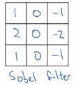
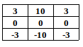
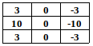

# More edge detection

## Vertical and horizontal filters

## Vertical edge detection

## Horizontal edge detection

## Other filters

### Sobel filter: More weight to the central row

Sobel filter: 

- It puts a little bit more weight to the central row, the central pixel.
- This makes it maybe a little bit more robust.

### Scharr filter: Edge detection

Vertical edge filter:

Horizontal edge filter:

### Detect edges with your own filter

With the rise of deep learning, one of the things we learned is that when you really want to detect edges in some complicated image, maybe you don't need to have computer vision researchers handpick these nine numbers.

#### Your own filter learnt with deep learning

Maybe you can just learn the 9 numbers of the matrix and treat them as parameters, which you can then learn using back propagation. 

The goal is to learn nine parameters so that when you take the image, the six by six image, and convolve it with your three by three filter, that this gives you a good edge detector.

And rather than just vertical and horizontal edges, **maybe it can learn to detect edges that are at 45 degrees or 70 degrees or 73 degrees or at whatever orientation it chooses.**

Neural networks:

- **Can actually learn low level features**
- **Can learn features such as edges,** __even more robustly than computer vision researchers__ are generally able to code up these things by hand.

But underlying all these computations is still this convolution operation, which allows back propagation to learn whatever 3 by 3 filter it wants.