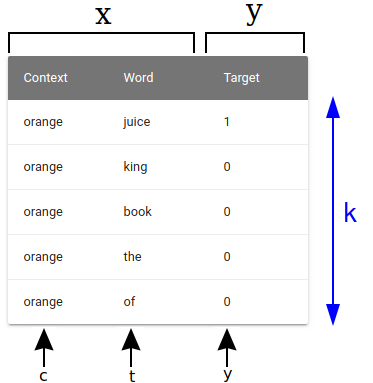
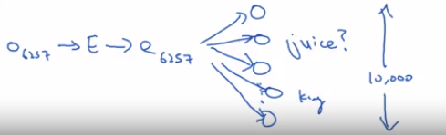
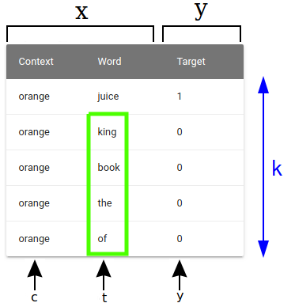

# Negative Sampling

Skip-Gram model allows you to construct a supervised learning task.

So we map from context to target and how that allows you to learn a useful word embedding.

**But the downside of that was the Softmax objective was slow to compute.**

Negative sampling that allows you to do something similar to the Skip-Gram model you saw just now, **but with a much more efficient learning algorithm**.

Paper: [Distributed Representations of Words and Phrases and their Compositionality by Tomas Mikolov, Ilya Sutskever, Kai Chen, Greg Corrado, Jeffrey Dean](https://arxiv.org/abs/1310.4546)

## Learning problem

You are given a large corpus of text with each of the texts being a sentence, then you make use of these sentences to generate a training set.

Let's take an example of sentence in the large corpus:

| Example |
|---------|
| I want a glass of orange juice to go along with my cereal. |

We're going to predict: **Is this a context-target pair?**

We will use a learning problem matrix:

The way we generate this data set is:

- We pick a **context word** (in the sentence) and then pick a **target word** (in the context word window) and that is the first row of this table.
  - That gives us a positive example. So context, target, and then give that a label of 1.
  - The positive example is generated exactly how we generated it in the previous lesson.
    - We sample a context word.
    - We look around a window of say, plus-minus ten words and pick a target word. So that's how you generate the first row of this table with orange, juice, 1.

- And then what we'll do is for some number of times (say k times):
  - We're going to take the **same context word** and then **pick random words from the dictionary** "king", "book", "the", "of"... whatever comes out at random from the dictionary and label all those 0, and those will be our **negative examples**.

| Important                       | One of those words we picked at random from the dictionary happens to appear in the window                                                                                                                 |
| ------------------------------- | ---------------------------------------------------------------------------------------------------------------------------------------------------------------------------------------------------------- |
|  | If just by chance, one of those words we picked at random from the dictionary happens to appear in the window (plus-minus ten word window for example) next to the context word, orange.                   |
|                                 | In this case we're going to create **a new supervised learning problem** where the learning algorithm inputs x, inputs this pair of words, and it has to predict the target label to predict the output y. |

## The final training set

So the problem is really:

| Given a pair of words like orange and juice, do you think they appear together? |
|---------------------------------------------------------------------------------|
| Do you think I got these two words by sampling two words close to each other?
| Or do you think I got them as one word from the text and one word chosen at random from the dictionary? |
| The objective is really to try to distinguish between these two types of distributions from which you might sample a pair of words. |

| Training set |
|-------|
| The cummultion matrix of all learning problem matrices gives you the training set. |

|  | How to choose k?                   |
| ------------------------------- | ---------------------------------- |
| Tomas Mikolov et Al recommends: | k is 5 to 20 for smaller data sets |
|                                 | k is 2 to 5 for large data sets    |

## Logistic regression model

So what we're going to do is define a logistic regression model. Say, that the chance of $y=1$, given the input c and t pair.

$P(y=1|c,t)= \sigma(\theta_{t}^{T}e_{c})$

- $\theta_{t}^{T}$: Parameter vector theta for each possible target word.
- $e_{c}$: Parameter vector, really the embedding vector, for each possible context word.

So if you have k examples here, then you can think of this as having a k to 1 ratio of negative to positive examples:

- For every positive examples, you have k negative examples with which to train this logistic regression-like model.

## Negative sampling nn

And so to draw this as a neural network, if the input word is orange,

The word orange is word 6257.

I works like this:

- You input the one hot vector O_6257 and get the embedings thanks to:
  - $e_{c} = E \cdot O_{c}$
- And then what you have is really 10,000 possible logistic regression classification problems.
  - One of these will be the classifier corresponding to the target word: juice.
  - There will be other possible words in your vocabulary, for example the word: king.

So think of this as having 10,000 binary logistic regression classifiers, but instead of training all 10,000 of them on every iteration, we're only going to train five of them.

Indeed, we're going to:

- train the one responding to the actual target word we got
- and train four randomly chosen negative examples.

And this is for the case where k is equal to 4.

So instead of having one giant 10,000 way Softmax, which is very expensive to compute, we've instead turned it into 10,000 binary classification problems, each of which is quite cheap to compute.

And on every iteration, we're only going to train five of them or more generally, k + 1 of them, of k negative examples and one positive examples.

And this is why the computation cost of this algorithm is much lower because you're updating k + 1, let's just say units, k + 1 binary classification problems.

Which is relatively cheap to do on every iteration rather than updating a 10,000 way Softmax classifier.

| On every iteration |
|--------------------|
| You choose four different random negative words with which to train your algorithm on. |

## How do you choose the negative examples

So after having chosen the context word orange, how do you sample these words to generate the negative examples?

One thing you could do is sample it according to the empirical frequency of words in your corpus.

### The more often they appear in the corpus (bad)

The more often they appear in your corpus, the more often the probability to be sampled.

But the problem with that is that you end up with a very high representation of words like "the", "of", "and", and so on.

### Total random in the vocabulary (bad)

One other extreme would be to say, you use 1 over the vocab size, sample the negative examples uniformly at random, but that's also very non-representative of the distribution of English words.

### Solution of the authors Mikolov et al (best)

So the authors, Mikolov et al, reported that empirically, what they found to work best was to take this heuristic value, which is a little bit in between the two extremes of sampling from the empirical frequencies, meaning from whatever's the observed distribution in English text to the uniform distribution.

And what they did was they sampled proportional to their frequency of a word to the power of three-fourths.

$P(w_{i}) = \frac{f(w_{i}^{3/4}}{\sum_{j=1}^{10000}f(w_{j})^{3/4}}$

So if f of wi is the observed frequency of a particular word in the English language or in your training set corpus:

- Then by taking it to the power of three-fourths, this is somewhere in-between the extreme of taking uniform distribution.
- And the other extreme of just taking whatever was the observed distribution in your training set.

We are not sure if this is very theoretically justified, but multiple researchers are now using this heuristic, and it seems to work decently well.
