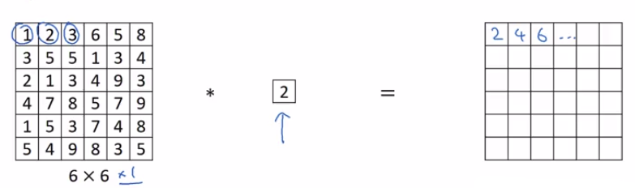

# Networks in Networks and 1x1 Convolutions

## Without volume

## With volume

As described in this lesson [Convolutions Over Volume](./convolutions_over_volume.md), the end matrix $n_{H}\times{n_{W}}\times{\# filters}$.

You end up with an output that is 6 by 6 by the number of filters. And this can carry out a pretty non-trivial computation on your input volume. 

And this idea is often called a one by one convolution but it's sometimes also called Network in Network, and is described in this paper, by Min Lin, Qiang Chen, and Schuicheng Yan.

## Why 1 by 1 convolution is useful?

Let's say you have a 28x28x192 volume.

If you want to shrink the height and width, you can use a pooling layer. But imagine the number of channels ($n_{C}$) has gotten too big and we want to shrink that. 

**How do you shrink a 28x28x192 into a 28x28x32 dimensional volume?**

**Well, what you can do is use 32 filters that are 1x1.**

And technically, each filter would be of dimension 1x1x192, because the number of channels in your filter has to match the number of channels in your input volume, but you use 32 filters and the output of this process will be a 28x28x32 volume.

**So this is a way to let you shrink** $n_{C}$ **as well**.

**Whereas pooling layers, I used just to shrink** $n_{H}$ and $n_{W}$, **the height and width of these volumes.**
