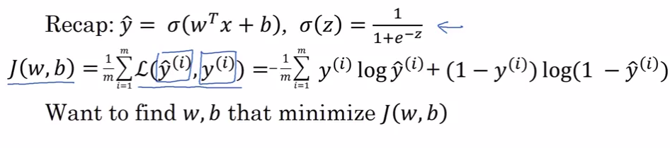
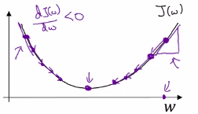
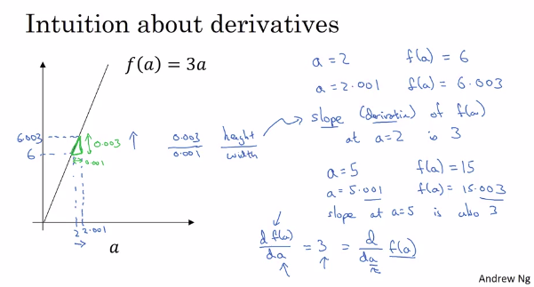
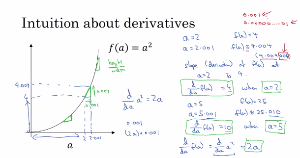
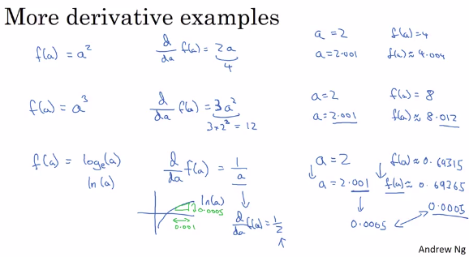
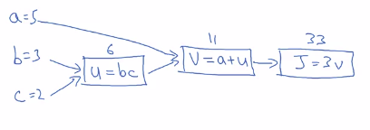
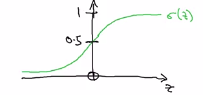
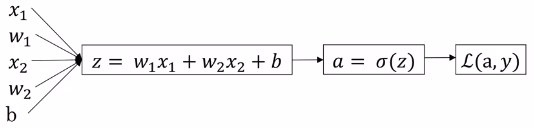

# Neural networks basics

- Good video:[Gradient descent, how neural networks learn ](https://youtu.be/IHZwWFHWa-w)
- Good video:[What is backpropagation really doing? ](https://youtu.be/Ilg3gGewQ5U)
- Best video:[Backpropagation calculus ](https://youtu.be/tIeHLnjs5U8)

## Summary

**Mathematical expression of the algorithm**:

For one example $x^{(i)}$:

$$z^{(i)} = w^T x^{(i)} + b \tag{1}$$

$$\hat{y}^{(i)} = a^{(i)} = sigmoid(z^{(i)})\tag{2}$$ 

$$\mathcal{L}(a^{(i)}, y^{(i)}) =  - y^{(i)}  \log(a^{(i)}) - (1-y^{(i)} )  \log(1-a^{(i)})\tag{3}$$

The cost is then computed by summing over all training examples:

$$J = \frac{1}{m} \sum_{i=1}^m \mathcal{L}(a^{(i)}, y^{(i)})\tag{6}$$

## Binary Classification

To store an image your computer stores three separate matrices
 corresponding to the **red, green, and blue color** channels of this image.

  * Input image is 64 pixels by 64 pixels

  * Then you would have $3\times64\times64$ matrices corresponding to the red, green and blue pixel.

$n_{x} = input size$

$n_{x}=3*64*64=12288$

## Logistic regression learning algorithm

<a href="../img/logistic_regression.pdf">logistic_regression</a>

Another way in in other books:

Logistic regression is a learning algorithm to use for when **the output label Y in a supervised learning problem is either 0 or 1 ** (binary classification problem). 

Example: You want to know if your image contains a cat. So the answer is true or false.

Input feature X is the image.

Given X you want the **probability**: $\hat{y} = P(y=1|X)$

You want $\hat{y}$ to be the probability of the chance that, y is equal to 1 given the input features x. 

So in other words, if X is a picture, as we saw in the last video, you want Y hat to tell you, what is the chance that this is a cat picture? 

Parameters:

- X is an X dimensional vector: $X\in\mathbb{R}^{n_{x}}$

- w is an X dimensional vector: $X\in\mathbb{R}^{n_{x}}$

- $w^{T}$ is the Transposition of the matrix w (see more here: [Transposition](./transposition.md)).

- b is a real number: $X\in\mathbb{R}$

The regression formula is: $(\vec{w}^{T}\vec{x} + b)$

## Logistic regression

The regression formula is: $(\vec{w}^{T}\vec{x} + b)$

BUT WE WANT $\hat{y}$ to be the PROBABILITY to be an image with a cat. So we need the sigma function of it.

A logistic function or logistic curve is a common "S" shape (sigmoid curve).

$\sigma(z)$ = 

$\sigma(z) = \frac{1}{1+e^{-z}}$

If z is very large then $e^{-z}$ will be close to zero.

  * So then $\sigma(z)$ goes very close to 1.

If z is very large negative number then $e^{-z}$ will be 
 a huge number.

  * So then $\sigma(z)$ goes very close to 0.

## Logistic regression cost function

<a href="../img/logistic_regression_cost_function.pdf">logistic_regression_cost_function</a>

Transcript: 

Cost function is a function that we want as small as possible.

### LOSS function

The loss function measures how well you're doing on the single training example. 

----

 **LOSS** function and not **COST function**.

  * The **loss** function computes the error for a **single training example**.
  * The **cost** function is the **average** of the loss functions of the **entire training set**.

|                  |                                                              |
|------------------|--------------------------------------------------------------|
|  | We will not use the loss function used in linear regression. |

Indeed in logistic regression the optimization will not be convex. So the optimization will be with multiple local optima.

----

We will use the loss function:

|  Important  |  Logistic loss function  |
|-------------|--------------------------|
|  | $\mathcal{l}(\hat{y},y)=-(y\log{\hat{y}}+(1-y)\log{(1-\hat{y})})$ |

----

If **y=1**: $\mathcal{l}(\hat{y},y)=-\log{\hat{y}}$

We want $\log{\hat{y}}$ large... so we want $\hat{y}$ large.

----

If **y=0**: $\mathcal{l}(\hat{y},y)=-\log{(1-\hat{y})}$

  * We want $-\log{(1-\hat{y})}$ large... so we want $\hat{y}$ small.

----
Reminder:

| Function  | Plot  |
|-----------|-------|
| log(x)          |       |
| log(1-x)        |       |

### COST function

The cost function measures how well your parameters w and b are doing on your entire training set.

Remember:

  * The **loss** function computes the error for a **single training example**.
  * The **cost** function is the **average** of the loss functions of the **entire training set**.

$J(w,b)=\frac{1}{m}\times{\sum_{i=1}^{m}{\mathcal{l}(\hat{y}^{(i)},y^{(i)})}}$

$J(w,b)=\frac{1}{m}\times{\sum_{i=1}^{m}y^{(i)}\log{\hat{y}^{(i)}}+(1-y^{(i)})\log{(1-\hat{y}^{(i)})}}$

It turns out that a logistic regression can be viewed as a very very small neural network.

## Gradient descent

|                                         |                               |                                            |                            |
|-----------------------------------------|-------------------------------|--------------------------------------------|----------------------------|
| SUPER VIDEO explaining gradient descent | [Gradient descent, how neural networks learn ](./https://youtu.be/IHZwWFHWa-w) |

Transcript: 

So in order to learn the set of parameters w and b it seems natural that we want to find w and b that make the **cost function J(w, b) as small as possible**.

Here is an illustration of gradient descent:

In practice, w can be much higher dimensional, but for the purposes of plotting, let's illustrate w as a single real number and b as a single real number. 

The cost function measures how well your parameters w and b are doing on the training set.

J is a convex function. This is why we use this particular cost function, J, for logistic regression.

We need to find w and b that tend towards the global optimum.

What gradient descent does is it starts at that initial point and then takes a step in the steepest downhill direction. At each iteration we try to go as quickly downhill as possible.

----

For the purpose of illustration let's ignore b a moment.

Repeat {

$w:=w-\alpha\frac{dJ(w)}{dw}$

}

  * $\alpha$ is the learning rate. It controls how big a step we take on each iteration (or gradient descent).

  * $\frac{dJ(w)}{dw}$ JUST mean the slope of the function J. This is basically the update or the change you want to make to the parameters w. When we start to write code to implement gradient descent,

$\frac{dJ(w)}{dw}$ JUST mean the slope of the function J.

----

Derivatives reminder: Remember that the definition of a derivative is the slope of a function at the point. 

Example: 

----

In our case:

So the slope of the function is really the height divided by the width, right, of a low triangle here at this tangent to J(w) at that point.

At the end we have

$w:=w-\alpha\frac{dJ(w,b)}{dw}$

$b:=b-\alpha\frac{dJ(w,b)}{dw}$

### Derivatives

#### Derivatives1

$slope=\frac{height}{width}$

#### Derivatives2

##### Computation graph

Imagine we have to compute the function:

J(a,b,c) = 3(a+bc)

The computer will compute in this order.
u=bc
v=a+u
J=3v

Here is the **computation graph**:

We want to optimize J.

And in the case of a logistic regression, J is of course the cos function that we're trying to minimize. 

In this little example, through a **left-to-right** pass, you can compute the value of J.

**BUT**

 In order **to compute derivatives**, there will be a **right-to-left** pass.

### Derivatives with a Computation Graph

$J=3v$, and so $dJ/dv=3$

Terminology of backpropagation, what we're seeing is that if you want to compute the derivative of this final output variable, which usually is a variable you care most about, with respect to v, then we've done one step of backpropagation.

so currently 33, will get bumped up to 33.003. So here, we've increased v by 0.001. And the net result of that is that J goes out 3 times as much (so $dJ/dv$).

| Math  | How the variable will called in the code  |
|-------|-------------------------------------------|
| $\frac{dJ}{da}$ | You could call this dJdvar. But because you're always taking derivatives with respect to this final output variable, I'm going to introduce a new notation. In code, when you're computing this thing in the code you write, we're just going to use the variable name **dvar** in order to represent that quantity. |

Example:

We have:

$\frac{dJ}{dv}=3$

$\frac{dv}{du}=1$

$\frac{dJ}{du}=\frac{dJ}{dv}\times\frac{dv}{du}=3\times1=3$

Let's go for another:

$\frac{du}{db}=2$

$\frac{dJ}{db}=\frac{dJ}{du}\times\frac{du}{db}=3\times2=6$

So if we increase b by 0.01, J increases by 0.06.

## Logistic regression gradient descent (Only one training example: Loss function)

### Additionnal material from Ronny Restrepo

[http://ronny.rest/](./http://ronny.rest/)

  * [Simple tutorial about derivatives along a computational graph](./simple_tutorial_about_derivatives_along_a_computational_graph.md)
  * [Simple tutorial about how to calculate derivatives of Tanh](./simple_tutorial_about_how_to_calculate_derivatives_of_tanh.md)
  * [Simple tutorial about how to calculate derivatives of Sigmoid](./simple_tutorial_about_how_to_calculate_derivatives_of_sigmoid.md)
  * [Step by step guide about how to calculate all the derivatives of Logistic Regression](./step_by_step_guide_about_how_to_calculate_all_the_derivatives_of_logistic_regression.md)

### Recapitulation

----

#### Logistic regression z

$z = w^{T}x + b$

#### Predicted equation $\hat{y}$

You want $\hat{y}$ to be the probability of the chance that y is equal to 1 given the input features x. So you need to use the sigma function:

$\hat{y}=a=\sigma(z)=\frac{1}{1+e^{-z}}$

#### Loss function l

  * The **loss** function computes the error for a **single training example**.
  * The **cost** function is the **average** of the loss functions of the **entire training set**.

$\mathcal{l}(\hat{y},y)=-(y\log{\hat{y}}+(1-y)\log{(1-\hat{y})})$

That you can write:

$\mathcal{l}(a,y)=-(y\log{(a)}+(1-y)\log{(1-a)})$

### Computation graph

Let's say we have only 2 features:

  * X1
  * X2

$z = w^{T}x + b$

So in order to compute z we have:

  * x1
  * x2
  * w1
  * w2
  * b

Then here is the computation graph:

### Derivatives chain rule

The two versions of the chain rule are related; 

If:

* ${\displaystyle z=f(y)}$
* ${\displaystyle y=g(x)}$

then:

${\displaystyle {\frac {dz}{dx}}={\frac {dz}{dy}}\cdot {\frac {dy}{dx}}=f'(y)g'(x)=f'(g(x))g'(x).}$

### Logistic regression derivatives

<a href="../img/131derivativetable.pdf">131derivativetable</a>

Let's go backward to compute the derivatives:

I think log is a ln (base e).

### Component 1 (Loss derivative)

Let's derive: $\mathcal{l}(a,y)=-(y\log{(a)}+(1-y)\log{(1-a)})$

$\frac{d}{dx}\log{u}=\frac{1}{u}\times\frac{du}{dx}$

$\frac{d}{da}y\log{a}=y\times\frac{1}{a}\times{1}=\frac{y}{a}$

$\frac{d}{da}(1-y)\log{(1-a)}=(1-y)\times\frac{1}{(1-a)}\times{-1}=-\frac{1-y}{1-a}$

so:

| Derivative | Variable  | Final result  |
|------------|-----------|---------------|
| $\frac{dl(a,y)}{da}$ | da |  $-(\frac{y}{a}-\frac{1-y}{1-a})=-\frac{y}{a}+\frac{1-y}{1-a}$ |

**In code $\frac{dl(a,y)}{da}$ will be variable da.**

### Component 2 (Sigmoid derivative)

Let's derive: $a=\sigma(z)=\frac{1}{1+e^{-z}}$

It's here:

* [Simple tutorial about how to calculate derivatives of Sigmoid](./simple_tutorial_about_how_to_calculate_derivatives_of_sigmoid.md)

so:

$\frac{da}{dz}=a(1-a)$

| Derivative  | Result  |
|-------------|---------|
| $\frac{da}{dz}$  | $a(1-a)$ |

### Component 3 (Regression derivative)

The whole $\frac{dl(a,y)}{dz}$ becomes:

variable dz = $\frac{dl(a,y)}{dz}=\frac{dl(a,y)}{da}\times\frac{da}{dz}=(-\frac{y}{a}+\frac{1-y}{1-a})\times a(1-a)$

$=\frac{1}{1-a}(-\frac{y}{a}(1-a)+1-y)\times{a(1-a)}$

$=(-\frac{y}{a}(1-a)+1-y)\times{a}$

$=(-y(1-a)+a-ya)$

$=-y+ya+a-ya$

$=a-y$

| Derivative | Variable  | Final result  |
|------------|-----------|---------------|
| $\frac{dl(a,y)}{dz}$ | dz  | $a-y$ |

### Last components

To end let's derive: $z=w_{1}x_{1}+w_{2}x_{2}+b$ 

Then:

* $\frac{dz}{dw_{1}} = x1$

* $\frac{dz}{dw_{2}} = x2$

* $\frac{dz}{db} = 1$

Then:

| Derivative | Variable  | Final result  |
|------------|-----------|---------------|
| $\frac{dz}{dw_{1}}$  | dw1  | $x_{1}\frac{dl(a,y)}{dz}=x_{1}(a-y)$ |
| $\frac{dz}{dw_{2}}$  | dw2  | $x_{2}\frac{dl(a,y)}{dz}=x_{2}(a-y)$ |
| $\frac{dz}{db}$  | db  | $1\times{\frac{dl(a,y)}{dz}}=a-y$ |

### Gradient descent result

So the gradient descent are the followings:

| Gradient descent |
|------------------|
| $w1:=w_{1}-\alpha{dw_{1}}$ |
| $w2:=w_{2}-\alpha{dw_{2}}$ |
| $b:=b-\alpha{db}$ |

## Gradient descent on m examples (Entire training set: Cost function)

 rename in .xml and use it with draw.io site.

The cost function is the average of all loss functions.

The derivative respect to say w and b of the overall cost function is also going to be the average of derivatives.

For example with $w_{1}$:

$\frac{d J(w,b)}{dw_{1}}=\frac{1}{m}\times{\sum_{i=1}^{m}\frac{d}{dw_{1}}l(a^{i},y^{i})}$

$\frac{dJ(w,b)}{dw_{1}}=\frac{1}{m}\times{\sum_{i=1}^{m}y^{(i)}\log{\hat{y}^{(i)}}+(1-y^{(i)})\log{(1-\hat{y}^{(i)})}}$

Now read: [Step by step guide about how to calculate all the derivatives of Logistic Regression](./step_by_step_guide_about_how_to_calculate_all_the_derivatives_of_logistic_regression.md)

### Result

| Derivative                 |  variable    | Math |
|----------------------------|--------------|------|
| $J(w,b)$      | J  | $J=\frac{1}{m}\times{\sum_{i=1}^{m}\mathcal{l}(a^{(i)},y^{(i)})=\frac{1}{m}\times{\sum_{i=1}^{m}-[y^{(i)}\log{(a^{(i)})}+(1-y^{(i)})\log{(1-a^{(i)})}]}}$ |
| $\frac{dz}{dw_{1}^{(i)}}$  | dw1  | $dw1=\frac{1}{m}\times{\sum_{i=1}^{m}x_{1}^{(i)}\frac{dl(a,y)}{dz^{(i)}}=\frac{1}{m}\times{\sum_{i=1}^{m}x_{1}^{(i)}(a^{(i)}-y^{(i)})}}$  |
| $\frac{dz}{dw_{2}^{(i)}}$  | dw2  | $dw2=\frac{1}{m}\times{\sum_{i=1}^{m}x_{2}^{(i)}\frac{dl(a,y)}{dz^{(i)}}=\frac{1}{m}\times{\sum_{i=1}^{m}x_{2}^{(i)}(a^{(i)}-y^{(i)})}}$ |
| $\frac{dz^{(i)}}{db}$          | db | $db=\frac{1}{m}\times{\sum_{i=1}^{m}dz^{(i)}=\frac{1}{m}\times{\sum_{i=1}^{m}(a^{(i)}-y^{(i)})}}$  |

| Derivative                 |  variable    | Code |
|----------------------------|--------------|------|
| $J(w,b)$      | J  | Repeat { $J+:=-[y^{(i)}\log{(a^{(i)})}+(1-y^{(i)})\log{(1-a^{(i)})}]$ } then J/:=m |
| $\frac{dz}{dw_{1}^{(i)}}$  | dw1  | Repeat { $dw1+:=x_{1}^{(i)}(a^{(i)}-y^{(i)})$} then  dw1/:=m  |
| $\frac{dz}{dw_{2}^{(i)}}$  | dw2  | Repeat { $dw2+:=x_{2}^{(i)}(a^{(i)}-y^{(i)})$} then  dw1/:=m |
| $\frac{dz^{(i)}}{db}$          | db | Repeat { $db+:=(a^{(i)}-y^{(i)})$} then db/:=m  |

| Gradient descent |
|------------------|
| $w1:=w_{1}-\alpha{dw_{1}}$ |
| $w2:=w_{2}-\alpha{dw_{2}}$ |
| $b:=b-\alpha{db}$ |

## Python

### Python and Vectorization

[Python and Vectorization](./python_and_vectorization.md)

### Python and Broadcasting

[Python and Broadcasting](./python_and_broadcasting.md)

### A note on python numpy vectors (tips and tricks)

[note on python numpy vectors (tips and tricks)](./note_on_python_numpy_vectors_tips_and_tricks.md)

## Implementing logistic regression

## Vectorizing Logistic Regression

| Notation | Explanation |
|----------|-------------|
| $X \in \mathbb{R}^{n_{x}\times m}$ | is the input matrix. X is an "$n_{x}\times{m}$" matrix. |                    

| Derivative | Variable  | Final result  |
|------------|-----------|---------------|
| $\frac{dl(a,y)}{da}$ | da |  $-(\frac{y}{a}-\frac{1-y}{1-a})=-\frac{y}{a}+\frac{1-y}{1-a}$ |
| $\frac{dl(a,y)}{dz}$ | dz  | $a-y$ |
| $\frac{dz}{dw_{1}}$  | dw1  | $x_{1}\frac{dl(a,y)}{dz}=x_{1}(a-y)$ |
| $\frac{dz}{dw_{2}}$  | dw2  | $x_{2}\frac{dl(a,y)}{dz}=x_{2}(a-y)$ |

## Vectorizing Logistic Regression's Gradient Output

----

$Z=w^TX+b$

Z=np.dot(w^T,X)+b

----

$dz^{(i)}=a^{(i)}-y^{(i)}$ 

$dZ=[dz^{(1)} + dz^{(2)} + \cdots dz^{(m)}]$

$A=[a^{(1)} + a^{(2)} + \cdots a^{(m)}]$

$Y=[y^{(1)} + y^{(2)} + \cdots y^{(m)}]$

So:

$dZ=A-Y=[a^{(1)}-y^{(1)}, a^{(2)}-y^{(2)} ... a^{(m)}-y^{(m)}]$

Now we have to calculate:

$db = \frac{1}{m} \times [dz^{(1)} + dz^{(2)} + \cdots dz^{(m)}] = \frac{1}{m} \times dZ$

| Variable  | Code              |
|-----------|-------------------|
| db        | (1/m)*np.sum(dZ)  |

And:

$dw = \frac{1}{m}XdZ^{T} = \frac{1}{m} [x^{(1)}dz^{(1)} \cdots x^{(m)}dz^{(m)}]$

