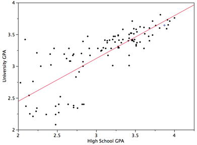
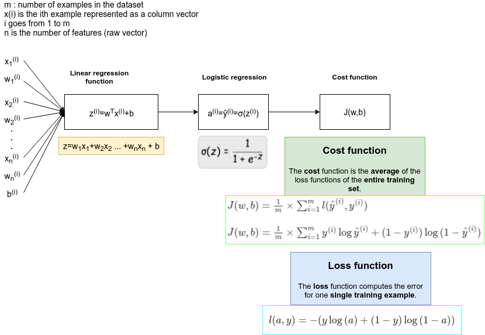
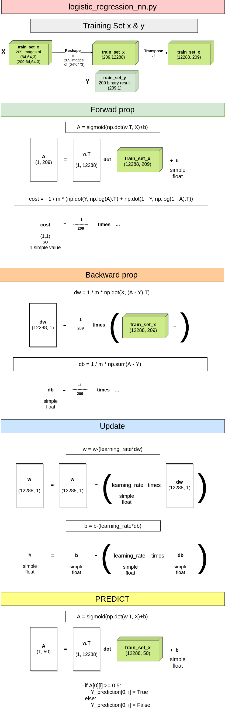

# Neural Network Basics Summarized

## Reshape images (flatten them into a vector)

A 3×64×64 matrices corresponding to the red, green and blue pixel of a 64x64 image.

You can reshape an image into a vector with:

```python
v = np.reshape(image.shape[0]*image.shape[1]*image.shape[2],newshape=1)
```

## Linear regression



Linear regression consists of finding the best-fitting straight line through the points.

The regression formula is: $z=(\vec{w}^{T} \cdot \vec{x} + b)$


```python
a = sigmoid(np.dot(w.T, X)+b)
```

y=a+bx but in the stats world it is: $y=\beta_{0}+\beta_{1}x$

You can use the Mean Square Error as some kind of cost function:

$MSE = \frac{1}{n}\displaystyle\sum_{i=1}^{n} (y_{i}-\hat{y_i})^2$

  * The MSE will be small if the predicted responses are very close to the true responses,
  * And will be large if for some of the observations, the predicted and true responses differ substantially.

More information here:

[Statistics: Simple linear regression](./statistics.md)

[Statistics: Multiple linear regression](./statistics.md)


## Logistic regression

 **Logistic regression** is a learning algorithm used in a supervised learning problem when:

- **the output y are all either 0 or 1**.


----

Given X you want the **probability**: $\hat{y} = P(y=1|X)$

We want y to be the PROBABILITY to be an image with a cat. So we need to apply a **logistic function** to it (**sigmoid**).

|                     |                               |
|---------------------|-------------------------------|
| $\hat{y}=\sigma(z)$ | $\hat{y}=\sigma (w^{T}x + b)$ |

With Inner product : $w^{T}x = \begin{bmatrix}
  w_{1} & w_{2} & w_{3} & \cdots & w_{n_{x}} \\
 \end{bmatrix} \begin{bmatrix}
  x_{1} \\
  x_{2} \\
  x_{3} \\
  \cdots  \\
  x_{n_{x}} 
 \end{bmatrix} = w_{1}x_{1}+w_{2}x_{2}+w_{3}x_{3}+...+w_{n_{x}}x_{n_{x}}$


$\sigma(z)$ = 

|         |                           |                                 |
|---------|---------------------------|---------------------------------|
| Sigmoid | $g(z)=\frac{1}{1+e^{-z}}$ | $g'(z)=\frac{d}{dz}g(z)=a(1-a)$ |


### Loss function

The loss function measures how well you're doing on a single training example.


For one example $x^{(i)}$:

$z^{(i)} = w^T x^{(i)} + b$
$\hat{y}^{(i)} = a^{(i)} = sigmoid(z^{(i)})$

$\mathcal{L}(\hat{y},y)=-(y\log{\hat{y}}+(1-y)\log{(1-\hat{y})})$


|  Important  |  Logistic loss function  |
|-------------|--------------------------|
|  | $\mathcal{L}(\hat{y},y)=-(y\log{\hat{y}}+(1-y)\log{(1-\hat{y})})$ |
| Can also be written as: | $$ \mathcal{L}(a^{(i)}, y^{(i)}) =  - y^{(i)}  \log(a^{(i)}) - (1-y^{(i)} )  \log(1-a^{(i)})$$ |


### Cost function

The cost function measures how well your parameters w and b are doing on your entire training set.

The cost is then computed by summing over all training examples:
$J(w,b)=\frac{1}{m}\times{\sum_{i=1}^{m}{\mathcal{L}(\hat{y}^{(i)},y^{(i)})}}$


m: number of samples in the training set

|  Important  |  Logistic loss function  |
|-------------|--------------------------|
|  | $J = \frac{1}{m} \sum_{i=1}^m \mathcal{L}(a^{(i)}, y^{(i)})$ |
| can also be written as | $J(w,b)= \frac{1}{m}\times{\sum_{i=1}^{m}-y^{(i)}\log{\hat{y}^{(i)}}-(1-y^{(i)})\log{(1-\hat{y}^{(i)})}}$ |
| Or: | $J(w,b)= - \frac{1}{m}\times{\sum_{i=1}^{m}y^{(i)}\log{\hat{y}^{(i)}}+(1-y^{(i)})\log{(1-\hat{y}^{(i)})}}$ |

```python
cost = - 1 / m * (np.dot(Y, np.log(A).T) + np.dot(1 - Y, np.log(1 - A).T))  # compute cost
```

### Gradient descent

Gradient descent is a first-order iterative optimization algorithm for finding the minimum of a function. To find a local minimum of a function using gradient descent, one takes steps proportional to the negative of the gradient (or approximate gradient) of the function at the current point.

----

Repeat {

$w:=w-\alpha\frac{dJ(w,b)}{dw}$

$b:=b-\alpha\frac{dJ(w,b)}{dw}$

}

----

To find $\frac{dJ(w,b)}{dw}$ we use derivatives chain rules.

$\alpha$ is the learning rate. It controls how big a step we take on each iteration (or gradient descent).

$\hat y=\sigma (w^{T}x + b)$ can then be resolved


#### Gradient descent example on m samples (Entire training set: Cost function)


Let's say we have 2 features:

  * $X_1$
  * $X_2$





The cost function is the average of all loss functions.

The derivative respect to say w and b of the overall cost function is also going to be the average of derivatives.

For example with $w_{1}$:

$\frac{d J(w,b)}{dw_{1}}=\frac{1}{m}\times{\sum_{i=1}^{m}\frac{d}{dw_{1}}l(a^{i},y^{i})}$

With $a^{i}=\hat{y^{i}}$

$\frac{dJ(w,b)}{dw_{1}}=\frac{1}{m}\times{\sum_{i=1}^{m}y^{(i)}\log{\hat{y}^{(i)}}+(1-y^{(i)})\log{(1-\hat{y}^{(i)})}}$

Now read: [Step by step guide about how to calculate all the derivatives of Logistic Regression](./step_by_step_guide_about_how_to_calculate_all_the_derivatives_of_logistic_regression.md)

| Derivative                 |  variable    | Math |
|----------------------------|--------------|------|
| $J(w,b)$      | J  | $J=\frac{1}{m}\times{\sum_{i=1}^{m}\mathcal{l}(a^{(i)},y^{(i)})=\frac{1}{m}\times{\sum_{i=1}^{m}-[y^{(i)}\log{(a^{(i)})}+(1-y^{(i)})\log{(1-a^{(i)})}]}}$ |
| $\frac{dz}{dw_{1}^{(i)}}$  | dw1  | $dw1=\frac{1}{m}\times{\sum_{i=1}^{m}x_{1}^{(i)}\frac{dl(a,y)}{dz^{(i)}}=\frac{1}{m}\times{\sum_{i=1}^{m}x_{1}^{(i)}(a^{(i)}-y^{(i)})}}$  |
| $\frac{dz}{dw_{2}^{(i)}}$  | dw2  | $dw2=\frac{1}{m}\times{\sum_{i=1}^{m}x_{2}^{(i)}\frac{dl(a,y)}{dz^{(i)}}=\frac{1}{m}\times{\sum_{i=1}^{m}x_{2}^{(i)}(a^{(i)}-y^{(i)})}}$ |
| $\frac{dz^{(i)}}{db}$          | db | $db=\frac{1}{m}\times{\sum_{i=1}^{m}dz^{(i)}=\frac{1}{m}\times{\sum_{i=1}^{m}(a^{(i)}-y^{(i)})}}$  |


| Derivative                 |  variable    | Code |
|----------------------------|--------------|------|
| $J(w,b)$      | J  | Repeat { $J+:=-[y^{(i)}\log{(a^{(i)})}+(1-y^{(i)})\log{(1-a^{(i)})}]$ } then J/:=m |
| $\frac{dz}{dw_{1}^{(i)}}$  | dw1  | Repeat { $dw1+:=x_{1}^{(i)}(a^{(i)}-y^{(i)})$} then  dw1/:=m  |
| $\frac{dz}{dw_{2}^{(i)}}$  | dw2  | Repeat { $dw2+:=x_{2}^{(i)}(a^{(i)}-y^{(i)})$} then  dw1/:=m |
| $\frac{dz^{(i)}}{db}$          | db | Repeat { $db+:=(a^{(i)}-y^{(i)})$} then db/:=m  |


| Gradient descent |
|------------------|
| $w1:=w_{1}-\alpha{dw_{1}}$ |
| $w2:=w_{2}-\alpha{dw_{2}}$ |
| $b:=b-\alpha{db}$ |


With vectors:

$\frac{\partial J}{\partial w} = \frac{1}{m}X(A-Y)^T\tag{7}$

```python
dw = 1 / m * np.dot(X,(A - Y).T)
```

$\frac{\partial J}{\partial b} = \frac{1}{m} \sum_{i=1}^m (a^{(i)}-y^{(i)})\tag{8}$

```python
db = 1 / m * np.sum(A - Y)
```

## Exam logisitic_regression_nn.py

draw.io: <a href="../logisitic_regression_nn.zip">logisitic_regression_nn.zip</a>


