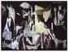
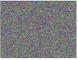
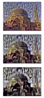

# Neural Style Transfer cost function SIMPLE definition

Paper: [The Neural Style Transfer Algorithm](https://arxiv.org/abs/1508.06576) by Leon A. Gatys, Alexander S. Ecker, Matthias Bethge.

To build a Neural Style Transfer system, let's define a cost function for the generated image.

Cost function:

$J(G)=\alpha J_{Content}(C,G)+\beta J_{Style}(S,G)$

|              |                           |                                                                                                                                                                                                  |
|--------------|---------------------------|--------------------------------------------------------------------------------------------------------------------------------------------------------------------------------------------------|
| Content cost | $\alpha J_{Content}(C,G)$ | This is a function of the content image and of the generated image and what it does is **it measures how similar is the contents of the generated image to the content of the content image C.** |
| Style cost | $\beta J_{Style}(S,G)$ | This is a function of S,G and what this does is it **measures how similar is the style of the image G to the style of the image S.** |
| $\alpha$ and $\beta$ | Previous functions weight these with two hyper parameters $\alpha$ and $\beta$ **to specify the relative weighting between the content costs and the style cost.** | **It seems redundant to use two different hyper parameters to specify the relative cost of the weighting. One hyper parameter seems like it would be enough but the original authors of the Neural Style Transfer Algorithm, use two different hyper parameters.** I'm just following them. |

## Find the generated image G

1. Initiate G randomly
  1. G: 100x100x3 or 500x500x3 or whatever dimension you want it to be.
1. Use Gradient descent to minimize J(G)
  1. You can update G as G minus the derivative respect to the cost function of J(G):
     $G:=G-\frac{d}{d G} J(G)$
     
In this process, you're actually updating the pixel values of this image G (100x100x3 for example).   

## Example generated image G

 C content

 S style

 G Initiated randomly image (just white noise image with each pixel value chosen at random)

----

As you run gradient descent, you minimize the cost function J(G) slowly through the pixel value so then you get slowly an image that looks more and more like your content image rendered in the style of your style image. 

