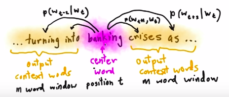

# nlp summary

## Progress in NLP

NLP-progress tutorial: https://github.com/sebastianruder/NLP-progress

### Word Embeddings (Word, sentence, and document)

#### skip-gram

You input a word an try to guess neighboring words using the current word.
We can think of the window it slides against the training text as looking like this:

Play with [wevi: word embedding visual inspector](https://ronxin.github.io/wevi/) and select the skip-gram presets. It will try to predict the surrounding two words.

After a time the output neurons are excited and reveal the highest probability of words surrounding the input word. Because there can be a lot of possibilities in the training set maybe more than the window size will be activated in the output. The output reflects all predicted cases for this given word.

https://jalammar.github.io/illustrated-word2vec/

Deep Sequence Modeling:

https://jalammar.github.io/skipgram-recommender-talk/

https://jalammar.github.io/visualizing-neural-machine-translation-mechanics-of-seq2seq-models-with-attention/

https://jalammar.github.io/illustrated-transformer/

https://jalammar.github.io/illustrated-bert/

### benchmarks

[GLUE benchmark](https://gluebenchmark.com/tasks)

| The Corpus of Linguistic Acceptability | CoLA The Corpus of Linguistic Acceptability | The Corpus of Linguistic Acceptability (CoLA) in its full form consists of 10657 sentences from 23 linguistics publications, expertly annotated for acceptability (grammaticality) by their original authors. The public version provided here contains 9594 sentences belonging to training and development sets, and excludes 1063 sentences belonging to a held out test set. Contact alexwarstadt [at] gmail [dot] com with any questions or issues. Read the paper or check out the source code for baselines.
| The Stanford Sentiment Treebank | 
| Microsoft Research Paraphrase Corpus |
| Semantic Textual Similarity Benchmark |
| Quora Question Pairs |
| MultiNLI Matched |
| MultiNLI Mismatched |
| Question NLI |
| Recognizing Textual Entailment |
| Winograd NLI |
| Diagnostics Main |

**GLUE**: Multi Task Benchmark

**SST-2**: Sentiment Analysis

[SQUAD](https://rajpurkar.github.io/SQuAD-explorer/): SQuAD2.0 combines the 100,000 questions in SQuAD1.1 with over 50,000 new, unanswerable questions written adversarially by crowdworkers to look similar to answerable ones. To do well on SQuAD2.0, systems must not only answer questions when possible, but also determine when no answer is supported by the paragraph and abstain from answering. SQuAD2.0 is a challenging natural language understanding task for existing models, and we release SQuAD2.0 to the community as the successor to SQuAD1.1. We are optimistic that this new dataset will encourage the development of reading comprehension systems that know what they don't know.

**RACE**: The RACE dataset is a large-scale ReAding Comprehension dataset collected from English Examinations that are created for middle school and high school students. RACE is more complex than SQUAD.

from: http://www.qizhexie.com/data/RACE_leaderboard.html

