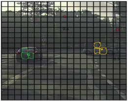
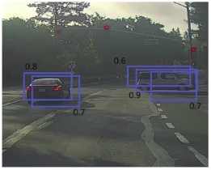
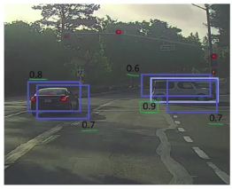
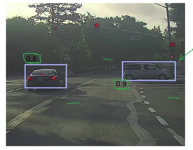
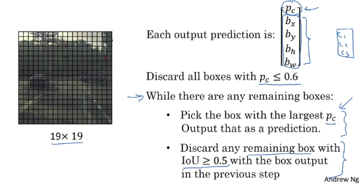

# Non-max Suppression

|                                                                                                                                                                                |
|--------------------------------------------------------------------------------------------------------------------------------------------------------------------------------|
| Non-max means that you're going to output your maximal probabilities classifications but suppress the close-by ones that are non-maximal. Hence the name, non-max suppression. |

Your algorithm may find multiple detections of the same objects.

Input: 19x19 = 361 grid cells

**All of the yellow or green boxes might think that the center of the car is in it. Maybe others as well will also think that they've found the car.**

So, when you run your algorithm, you might end up with multiple detections of each object. 

## What Non-max Suppression does

So, what non-max suppression does, is it cleans up these detections. So they end up with just one detection per car.

Because you're running the image classification and localization algorithm on every grid cell (19x19=361 grid cells), it's possible that many of them will raise their hand and say, "My chance of thinking I have an object in it is large".

What Non-max Suppression does is **it looks at the probabilities (more or less: Pc times C1, or C2, or C3) associated with each of these detections** : 

1. **It takes the largest probability** (light blue 0.9 in our case) and says: "That's my most confident detection, so let's highlight that and just say I found the car there."
1. Then the **non-max suppression then looks at all of the remaining rectangles that have a high overlap (with a high IoU, [Intersection Over Union](./intersection_over_union.md))**. All these detections that highly overlaps with the largest detection probability we just selected are suppressed.

Then you go on with the next detected object (second car) and do the same thing:

## Non-max suppression algorithm in more details

Here Andrew NG use Pc as the prediction probability (but if you read the YOLO paper this is not really the case):

